<div class="titlepage">

# AI-Assisted Virtual Camera Tracking for Coarse Pointing, Acquisition and Tracking in Free Space Optical Communication

<p class="subtitle">Software-Based Simulation and Validation Platform for FSOC Coarse Alignment</p>

| | |
|---|---|
| Event | Smart India Hackathon (SIH) 2026 |
| Problem Statement | PS-169 — *Development of an AI-Based Virtual Camera Tracking System for Coarse Alignment of Mobile Free Space Optical Communication (FSOC) Terminals* |
| Organisation | Department of Space / Indian Space Research Organisation (ISRO) |
| Category | Software |
| Theme | Smart Automation (PS lists: Smart Automation, Space Technology) |
| System name | FSOC-PAT — Virtual Coarse Alignment Laboratory, software version 1.0.0 |
| Report basis | Audit of the repository as built, 2026-10-04 |

</div>

## How to read this report

Every statement is labelled by its evidential status where it matters:

| Label | Meaning |
|---|---|
| **IMPLEMENTED** | Present in the source code and executed; the file is named. |
| **MEASURED** | A number produced by running a named script on the machine described in §26; the output file is named. |
| **DESIGNED** | A design choice or rationale, not itself a measurement. |
| **NOT IMPLEMENTED / NOT MEASURED** | Absent from the current build; stated explicitly rather than omitted. |
| **FUTURE** | Proposed work. Nothing in this category exists. |

All benchmark tables are generated automatically from the benchmark output files when this document is
built (`scripts/build-report.ts`); no result in a table was typed by hand.

The system is **software only**. There is no laser, telescope, gimbal, photodetector, UAV or satellite in
this project, and nothing has been validated against optical hardware.

---

## 1. Executive Summary

**Free Space Optical Communication (FSOC)** transmits data on a narrow beam of light instead of radio. A
narrow beam gives very high data rates and a licence-free spectrum, but it creates a pointing problem: if
the beam is a few microradians wide, a tiny angular error means the light simply misses the receiver.
Mobile FSOC terminals therefore need **Pointing, Acquisition and Tracking (PAT)**: first *find* the remote
terminal, then *keep* the beam on it while both platforms move. PAT is done in two stages. **Coarse
alignment** uses a camera with a wide field of view (FOV) to find the remote terminal's **beacon** — a
visible optical reference target used by the camera to determine the direction of the remote terminal —
and to keep it inside the FOV. **Fine alignment** then takes over with fast steering optics. Fine
alignment cannot start until coarse alignment has the beacon.

Developing coarse-alignment algorithms on real hardware needs cameras, pan-tilt mechanisms and optical
benches. PS-169 asks for a software substitute: a virtual scene, a virtual camera that can be pointed, a
moving beacon, realistic disturbances, and an automatic tracking loop whose performance is measured.

**What was built (IMPLEMENTED).** FSOC-PAT is a browser application (Next.js/TypeScript) whose engine runs
in a Web Worker at 30 Hz. Each frame: a 2000 × 2000 px scene containing a moving beacon and optional
decoys is rendered; a 640 × 480 px monochrome sensor window (4° × 3° FOV) is cropped at the current
pan/tilt pose; noise, atmosphere, blur, jitter and platform motion are applied to that image only; a
perception stage finds the beacon; a Kalman filter tracks it; the pixel error becomes an angular
line-of-sight (LOS) error; a PID controller commands pan/tilt rates; a rate- and acceleration-limited
virtual mount moves the camera; and the next frame is seen from the new pose. Ground truth is used to
render the scene and to score it, never to make a decision.

**How AI and classical computer vision are combined (IMPLEMENTED).** Three perception configurations share
one interface: classical CV alone; a learned branch alone; and a hybrid. In the hybrid, a classical
threshold detector and an independent learned branch (a local-contrast proposer plus a 2,989-parameter
convolutional network, *TinyBeaconNet*) both propose candidates from the same frame; every candidate is
followed over time in world coordinates and judged by a second learned model, the *track verifier*; a
decision engine combines these with the Kalman prediction and lock hysteresis. In the shipped browser
application both networks execute in **ONNX Runtime Web 1.30.0 (WebAssembly)** inside the simulation
worker.

**How performance is measured (MEASURED).** A metrics engine computes the five PS-169 gates (acquisition
time, tracking error, target loss, re-acquisition time, processing speed) plus RMSE, centroiding error and
lock retention. A 14-scenario PS-169 benchmark passes all five gates in all 14 scenarios with the
classical detector (§26). A controlled comparison of classical, AI-only and hybrid perception over 13
conditions × 6 seeds (§27) shows the hybrid holding the true beacon ~97 % of the time in bright-decoy
conditions where classical CV holds it 0 %, equal performance in benign conditions, and specific
weaknesses that are reported in full.

**Main contribution.** A closed-loop, measurable coarse-alignment laboratory in which a learned perception
stage runs on the real control loop in the browser, and in which the decision to trust a candidate is
made from its behaviour over time — because on appearance alone, PS-169's beacon and a bright decoy are
indistinguishable (the measured evidence for this claim is in §28).

---

## 2. Problem Statement and Understanding

### 2.1 An everyday picture

Imagine trying to keep a laser pointer on a coin carried by someone walking across a field, while you are
standing on a moving boat, at night, in light rain. You first have to *find* the coin, then keep turning
to follow it, ignoring street lamps that look like the coin, and if you lose it behind a tree you must
guess where it went and find it again quickly. FSOC coarse alignment is that task, done by a camera on a
motorised mount.

### 2.2 Technical terms

| Term | Meaning in this system |
|---|---|
| Transmitter / receiver | The two FSOC terminals. Here the *receiver's* camera tracks the *transmitter's* beacon. |
| Optical beacon | The remote terminal's light source as seen by the camera: a bright spot, 5–20 px, square or circular. |
| Camera (focal-plane array) | A virtual monochrome sensor, 640 × 480 px, sampling a window of the scene. |
| FOV | Field of view: the angular extent the sensor sees, 4° × 3° by default. |
| Line of sight (LOS) | The direction from the receiver to the beacon. |
| Pointing error | The angle between the camera boresight (image centre) and the LOS. |
| Coarse alignment | Finding the beacon and keeping it in (and centred in) the FOV — **what this project implements**. |
| Fine alignment | Sub-pixel/µrad beam steering after coarse lock — **not implemented** (out of PS-169 scope). |
| PAT | Pointing, acquisition and tracking: the whole process. |

### 2.3 Why software

PS-169 states that real-hardware development needs "expensive cameras, pan-tilt mechanisms, and optical
components". A simulator additionally gives what hardware cannot: exact ground truth for scoring, perfect
repeatability through seeded randomness, and the ability to inject any disturbance on demand.

---

## 3. Objectives

| Class | Objective | Status |
|---|---|---|
| Primary | Configurable virtual environment (scene size, background, decoys) | IMPLEMENTED |
| Primary | Virtual camera with configurable resolution, FOV, rate, slew limits | IMPLEMENTED |
| Primary | Moving optical beacon, six motion models | IMPLEMENTED |
| Primary | Automatic detection — classical CV | IMPLEMENTED |
| Primary | Automatic detection — AI | IMPLEMENTED |
| Primary | Hybrid decision (classical + AI + temporal) | IMPLEMENTED |
| Primary | Continuous tracking with Kalman prediction | IMPLEMENTED |
| Primary | Virtual pan/tilt control (PID + bounded mount) | IMPLEMENTED |
| Primary | Acquisition, lock maintenance, re-acquisition | IMPLEMENTED |
| Primary | Disturbance simulation (noise, atmosphere, jitter, platform motion) | IMPLEMENTED |
| Primary | Real-time visualisation and automatic performance logging | IMPLEMENTED |
| Secondary | Optical blur and exposure motion smear | IMPLEMENTED |
| Secondary | MP4 video input (PS Benchmark-2) | IMPLEMENTED — perception-only, classical detector only (§30, row 12) |
| Secondary | Multiple simultaneous beacons | NOT IMPLEMENTED (config accepts 1–5; renderer/tracker use 1) |
| Secondary | User-defined arbitrary trajectories | NOT IMPLEMENTED (six built-in models) |
| Future | Hardware-in-the-loop, real camera, fine alignment | FUTURE (§40) |

---

## 4. System Requirements

Status column: ✔ = implemented and verified in code/tests; ◐ = partial; ✘ = not implemented.

### 4.1 Functional (F) and simulation (S)

| ID | Requirement (PS-169 row) | Implementation | Status |
|---|---|---|---|
| F1 | Screen ≥ 2000 × 2000 (1) | `scene.width/height` 2000–4096, default 2000 (`config.ts`) | ✔ |
| F2 | Monochrome FPA (2) | 8-bit single-channel frames (`Uint8Array`) | ✔ |
| F3 | Resolution 640 × 480 (3) | `camera.resolutionWidth/Height`, default 640 × 480 | ✔ |
| F4 | FOV user-defined, default 4° × 3° (4) | `camera.fovXDeg/fovYDeg` | ✔ |
| F5 | Update ≥ 30 Hz (5) | `camera.updateHz` default 30 (20–120) | ✔ |
| F6 | Initial camera at screen centre (6) | pan = tilt = 0 at start (`createCamera`) | ✔ |
| F7 | Target = beacon spot (7) | `stampSpot` / `stampSoftSpot` (`scene.ts`) | ✔ |
| F8 | 1 target mandatory, multiple optional (8) | single beacon rendered and tracked | ◐ |
| F9 | Shape user-defined, default square (9) | `beacon.shape` square/circle | ✔ |
| F10 | Size 5–20 px, default 10 (10) | `beacon.sizePx` 5–20, default 10 | ✔ |
| F11 | Initial location user-defined, default random (11) | `startX/startY` or random ±220 px of centre | ✔ |
| F12 | ≥ 4 motions + optional (12) | straight, circular, figure-8, random, spiral, sinusoidal | ✔ |
| F13 | Max pan/tilt 5–10 °/s, default 5 (13, 14) | `maxPanSpeedDegS/maxTiltSpeedDegS` 5–10, default 5 | ✔ |
| F14 | Update interval ≥ 20 Hz (15) | control runs every frame (30 Hz) | ✔ |
| S1 | Salt & pepper, Gaussian, Poisson (21) | `applyDisturbances` (`camera.ts`) | ✔ |
| S2 | Noise σ up to 20 (22) | `noise.gaussianSigma` 0–20 | ✔ |
| S3 | Camera jitter ±20 px/frame (23) | `jitter.maxPxPerFrame` 0–20, magnitude clamped | ✔ |
| S4 | Clear, haze, fog, rain, low light (24) | `atmosphereParams` | ✔ |
| S5 | Platform motion ±20 px/frame, linear + optional (25) | `PlatformMotion`: linear, circular, figure-8, spiral, random | ✔ |

### 4.2 AI (A), tracking (T), control (C), performance (P), logging (L), non-functional (N)

| ID | Requirement | Implementation | Status |
|---|---|---|---|
| A1 | AI-assisted detection on the live loop | `AiBranchDetector`, `HybridFusionDetector` (`detector-ai.ts`) | ✔ |
| A2 | Trained model loaded from app assets | `public/models/*.onnx`, fetched by the worker | ✔ |
| A3 | Browser inference runtime | ONNX Runtime Web 1.30.0, WASM (`src/lib/ort-runtime.ts`) | ✔ |
| A4 | No AI claim without a model | learned detectors refuse to construct without weights | ✔ |
| T1 | Track the beacon continuously | Kalman filter + state machine (`kalman.ts`, `tracker.ts`) | ✔ |
| T2 | Survive short detection loss | `PREDICT_REACQUIRE` state, Kalman coasting | ✔ |
| T3 | Re-acquire after loss | search scan + re-confirmation | ✔ |
| C1 | Control and reposition the camera | `PIDAngleController` + `ReceiverMount` | ✔ |
| C2 | Respect pan/tilt speed limits | saturation in controller and mount | ✔ |
| P1 | Acquisition ≤ 2 s (16) | measured §26 | ✔ (14/14 scenarios) |
| P2 | Tracking error ≤ 10 px (17) | measured §26 | ✔ (14/14) |
| P3 | Target loss < 5 % (18) | measured §26 | ✔ (14/14) |
| P4 | Re-acquisition ≤ 1 s (19) | measured §26 | ✔ where loss occurs; fails in the 7 s blackout demo (§29.2) |
| P5 | Processing ≥ 20 FPS (20) | measured §26, §28.4 | ✔ |
| L1 | Automatic performance report | `metrics.json`, `events.csv`, `summary.html` (`export.ts`) | ✔ |
| L2 | Real-time statistics display | telemetry, charts, Perception Chain panel | ✔ |
| N1 | Determinism | seeded mulberry32 RNG; identical reruns asserted in tests | ✔ |
| N2 | Runs offline, no API keys | all assets served from the app origin | ✔ |
| N3 | Standalone executable | Next.js standalone server (`bun run build && bun run start`); not a single-file native executable | ◐ |

---

## 5. High-Level System Architecture

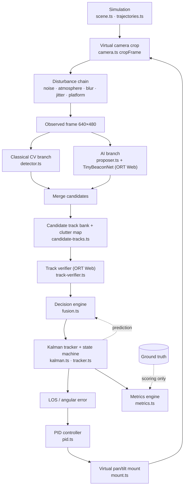

<p class="caption">Figure A. Runtime architecture. Solid arrows are the closed loop executed every frame by
<code>SimulationRunner.step / stepAsync</code> (<code>simulation.ts</code>); ground truth reaches only the metrics
engine.</p>

| Block | Responsibility | Source |
|---|---|---|
| Simulation | Beacon trajectory, scene raster, decoys, starfield | `scene.ts`, `trajectories.ts` |
| Virtual camera | Pose (pan, tilt), sensor-window crop | `camera.ts` |
| Disturbance chain | Corrupts the observed frame only | `camera.ts` `applyDisturbances`, `scene.ts` blur/smear |
| Classical CV | Threshold, connected components, centroid, confidence | `detector.ts` `ClassicalDetector` |
| AI branch | Local-contrast proposals scored by a CNN | `proposer.ts`, `nn.ts`, `detector-ai.ts` |
| Track bank / verifier | Multi-frame evidence per candidate; learned P(beacon) | `candidate-tracks.ts`, `track-verifier.ts` |
| Decision engine | Weighted score, hard gates, hysteresis | `fusion.ts` `fuse()` |
| Kalman + state machine | Estimate, predict, lifecycle | `kalman.ts`, `tracker.ts` |
| LOS + PID | Pixel → angle → rate command | `pid.ts` `PIDAngleController.compute` |
| Mount | Rate/acceleration/travel limits; sole writer of pose | `mount.ts` `ReceiverMount.step` |
| Metrics | PS-169 gates and statistics | `metrics.ts` `MetricsEngine` |
| Orchestration | One canonical frame loop for UI, benchmark, tests | `simulation.ts`, `pipeline.ts` |

---

## 6. Detailed Data Flow of One Frame

This is the order of operations in `SimulationRunner.step()` / `stepAsync()` and `Pipeline.step()` /
`stepAsync()` (verified in source):

1. **Trajectory.** `trajectory.at(t)` gives the beacon's scene position and velocity (ground truth).
2. **Blink.** If `blinkPeriodS > 0`, the beacon is hidden for the first 12 % of each period.
3. **Exposure smear.** If `exposureMs > 0`, the beacon's motion relative to the sensor window and the
   window's own slew are converted into smear vectors.
4. **Render.** `renderScene` stamps decoys and the beacon onto the background (optical PSF blur if set).
5. **Pose offsets.** Platform motion offset and Gaussian jitter (clamped) are added to the boresight.
6. **Crop.** `cropFrame` copies the 640 × 480 sensor window from the scene.
7. **Disturbances.** Salt & pepper → Gaussian → Poisson → atmosphere → rain streaks, on the frame only.
8. **Packet.** A `FramePacket` is built: frame, timestamp, mount pose; ground truth is attached for the
   metrics branch.
9. **Context.** The pipeline hands the detector the tracker's own state, Kalman prediction and the mount
   pose (`setContext`).
10. **Classical CV.** `ClassicalDetector.detectCandidates` returns up to 12 candidates.
11. **AI branch.** `LocalContrastProposer.propose` returns up to 6 spots; `mergeBranchCandidates` merges
    them (source `cv`, `ai` or `both`).
12. **CNN.** All merged candidates are cropped (`buildPatchBatch`) and scored in one ONNX Runtime call.
13. **Track bank.** `CandidateTrackBank.update` associates candidates into world-frame tracks and fits
    velocities; feature rows are scored in one call by the track verifier; the clutter map is updated.
14. **Decision.** `fuse()` scores, gates and selects one candidate (or none), with provenance.
15. **Tracker.** `Tracker.update` predicts, corrects with the selected measurement, and advances the state
    machine.
16. **LOS.** The estimate's pixel offset from the image centre becomes an angular error.
17. **PID.** `PIDAngleController.compute` produces pan/tilt rate commands (or the scan point is tracked
    in SEARCH).
18. **Mount.** `ReceiverMount.step` applies rate saturation, acceleration and travel limits and writes the
    new pose.
19. **Metrics and logs.** `MetricsEngine.onFrame` scores the frame against ground truth; the worker emits
    telemetry and log entries; the next frame is rendered from the new pose.

---

## 7. Virtual Environment and Camera Model

**IMPLEMENTED** (`scene.ts`, `camera.ts`, `config.ts`).

| Parameter | Value (default) | Configurable range |
|---|---|---|
| Scene | 2000 × 2000 px, background grey level 18 | 2000–4096; background 0–80 |
| Starfield | ⌊W·H / 2600⌋ single pixels at background + 8 … + 29 | fixed |
| Sensor | 640 × 480, monochrome, 8-bit | 160–1280 × 120–1024 |
| FOV | 4.0° × 3.0° | 0.5–30° |
| Frame rate | 30 Hz | 20–120 Hz |
| Initial pose | pan = 0°, tilt = 0° (scene centre) | — |

**Angular scale.** The sensor samples the scene one-to-one, so

$$ k_x = \frac{W_\text{img}}{\text{FOV}_x} = \frac{640}{4^\circ} = 160\ \text{px/°},\qquad k_y = \frac{480}{3^\circ} = 160\ \text{px/°}. $$

**Projection (scene → image).** The model is planar (a 2-D angular scene, not a 3-D world with a pinhole
camera). The sensor window centre in scene pixels is

$$ c_x = \tfrac{W_s}{2} + \text{pan}\cdot k_x + o_x,\qquad c_y = \tfrac{H_s}{2} + \text{tilt}\cdot k_y + o_y, $$

where $(o_x, o_y)$ is the platform-motion plus jitter offset. A scene point $(X, Y)$ appears at image
coordinates $u = X - (c_x - W_\text{img}/2)$, $v = Y - (c_y - H_\text{img}/2)$. Mount travel is limited so
the window never leaves the scene: $|\text{pan}| \le (W_s/2 - W_\text{img}/2)/k_x = 4.25°$ and
$|\text{tilt}| \le (H_s/2 - H_\text{img}/2)/k_y = 4.75°$ at defaults. A full 3-D world model, lens
distortion and perspective projection are **NOT IMPLEMENTED**.

---

## 8. Optical Beacon Model

**IMPLEMENTED** (`scene.ts`, `trajectories.ts`).

| Property | Model |
|---|---|
| Shape | square (default) or circle (pixel-centre inside radius) |
| Size | 5–20 px side/diameter, default 10 |
| Intensity | grey level = round(235 × intensity), intensity 0.2–1.0, default 1.0 |
| Start | user-defined, or random within ±220 px of scene centre on both axes |
| Visibility | hidden during blink-off, or by the debug "kill beacon" control |
| Blur | optional Gaussian PSF, σ 0–4 px (default 0) |
| Motion smear | optional, from exposure time 0–33 ms (default 0) |

**Trajectories** (scene px; `speed` multiplier default 1.2):

| Model | Equation / behaviour (from source) |
|---|---|
| Straight | constant velocity of 60·speed px/s at a seeded random heading, reflecting at scene margins |
| Circular | $x = c_x + r(\cos a - 1),\ y = c_y + r\sin a$, $a = \omega t$ (circle passes through the start point) |
| Figure-8 | $x = c_x + a\sin\omega t,\ y = c_y + b\sin(2\omega t + \varphi)$ |
| Random | velocity re-drawn and smoothed ($v \leftarrow 0.55v + 0.45 v_\text{new}$) at 90·speed px/s, bounded |
| Spiral | outward spiral, radius growing linearly from 0 |
| Sinusoidal | $x = c_x + a\sin(0.7\omega t),\ y = c_y + b\sin\omega t + \text{drift}$, clamped |

**Ground truth vs observation.** The beacon's trajectory position is the *ground truth*. It is used (i)
to render the scene and (ii) by the metrics engine to score the run. The detector, track bank, verifier,
decision engine, Kalman filter and controller receive only the *observation* — the disturbed frame — plus
the system's own state (its Kalman estimate and mount encoder pose). This is enforced by tests that
inspect the source of every perception and control file for ground-truth identifiers
(`tests/engine-evidence.test.ts`, `tests/ai-integrity.test.ts`, `tests/ai-runtime.test.ts`).

---

## 9. Disturbance Model

**IMPLEMENTED.** Applied in this order to the observed frame only (`applyDisturbances`, `camera.ts`).

| Disturbance | Physical interpretation | Implementation | Parameters | Effect on tracking |
|---|---|---|---|---|
| Salt & pepper | dead/hot pixels, bit errors | ⌊p·N⌋ random pixels set to 0 or 255 | 0–40 % (PS suggests 10 %) | isolated false peaks |
| Gaussian | read/thermal noise | $v \leftarrow v + \sigma\,\mathcal N(0,1)$, clipped 0–255 | σ 0–20 | blob-edge jitter, threshold crossings |
| Poisson | photon shot noise | normal approximation, λ = v/12, $v' = 12(\lambda + \sqrt\lambda\,\mathcal N)$ | on/off | intensity-dependent fluctuation |
| Atmosphere | haze, fog, rain, low light | $v' = (v-24)\,c + 24\,b + (1-b)\cdot 90$ | haze c ≤ 0.55, b ≤ 0.9; fog 0.32/0.78; rain 0.70/0.85; low light 0.80/0.45 | contrast loss; background lift |
| Rain streaks | rain drops | 70 streaks of 5–16 px, +22…+47 grey levels | rain mode | false elongated candidates |
| Camera jitter | high-frequency platform vibration | per-axis $\mathcal N(0, (j/2)^2)$ offset, magnitude clamped to $j$ | j = 0–20 px/frame | image shifts between frames |
| Platform motion | slow platform movement | analytic offsets: linear, circular, figure-8, spiral, random | amplitude 0–20 px, speed 0.05–4 | apparent target motion |
| Optical blur | defocus, turbulence spreading | separable Gaussian PSF on every spot | σ 0–4 px | lower peak, wider spot |
| Motion smear | exposure-time blur | spot swept along relative motion over the exposure | 0–33 ms | elongated, dimmer beacon |
| Bright decoys | other light sources | static spots, 6–15 px, intensity range configurable | count 0–12 | false locks (§31.1) |
| Blink / kill | beacon occlusion | beacon not rendered | period, frames | detection loss, re-acquisition |

Known modelling defect (documented, not changed, because published results depend on it): in `low_light`
the airlight term $(1-b)\cdot90$ *brightens* the background by about +41 grey levels, lifting dim decoys
above the classical threshold. Turbulence-induced beam wander and scintillation are **NOT IMPLEMENTED**.

---

## 10. Classical Computer-Vision Pipeline

**IMPLEMENTED** (`ClassicalDetector`, `detector.ts`). The frames are already monochrome, so there is no
colour conversion; **no denoising, morphology or contour stage exists** in the build.

| Stage | What it does | Parameters | Why |
|---|---|---|---|
| Threshold | pixels with $v \ge T$ are foreground | T = 90 | the beacon is the brightest object in a dark sky |
| Connected components | 4-connectivity iterative flood fill | — | groups pixels into blobs, no recursion |
| Area filter | keep blobs with area in [4, 1200] px | min/max area | rejects single noise pixels and huge regions |
| Descriptors | brightness = peak/255; size affinity $s(A) = \max(0.15, A/A_0)$ if $A \le A_0$ else $\max(0.1, A_0/A)$ with $A_0$ = configured size²; shape = 1/aspect | — | prefers the configured beacon size and compact spots |
| Composite | $S = 0.45\,b + 0.35\,s + 0.20\,h$; confidence $= \min(1, 1.25\,S)$ | — | single ranking score |
| Temporal gate | with a Kalman hint: ×1 if d < 60 px, ×0.4 if d < 140 px, else ×0.05 | — | sticky tracking |
| Cold-search floor | reject if confidence < 0.5 and no hint | 0.5 | stops locking onto rain/noise when the beacon is out of view |
| Centroid | intensity-weighted centroid of the chosen blob | — | sub-pixel position |

Advantages: deterministic, ~0.3–0.5 ms per frame (MEASURED, §28.4), excellent localisation (0.8 px
centroiding error, §29.2). Limitations: a fixed threshold misses a beacon below it (§27: dim beacon, recall
0), and it has no way to tell a decoy from the beacon except configured size and brightness. Classical CV
is retained in the hybrid because it is the more accurate localiser and an independent second opinion.

---

## 11. AI Model

**IMPLEMENTED.** The model is **not YOLO** and does not regress bounding boxes. It is a binary ROI
classifier, *TinyBeaconNet*, applied to candidate locations, plus a second learned model that judges
candidate *tracks*. Both are specified in Appendix B.

| Field | TinyBeaconNet `beacon-roi-v2` | Track verifier `track-verifier-v1` |
|---|---|---|
| Family | small CNN, binary classifier | multilayer perceptron, binary classifier |
| Architecture | conv3×3 1→8, ReLU, max-pool 2 · conv3×3 8→12, ReLU, max-pool 2 · conv3×3 12→16, ReLU · global average pool · dense 16→16, ReLU · dense 16→1, sigmoid | standardise (train mean/std) · dense 8→12, ReLU · dense 12→1, sigmoid |
| Parameters | 2,989 | 121 (8·12+12+12+1) |
| Input | `patches` float32 [N, 1, 24, 24] | `features` float32 [N, 8] |
| Output | `p_beacon` [N, 1], P(ROI contains beacon) | `p_beacon` [N, 1], calibrated P(track is beacon) |
| Classes | 1 (beacon) vs background | 1 (beacon track) vs other |
| Thresholds | `ai` detector accepts ≥ 0.50; hybrid: veto below 0.35, reject below 0.12 without temporal support, AI-only spot needs ≥ 0.60 | decoy ≤ 0.20 (age ≥ 30); verified ≥ 0.75 (age ≥ 15); AI-only start ≥ 0.5 (age ≥ 10) |
| NMS | none in the model; the proposer applies 10 px non-maximum suppression | — |
| Format / runtime | ONNX opset 17, ONNX Runtime Web 1.30.0 (WASM) | same |
| File / SHA-256 | `beacon-roi-v2.onnx` (14,422 B) <br/><code class="hash">1bb8a7ded0f6d9b1bd34b103e383ef66f1be33af3ae000f2f8b623a24e84ffbb</code> | `track-verifier-v1.onnx` (1,196 B) <br/><code class="hash">c5fd64314968a0b0a5189f9dc02b313076beca9174b3e7221a40e8de729d67ad</code> |

**Why this model.** The plan's Phase 12 required full-frame detection (Mode 1) and candidate verification
(Mode 2) to be implemented and measured. Both were: the same CNN applied densely over the 640 × 480 frame
costs 822 ms per frame against 9.9 ms for Mode 2 (MEASURED, §28.5) — far beyond the
33.3 ms budget at 30 Hz. The beacon is 5–20 px in a 307,200-pixel frame, so a full-frame network spends
almost all its arithmetic on empty sky. A 24 × 24 crop around each candidate is enough context.

---

## 12. Dataset

### 12.1 Real data — Zenodo laser-spot set

| Item | Value (verified from the files) |
|---|---|
| Source | D. Torielli, *Laser Pointer Spot Annotated RGB Images*, Zenodo, v2, 2025, DOI 10.5281/zenodo.15230870 [2] |
| Licence | CC BY 4.0 |
| Training images | 309 (`train`) + 76 (`valid`) = 385, Intel RealSense D435, 1280 × 720 |
| Test images | 56, smartphone camera, 1280 × 720, 45 spot annotations (some images have none) |
| Annotation format | YOLO (train/valid), COCO (test) |
| Classes | 1, `Laser` |
| Content | laser-pointer spots projected on indoor surfaces of different materials and colours |

**Why it is useful but not sufficient.** It is real optical-spot data from two different cameras, which
gives a genuine cross-camera generalisation test. But it is not the FSOC domain: indoor lit scenes, no
dark sky, no atmospheric attenuation, no sensor-noise model, no platform motion, no competing bright
objects. A measurement on this set shows the spot is the frame's brightest pixel in only 21 % of images,
so even its proposal mechanism had to differ (local contrast, not global threshold).

### 12.2 Synthetic FSOC data

Generated by `scripts/gen-synthetic-dataset.ts`, which drives the shipped `SimulationRunner` with randomised
recipes (beacon size/intensity/shape, decoys, noise family, atmosphere, jitter, platform motion, optical
blur on 50 % of recipes, exposure smear on 40 %). Ground truth writes the YOLO labels only.

| Split | Recipes | Seeds | Images | With beacon / empty |
|---|---|---|---|---|
| train | 180 | 700,000 + 17k | 5,040 | — |
| valid | 45 | 900,000 + 17k | 1,260 | — |
| test_stress (**locked**) | 40 | 1,100,000 + 17k | 1,120 | — |
| total | 265 | — | 7,420 | 5,120 / 2,300 |

### 12.3 Splits used for training

| Split | Patches (pos / neg) | Role |
|---|---|---|
| real_train | 3,849 (1,995 / 1,854) | Stage A training |
| real_valid | 897 (441 / 456) | Stage A model selection |
| synth_train | 49,406 (24,626 / 24,780) | Stage B training |
| synth_valid | 12,488 (6,328 / 6,160) | Stage B model selection |
| real_test (**locked**) | 615 (315 / 300) | reported once |
| synth_stress_test (**locked**) | 10,486 (4,886 / 5,600) | reported once |

The track verifier uses a separate dataset of candidate *tracks* harvested from 180 closed-loop simulator
recipes (`scripts/ai/gen-track-dataset.ts`): 29,180 training samples (9,876 beacon), 5,955 validation and
7,415 locked test, from disjoint seed ranges (2,000,000 / 2,500,000 / 2,900,000 + 13k).

---

## 13. Data Preprocessing and Augmentation

**IMPLEMENTED** (`scripts/ai/common.py`, mirrored bit-for-bit in `src/engine/nn.ts`).

| Step | Detail |
|---|---|
| Image format | 8-bit greyscale (real RGB images converted with PIL `convert('L')`) |
| Resizing | **none** — ROIs are cut at native resolution |
| ROI crop | 24 × 24 window centred on the candidate, edge replication at borders |
| Normalisation | subtract median of the 2-px border ring, divide by 128, clip to [−1, 2] |
| Positives | true spot centres plus 6 jittered copies: (2,−1), (−2,1), (1,2), (−1,−2), (3,0), (0,−3) px |
| Negatives | top-hat (image − 15×15 box mean) peaks, contrast ≥ 12, NMS 10 px, ≥ 22 px from any spot; ≤ 6 per image (≤ 5 synthetic) |
| Test isolation | the smartphone set is read only into `real_test`; the stress split only into `synth_stress_test` |
| Augmentation (training only) | random 90° rotations and horizontal flips; amplitude × U(0.75, 1.3); additive Gaussian noise σ = 0.035 (normalised units) |

Scale, crop-shift, contrast and blur augmentations beyond the above are **NOT IMPLEMENTED** as
augmentations; blur and smear enter through the synthetic generator instead.

---

## 14. Two-Stage Training

**IMPLEMENTED** (`scripts/ai/train_roi.py`). MEASURED results from `public/models/beacon-roi-v2.json`.

| | Stage A | Stage B |
|---|---|---|
| Data | real_train | real_train + synth_train (real kept to avoid forgetting) |
| Selection | real_valid F1 | real_valid + synth_valid F1 |
| Epochs | 40 | 40 |
| Optimiser / LR | Adam, 2 × 10⁻³, cosine annealing | Adam, 1 × 10⁻³, cosine annealing |
| Batch size | 256 | 256 |
| Loss | binary cross-entropy with logits | same |
| Seed | 7 | 8 |
| Hardware | CPU (PyTorch 2.14.0+cpu), Intel Core i3-1215U | same |
| Training time | not recorded | not recorded |

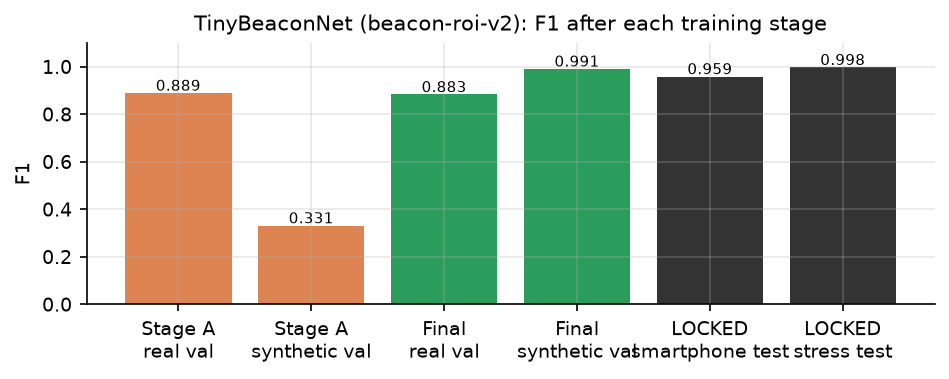
<p class="caption">Figure 1. TinyBeaconNet F1 after each stage (MEASURED). Stage A alone reaches F1 0.8891 on real
data but only 0.3314 on the FSOC domain — the case for Stage B.</p>

**Domain gap.** Stage A teaches real optical-spot appearance; on simulator data it scores F1
0.3314, barely better than chance. Stage B adds the FSOC domain. **Overfitting control:** best
epoch selected on validation only; small model; augmentation. **Leakage control:** locked splits read once
at the end; disjoint seed ranges for every synthetic split. **Track verifier** (`train_track_verifier.py`):
40 epochs, Adam 3 × 10⁻³, batch 1,024, *unweighted* BCE (an earlier class-weighted version produced
inflated, uncalibrated probabilities), epoch selected on validation log-loss.

---

## 15. AI Inference Pipeline and Runtime

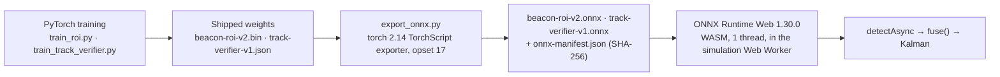

At runtime (`HybridFusionDetector.detectAsync`): candidates → `buildPatchBatch` (identical crop and
normalisation) → one `InferenceSession.run` → probabilities → track bank → feature rows → one verifier
`run` → `fuse()`. The ONNX graphs include the sigmoid and (for the verifier) the standardisation.
Execution mode: **CPU via WebAssembly**, single thread, no proxy worker; no GPU, WebGPU or WebGL
provider is used. WASM artefacts are served from the app (`public/ort/`), so the system runs offline.

| Verification (MEASURED) | Result |
|---|---|
| ONNX vs PyTorch (export script) | max \|Δ\| 3.6 × 10⁻⁷ (CNN), 7.5 × 10⁻⁸ (verifier) |
| ORT vs TypeScript on a live browser frame | \|Δ\| 5.5 × 10⁻⁸ (`benchmark-results/browser-e2e/evidence.json`) |
| ORT vs TypeScript decisions, 240 closed-loop frames | identical (`tests/ai-runtime.test.ts`) |
| Browser session creation | 477 ms (Chrome, 2026-10-04) |

If ORT cannot start, the worker logs a warning and uses the in-engine TypeScript forward pass of the same
weights; every frame's provenance records which runtime produced the scores, so this cannot be hidden.

---

## 16. Classical CV + AI Fusion

**Why neither alone.** Classical CV finds compact bright blobs quickly and localises them precisely, but
cannot distinguish a decoy from the beacon and cannot see below its threshold. The CNN recognises
"optical spot" vs "not a spot" across cameras, but — measured — cannot reject bright decoys, because
PS-169 lets the beacon be 5–20 px and the decoys are 6–15 px: "wrong size" is not a property the model is
allowed to learn. On its own the CNN's appearance score separates beacon tracks from decoy tracks at only
AUC 0.755 (§28.2). What separates them is *behaviour over time*: decoys are fixed in the world; the beacon
rides a mobile terminal.

**Candidate generation.** Classical candidates (≤ 12) and AI-branch spots (≤ 6) are merged; a spot found
by both (≤ 6 px apart) becomes one candidate labelled `both` with the classical geometry.

**Temporal evidence (track bank).** Each candidate's world position is computed from the mount's own
encoder pose: $w_x = \text{pan}\cdot k_x + (u - 320)$. When ≥ 3 tracks are matched, the median
frame-to-frame displacement (common-mode shake: jitter and platform motion) is removed. Association is
greedy nearest-first within 30 px (60 px if common-mode cannot be estimated). Each track keeps a 30-frame
history; world speed is the least-squares slope; reliability $= \min(1, (n-1)/20)$. Features: mean CNN
score, mean classical composite, mean size affinity, mean brightness, speed, reliability, speed ×
reliability, persistence (EMA weight 0.2). Tracks ≥ 45 frames old with P ≤ 0.20 are written to a
**clutter map** (30 px radius).

**Decision formula** (`fuse()`, `fusion.ts`). For candidate $i$ with classical confidence $c_i$, shape
$h_i$, brightness $b_i$, CNN score $a_i$, distance $d_i$ to the Kalman prediction and verifier
probability $p_i$:

$$ m_i = \frac{1}{1 + (d_i/45)^2}\ \ (\text{0.5 if no prediction}),\qquad \text{veto}(a_i) = \begin{cases} 0.3\,(a_i - 0.35)/0.35 & a_i < 0.35\\ 0 & \text{otherwise}\end{cases} $$

$$ S_i = w_c c_i + w_m m_i + w_h h_i + w_b b_i + \text{veto}(a_i) + 0.4\,(p_i - 0.5)\cdot[\text{age}_i \ge 6] $$

with $(w_c, w_m, w_h, w_b) = (0.58, 0, 0.17, 0.25)$ in cold search and $(0.30, 0.55, 0.06, 0.09)$ when a
prediction exists. While locked, a candidate more than 55 px from the incumbent is multiplied by 0.45
(hysteresis) unless it is a *verified challenger* (age ≥ 15, $p \ge 0.75$, and the incumbent's $p \le
0.35$ or exceeded by ≥ 0.35); in that case proximity to the incumbent's own prediction is treated as
neutral. Reported confidence $= \min(1, 1.15\,S)$; in cold search a choice below 0.5 is rejected.

**Hard rejection gates** (in order): (1) CNN < 0.12 with no temporal support; (2) AI-only spot with CNN <
0.60 and no temporal support; (3) AI-only spot not yet verified (age < 10 or $p$ < 0.5); (4) established
decoy: age ≥ 30 and $p \le 0.20$, *even if exactly where the Kalman filter predicts*; (5) on the clutter
map with no temporal support. "Temporal support" = a prediction exists, it is not doubted, and $m_i \ge
0.35$.

| Situation | Behaviour |
|---|---|
| CV and AI agree | `agreement`; classical geometry used |
| CV and AI disagree | weighted score decides; recorded as `disagreed` |
| AI strongly rejects a CV candidate | rejected unless temporally supported (edge-clipped or fogged beacon on its predicted path) |
| CV finds, AI does not | still scored; CNN only vetoes, never promotes |
| AI finds, CV does not | allowed only after the CNN (≥ 0.6) and the verifier (age ≥ 10, $p$ ≥ 0.5) agree |
| No candidate | no measurement; tracker predicts, then searches |
| Multiple candidates | highest score after gates and hysteresis |

---

## 17. Decision State Machine

**IMPLEMENTED** (`tracker.ts`). States: `SEARCH`, `CANDIDATE`, `ACQUIRE`, `TRACK`, `PREDICT_REACQUIRE`.
There is no separate `LOST` state; loss returns to `SEARCH`.

| State | Entry | Actions | Exit |
|---|---|---|---|
| SEARCH | start; candidate disconfirmed; prediction timed out | camera follows an expanding scan pattern; no prediction hint | any accepted detection → CANDIDATE |
| CANDIDATE | first detection | Kalman initialised; camera steers to estimate | 2 consecutive detections → ACQUIRE; 8 misses → SEARCH |
| ACQUIRE | 2nd detection; or a deliberate target switch | confirm | streak ≥ 3 → TRACK (acquisition or re-acquisition event); 8 misses → SEARCH |
| TRACK | confirmed | PID on Kalman estimate | 2 misses → PREDICT_REACQUIRE (loss event); `newTarget` → ACQUIRE |
| PREDICT_REACQUIRE | short loss | Kalman coasts; camera follows prediction | detection → TRACK (re-acquisition); 30 misses → SEARCH |

A detection more than 50 px from the previous one during CANDIDATE/ACQUIRE restarts the confirmation
streak. When the hybrid deliberately moves to a different object while locked (`newTarget`), the Kalman
state is reset, the switch is recorded as a loss followed by a re-acquisition, and the new target must be
re-confirmed. **Why AI must not drive the camera directly:** a per-frame score has no memory; a single
confident decoy frame would slew the mount. Every detection passes through the same confirmation,
gating and hysteresis.

**Temporal-consistency bug and fix (part of the final build).** With no Kalman prediction, motion
consistency is a neutral 0.5 so that candidates are not penalised for evidence they cannot have. An early
version read that 0.5 as *temporal support*, which disabled the CNN's rejection gate for the whole of
SEARCH — exactly when false locks form. Fix: temporal support requires that a prediction exists (and,
in the final build, is not doubted). Regression test: `tests/ai-integrity.test.ts`, "the model can veto
during a cold search".

---

## 18. Kalman Filter

**IMPLEMENTED** (`Kalman2D`, `kalman.ts`). State $\mathbf s = [x, y, v_x, v_y]^\top$ in image pixels;
constant-velocity model.

$$ \mathbf F = \begin{bmatrix} 1&0&\Delta t&0\\ 0&1&0&\Delta t\\ 0&0&1&0\\ 0&0&0&1\end{bmatrix},\qquad \mathbf H = \begin{bmatrix}1&0&0&0\\0&1&0&0\end{bmatrix} $$

Prediction: $\hat{\mathbf s}^- = \mathbf F\hat{\mathbf s}$, $\mathbf P^- = \mathbf F\mathbf P\mathbf F^\top + \mathbf Q$ with
$\mathbf Q = \text{diag}(q, q, q/2, q/2)$ (velocity cross-covariance reset to 0). Update:
$\mathbf K = \mathbf P^-\mathbf H^\top(\mathbf H\mathbf P^-\mathbf H^\top + \mathbf R)^{-1}$,
$\hat{\mathbf s} = \hat{\mathbf s}^- + \mathbf K(\mathbf z - \mathbf H\hat{\mathbf s}^-)$,
$\mathbf P = (\mathbf I - \mathbf K\mathbf H)\mathbf P^-$, with $\mathbf R = r\,\mathbf I_2$. Defaults: $q = 0.6$, $r =
4.0$. On the first measurement the state is set to it with zero velocity and $\mathbf P = \text{diag}(r, r, 25,
25)$. A singular innovation covariance skips the update. Prediction runs every frame, measurement or not,
which smooths frame-to-frame detection jitter and carries the estimate through short gaps (the judge demo
coasts 0.93 s on prediction, §29.2).

---

## 19. LOS / Angular Error

**IMPLEMENTED** (`PIDAngleController.compute`). With the target estimate $(x, y)$ and image centre $(320,
240)$:

$$ e_x = x - 320,\quad e_y = y - 240,\qquad \theta_x = \frac{e_x}{640}\cdot 4^\circ,\quad \theta_y = \frac{e_y}{480}\cdot 3^\circ $$

so 16 px of error is 0.1° (asserted in `tests/engine-unit.test.ts`). $\theta_x$ drives pan and
$\theta_y$ drives tilt. Lens intrinsics beyond FOV/resolution are **NOT IMPLEMENTED** (no distortion).

---

## 20. PID Controller

**IMPLEMENTED** (`pid.ts`), in angle space:

$$ u = K_p\,\theta + K_i \int \theta\,dt + K_d\,\frac{d\theta}{dt},\qquad u \in [-\omega_{max}, +\omega_{max}] $$

| Parameter | Value (default) | Role |
|---|---|---|
| $K_p$ | 2.2 | rate proportional to angular error |
| $K_i$ | 0.25 | removes steady lag behind a moving target |
| $K_d$ | 0.35 | damps overshoot |
| Integrator clamp | ±8 °·s | anti-windup |
| Deadband | 0.02° on both axes | no command when centred |
| Output saturation | ±max pan/tilt speed (5 °/s) | respects PS rows 13–14 |
| Integrator reset | on entering SEARCH or ACQUIRE | prevents stale integral after loss |

In SEARCH the same controller tracks a moving scan point (`ScanPattern`: raster or spiral, expanding
from where the camera points, at 0.9 × max slew). PID is used because the plant (a rate-commanded
mount) is simple and its behaviour is transparent and tunable; model-predictive or adaptive control is
**NOT IMPLEMENTED**.

---

## 21. Virtual Pan-Tilt Mount

**IMPLEMENTED** (`ReceiverMount.step`, `mount.ts`). The mount is the only code that changes camera pose.

| Property | Model |
|---|---|
| Command | pan/tilt rate (°/s) from the controller |
| Rate saturation | ±max pan/tilt speed (default 5 °/s) |
| Acceleration limit | 40 °/s² (configurable 5–500); reaches 5 °/s in ~0.13 s |
| Travel limit | pose clamped so the window stays in the scene; rate zeroed at the stop |
| Integration | pose += achieved rate × Δt |
| Telemetry | commanded and achieved rates, saturation/acceleration/travel flags, effort |

Response delay beyond the acceleration limit, backlash and resonance are **NOT IMPLEMENTED**.

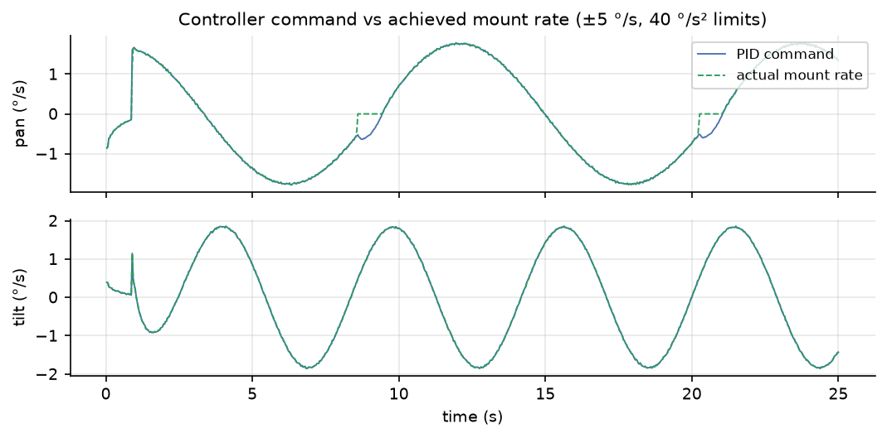
<p class="caption">Figure 2. Controller command vs achieved mount rate (MEASURED, hybrid, decoy scene, seed 4402,
<code>scripts/report-timeseries.ts</code>). The two differ during transients because of the acceleration limit.</p>

---

## 22. Tracking Lifecycle — a Measured Example

Bright-decoy scene, seed 4402, hybrid detector on ONNX Runtime Web (`docs/report/data/hybrid_decoys_4402.csv`):

1. **t = 0.03 s.** The beacon is outside the FOV; a bright decoy is in view. The classical branch and the
   CNN both rate the decoy highly; the system enters CANDIDATE, then TRACK on the decoy at t ≈ 0.10 s.
2. **t ≈ 0.1–1 s.** The decoy's track ages. Its world speed stays ≈ 0 px/s; the verifier's P(beacon)
   falls.
3. **t ≈ 1 s.** The beacon enters the FOV; its track shows ≈ 100–400 px/s world motion and P → 0.99.
   The decoy (P ≤ 0.20, age ≥ 30) is rejected outright and written to the clutter map; the verified
   challenger takes the lock; the tracker re-confirms (loss + re-acquisition events).
4. **t > 1.5 s.** Error stays mostly between 1 and 10 px for the rest of the run (Figure 3).

With the classical detector the identical scene never leaves the decoy (mean error 429 px, 0 % correct
lock). When the target leaves the FOV, the tracker coasts on prediction for up to 30 frames
(PREDICT_REACQUIRE), then returns to SEARCH, whose scan starts from where the camera is pointing.

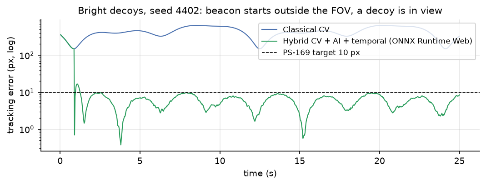
<p class="caption">Figure 3. Tracking error vs time, same scene and seed, classical vs hybrid (MEASURED).</p>

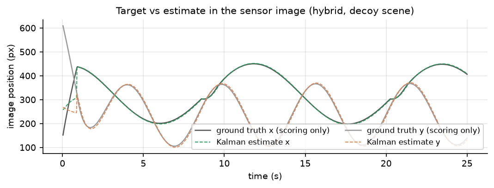
<p class="caption">Figure 4. Ground-truth beacon position (scoring only) vs Kalman estimate, hybrid (MEASURED).</p>

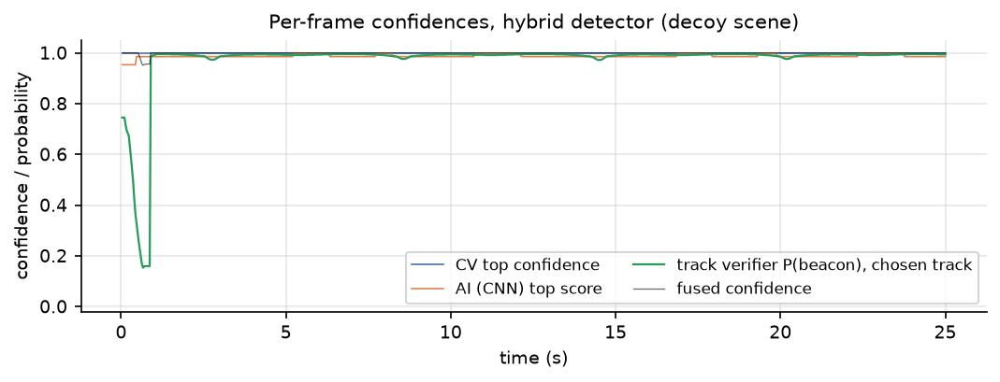
<p class="caption">Figure 5. Classical confidence, CNN score, verifier probability and fused confidence vs time
(MEASURED). The classical and CNN scores stay near 1 for both the decoy and the beacon; only the
verifier separates them.</p>

---

## 23. Performance Metrics

**IMPLEMENTED** (`metrics.ts`, `scripts/eval-detectors.ts`). Ground truth is used here and only here.

| Metric | Definition (as computed) |
|---|---|
| Acquisition time | $t$ of the first frame in TRACK (any lock, PS definition) |
| Correct acquisition (evaluation only) | $t$ of the first frame in TRACK/PREDICT with error ≤ lock radius (10 px) |
| Tracking error | $e = \lVert \hat{\mathbf p}_\text{Kalman} - \mathbf p_\text{GT}\rVert_2$ per frame with an estimate |
| Average / max / RMSE error | mean, maximum, $\sqrt{\text{mean}(e^2)}$ over those frames; p95/p99 also reported |
| Centroiding error | $\lVert \mathbf p_\text{detector} - \mathbf p_\text{GT}\rVert$ when the beacon is in frame (raw detector, not Kalman) |
| False-positive frames | detections reported while the beacon is outside the frame |
| Target loss | frames in SEARCH / total frames × 100 |
| Lock retention | frames locked (error ≤ 10 px) / frames in TRACK or PREDICT × 100 |
| Correct lock (evaluation only) | frames locked on the beacon / frames the beacon is in view × 100 |
| Re-acquisition time | $t$(re-entry to TRACK) − $t$(confirmed loss); mean and max |
| Algorithm FPS | frames processed / summed pipeline time |
| Wall-clock FPS | frames / elapsed wall time |
| Processing / detector latency | mean per-frame pipeline / detector time (ms) |
| Detection rate, track continuity | % frames with a detection; longest TRACK streak |
| Precision / recall / miss rate (Arm A) | hit = detection within 8 px of truth while visible |

mAP is **NOT MEASURED** (the model does not output boxes).

---

## 24. Experimental Methodology

| Item | Value |
|---|---|
| Hardware | 12th Gen Intel(R) Core(TM) i3-1215U, 8 logical threads (win32) |
| OS | Windows 11 |
| Runtime | Bun 1.4.2; ONNX Runtime Web 1.30.0 (WASM, 1 thread); browser checks in Chrome 154 |
| Model versions | `beacon-roi-v2`, `track-verifier-v1` (hashes §11) |
| Simulation | 30 Hz, fixed Δt = 1/30 s in benchmarks; scene 2000², sensor 640 × 480, FOV 4° × 3° |
| PS-169 benchmark | 14 presets × 5 seeds (`scripts/batch-test.ts`), classical detector, mean of 5 seeds gated |
| Detector comparison | 13 conditions × 3 detectors × 6 seeds (4200 + 101k), 25 s per run (`scripts/eval-resumable.sh`) |
| Arm A | camera frozen (controller off), detector asked cold every frame — perception only |
| Arm B | full closed loop; medians across seeds; diverged seeds (mean error > 50 px) counted |
| Seeds | fixed, so every detector sees identical scenes; disjoint from all training and from development seeds (9100 + 37k) used for tuning |

Fixed seeds make every run exactly reproducible and make detector comparisons paired: a difference
between detectors on the same seed is caused by the detector, not by a different scene.

---

## 25. Benchmark Scenarios

| Scenario | Description | Purpose |
|---|---|---|
| PS169-01…04 | straight, circular, figure-8, random; clear | baseline closed loop per PS motion |
| PS169-05…07 | Gaussian σ 12; salt & pepper 10 %; Poisson | sensor noise |
| PS169-08 | camera jitter ±8 px/frame | vibration |
| PS169-09…12 | haze, fog, rain, low light | atmosphere |
| PS169-13 | platform motion | moving platform |
| PS169-14 | high disturbance (combined) | stress |
| Clear … Low light | as above, figure-8 default scene | detector comparison |
| Heavy sensor noise | S&P 2 %, σ 18, Poisson | noise stress |
| Camera jitter | ±16 px/frame | vibration stress |
| Optical blur + motion smear | PSF σ 2 px, exposure 20 ms, speed 2 | Phase-3 effects |
| Dim beacon | intensity 0.35 (level 82 < threshold 90) | below classical threshold |
| Blinking beacon | blink period 4 s | loss and re-acquisition |
| Bright decoys (+ noise, + jitter) | 10 decoys at 62–95 % intensity | false-lock resistance |
| Judge demonstration | figure-8, haze+noise, vibration, 7 s blackout | scripted causal chain |

Multiple simultaneous targets are **NOT IMPLEMENTED** as a scenario.

---

## 26. PS-169 Benchmark Results (Classical Detector)

MEASURED by `scripts/batch-test.ts` (`benchmark-results/2026-09-29T11-19-28-003Z/`); mean of 5 seeds per scenario; all five PS gates.

| Scenario | Acq (s) | Avg err (px) | Max err (px) | RMSE (px) | Centroid err (px) | Loss (%) | Lock (%) | Re-acq (s) | Alg. FPS | All 5 gates |
|---|---|---|---|---|---|---|---|---|---|---|
| PS169-01 Straight / Clear | 0.10 | 1.27 | 11.7 | 1.83 | 0.81 | 0.00 | 99.6 | — | 3435 | PASS |
| PS169-02 Circular / Clear | 0.10 | 1.08 | 12.0 | 1.58 | 0.85 | 0.00 | 99.4 | — | 4023 | PASS |
| PS169-03 Figure-8 / Clear | 0.60 | 6.04 | 24.2 | 6.76 | 0.83 | 1.67 | 96.4 | — | 3989 | PASS |
| PS169-04 Random / Clear | 0.10 | 1.12 | 11.3 | 1.68 | 0.85 | 0.00 | 99.4 | — | 3984 | PASS |
| PS169-05 Gaussian Noise | 0.10 | 1.67 | 12.8 | 2.37 | 0.83 | 0.00 | 99.4 | — | 2941 | PASS |
| PS169-06 Salt & Pepper | 0.10 | 1.82 | 16.1 | 2.64 | 0.84 | 0.00 | 99.1 | — | 720 | PASS |
| PS169-07 Poisson | 0.10 | 1.33 | 15.7 | 2.06 | 0.84 | 0.00 | 99.1 | — | 3069 | PASS |
| PS169-08 Camera Jitter | 1.55 | 7.14 | 32.5 | 8.19 | 0.84 | 4.82 | 80.8 | — | 3968 | PASS |
| PS169-09 Haze | 0.10 | 1.80 | 13.6 | 2.44 | 0.81 | 0.00 | 99.3 | — | 3940 | PASS |
| PS169-10 Fog | 0.10 | 1.13 | 10.9 | 1.57 | 0.85 | 0.00 | 99.6 | — | 3983 | PASS |
| PS169-11 Rain | 1.33 | 6.12 | 23.4 | 6.87 | 0.84 | 4.09 | 95.7 | — | 3766 | PASS |
| PS169-12 Low Light | 0.10 | 1.62 | 10.4 | 2.23 | 0.83 | 0.00 | 99.7 | — | 3843 | PASS |
| PS169-13 Platform Motion | 0.10 | 1.21 | 13.7 | 1.82 | 0.84 | 0.00 | 99.3 | — | 3953 | PASS |
| PS169-14 High Disturbance | 0.10 | 4.85 | 21.0 | 5.54 | 0.86 | 0.00 | 97.0 | — | 3489 | PASS |

**14/14 scenarios pass all five PS-169 gates** (mean of 5 seeds each). "—" = no loss occurred, so no re-acquisition was needed.

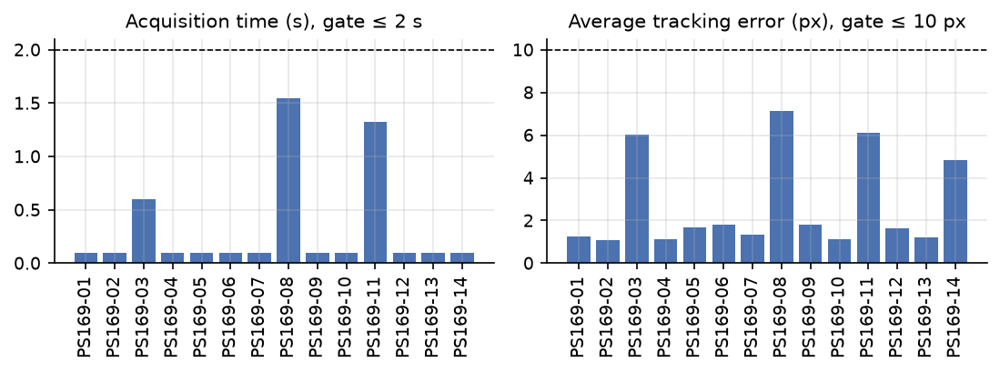
<p class="caption">Figure 6. Acquisition time and average tracking error per PS-169 scenario (MEASURED).</p>

The classical path is byte-identical to the originally published benchmark: all 70 seeded runs reproduce
exactly after every change made for the AI work.

---

## 27. Classical vs AI vs Hybrid

MEASURED (learned stages on onnxruntime-web 1.30.0 (wasm, 1 thread); 25 s per run; seeds 4200, 4301, 4402, 4503, 4604, 4705); same scenarios, same seeds for all three detectors.

### 27.1 Closed loop (Arm B): median correct-lock % · diverged seeds out of 6

| Condition | Classical | AI only | Hybrid | Hybrid median error | Hybrid correct acq |
|---|---|---|---|---|---|
| Clear | 95.6 % · 0/6 | 96.3 % · 0/6 | 95.6 % · 0/6 | 6.07 px | 0.55 s |
| Haze | 95.6 % · 0/6 | 95.6 % · 2/6 | 95.6 % · 0/6 | 6.07 px | 0.55 s |
| Fog | 95.6 % · 0/6 | 96.3 % · 0/6 | 95.6 % · 0/6 | 6.07 px | 0.55 s |
| Rain | 95.6 % · 0/6 | 93.6 % · 1/6 | 96.0 % · 0/6 | 6.07 px | 0.55 s |
| Low light | 95.6 % · 2/6 | 96.3 % · 0/6 | 96.4 % · 0/6 | 6.07 px | 0.55 s |
| Heavy sensor noise | 95.9 % · 2/6 | 95.8 % · 0/6 | 95.9 % · 1/6 | 6.06 px | 0.55 s |
| Camera jitter | 58.3 % · 0/6 | 58.4 % · 0/6 | 57.8 % · 0/6 | 9.37 px | 0.35 s |
| Optical blur + motion smear | 21.5 % · 0/6 | 21.7 % · 0/6 | 21.5 % · 0/6 | 15.10 px | 0.83 s |
| Dim beacon (below threshold) | 0.0 % · 0/6 | 31.1 % · 4/6 | 95.7 % · 2/6 | 6.11 px | 1.70 s |
| Blinking beacon (reacquisition) | 93.6 % · 0/6 | 90.5 % · 2/6 | 93.6 % · 0/6 | 10.55 px | 1.53 s |
| Bright decoys | 0.0 % · 4/6 | 2.9 % · 6/6 | 96.7 % · 2/6 | 17.19 px | 1.38 s |
| Bright decoys + noise | 0.0 % · 5/6 | 0.3 % · 6/6 | 96.8 % · 2/6 | 16.94 px | 1.03 s |
| Bright decoys + jitter | 0.0 % · 4/6 | 1.7 % · 6/6 | 60.1 % · 4/6 | 114.15 px | 4.67 s |

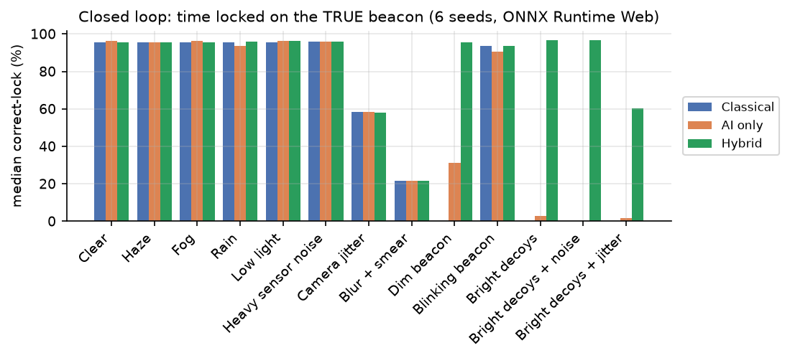
<p class="caption">Figure 7. Median time locked on the true beacon, per condition and detector (MEASURED).</p>

### 27.2 Perception on identical frames (Arm A): precision / recall / false alarms on empty frames

| Condition | Classical P / R / FA | AI only P / R / FA | Hybrid P / R / FA | Empty frames |
|---|---|---|---|---|
| Clear | 0.950 / 1.000 / 71 | 0.375 / 0.961 / 2111 | 0.950 / 0.996 / 71 | 3150 |
| Haze | 0.973 / 1.000 / 38 | 0.277 / 0.712 / 2120 | 0.963 / 0.996 / 51 | 3150 |
| Fog | 0.983 / 1.000 / 23 | 0.443 / 0.968 / 1602 | 0.969 / 1.000 / 43 | 3150 |
| Rain | 0.962 / 1.000 / 54 | 0.308 / 0.866 / 2442 | 0.945 / 0.996 / 78 | 3150 |
| Low light | 0.386 / 1.000 / 2145 | 0.376 / 0.963 / 2111 | 0.913 / 0.996 / 128 | 3150 |
| Heavy sensor noise | 0.358 / 1.000 / 2421 | 0.375 / 0.964 / 2122 | 0.857 / 0.995 / 224 | 3150 |
| Camera jitter | 0.946 / 1.000 / 77 | 0.378 / 0.970 / 2114 | 0.917 / 0.995 / 119 | 3151 |
| Optical blur + motion smear | 0.959 / 1.000 / 58 | 0.391 / 0.991 / 2105 | 0.947 / 0.996 / 76 | 3131 |
| Dim beacon (below threshold) | 0.000 / 0.000 / 0 | 0.217 / 0.558 / 2123 | 0.910 / 0.641 / 21 | 3150 |
| Blinking beacon (reacquisition) | 0.949 / 1.000 / 61 | 0.319 / 0.957 / 2255 | 0.948 / 0.996 / 61 | 3373 |
| Bright decoys | 0.235 / 0.989 / 3432 | 0.135 / 0.569 / 3432 | 0.854 / 1.000 / 183 | 3432 |
| Bright decoys + noise | 0.096 / 0.403 / 3432 | 0.084 / 0.353 / 3432 | 0.390 / 0.975 / 1598 | 3432 |
| Bright decoys + jitter | 0.236 / 0.991 / 3430 | 0.134 / 0.565 / 3430 | 0.817 / 0.994 / 232 | 3430 |

### 27.3 Interpretation — complementary strengths, not a universal winner

* **Hybrid clearly better:** bright decoys (~97 % correct lock vs 0 % classical), bright decoys + noise
  (~97 % vs 0 %), dim beacon below threshold (95.7 % vs 0 %), low light (0/6 vs 2/6 diverged; precision
  0.913 vs 0.386 in Arm A), heavy noise (precision 0.857 vs 0.358).
* **Equal:** clear, haze, fog, rain, camera jitter, blur + smear, blinking beacon — classical CV was
  already right; the hybrid adds cost, not accuracy.
* **Hybrid worse or costly:** ~10× the per-frame cost (§28.4); slower dim-beacon acquisition (1.70 s)
  because AI-only spots must prove themselves over ≥ 10 frames; bright decoys + jitter only partly solved
  (60 %, 4/6 diverged); a few extra false alarms in clear/haze/rain in Arm A.
* **No detector does well** under strong jitter (~58 %) or blur + smear (~21 %): those losses are in
  tracking/control against a 10 px lock radius, not in perception.
* **AI branch alone should not be used:** ~2,100 false alarms per 3,150 empty frames in every condition.

---

## 28. AI Model Results

### 28.1 TinyBeaconNet (patch level, MEASURED, `public/models/beacon-roi-v2.json`)

| Split | Accuracy | Precision | Recall | F1 |
|---|---|---|---|---|
| Stage A — real validation | — | — | — | 0.8891 |
| Stage A — synthetic validation | — | — | — | 0.3314 |
| Stage B — combined validation | — | — | — | 0.9842 |
| Final — real validation | — | — | — | 0.8834 |
| Final — synthetic validation | — | — | — | 0.9910 |
| **LOCKED smartphone test** (56 images, different camera) | 0.9577 | 0.9558 | 0.9619 | **0.9589** |
| **LOCKED synthetic stress test** | 0.9977 | 0.9988 | 0.9963 | **0.9975** |

Patch-level classification of ROIs, threshold 0.5. "—" = not recorded for that split.

### 28.2 Track verifier (track level, MEASURED, `public/models/track-verifier-v1.json`)

| Measure | Value |
|---|---|
| Validation F1 / AUC | 0.8793 / 0.9685 |
| LOCKED test precision / recall / F1 | 0.9128 / 0.7253 / 0.8083 |
| LOCKED test AUC / log-loss | 0.9608 / 0.2573 |
| LOCKED test, tracks age ≥ 30: F1 / AUC | 0.8194 / 0.9706 |
| Ablation: without CNN feature — F1 / AUC | 0.7993 / 0.9622 |
| Ablation: without motion features — F1 / AUC | 0.7990 / 0.9416 |
| Ablation: CNN feature only — F1 / AUC | 0.0000 / 0.7550 |

The "CNN only" model never exceeds 0.5 (F1 0 at the 0.5 threshold); its ranking ability is AUC 0.755. Appearance alone does not separate beacon from decoy tracks; motion does.

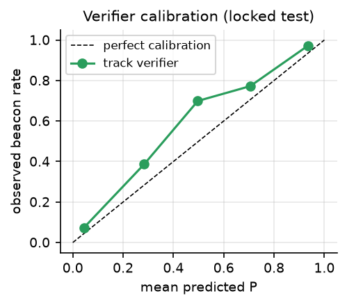
<p class="caption">Figure 8. Verifier calibration on the locked test (MEASURED). Points slightly above the diagonal:
the model is mildly under-confident.</p>

### 28.3 mAP

**NOT MEASURED** — the model classifies ROIs; it does not output boxes.

### 28.4 Latency (MEASURED, `scripts/bench-latency.ts`, bright decoys + noise + jitter)

| Detector | Perception mean / p95 (ms) | Pipeline mean / p95 (ms) | Stage split (ms) | Pipeline FPS | 30 Hz budget (p95) |
|---|---|---|---|---|---|
| Classical | 0.42 / 0.58 | 0.45 / 0.65 | — | 2238 | within |
| AI only | 4.00 / 6.05 | 4.03 / 6.10 | CV 0.00 · AI 3.99 · temporal 0.00 · fusion 0.000 | 248 | within |
| Hybrid | 4.40 / 6.30 | 4.42 / 6.32 | CV 0.45 · AI 3.81 · temporal 0.10 · fusion 0.012 | 226 | within |
| Mode 1 full-frame | 288 | — | — | — | over |

12th Gen Intel(R) Core(TM) i3-1215U, 8 threads; runtime onnxruntime-web 1.30.0 (wasm, 1 thread); measured 2026-09-29. Latency on the judge machine: **not measured** — run `bun scripts/bench-latency.ts` there.

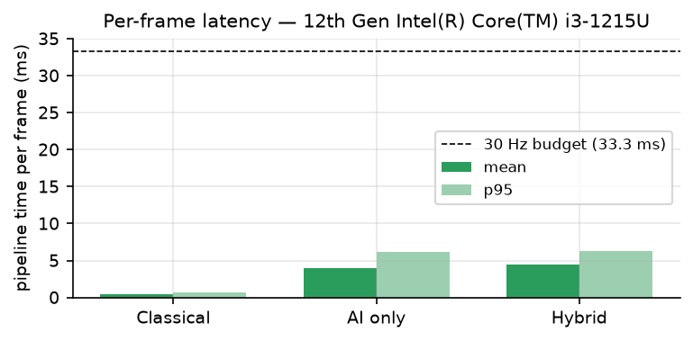
<p class="caption">Figure 9. Per-frame pipeline time per detector (MEASURED).</p>

### 28.5 Mode 1 vs Mode 2 (Phase 12)

MEASURED on the same 120 frames (clear, bright decoys, dim beacon), ONNX Runtime Web for Mode 2:

| Mode | Latency per frame | Recall | Precision |
|---|---|---|---|
| Mode 1 — full-frame CNN | 822.2 ms | 0.793 | 0.192 |
| Mode 2 — proposals + ROI CNN (`ai`) | 9.92 ms | 0.655 | 0.211 |

Mode 1 is 83× slower and over the 33.3 ms budget; neither mode alone has acceptable precision on this mix — which is why neither is used alone in the hybrid.

---

## 29. Tracking Results

### 29.1 Default scenario (classical)

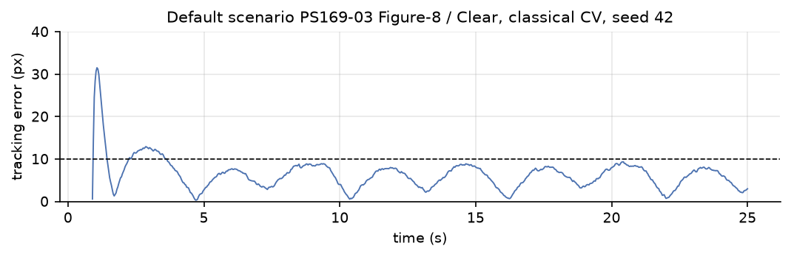
<p class="caption">Figure 10. PS169-03 Figure-8 / Clear, seed 42, classical (MEASURED): acquisition 0.97 s, mean error 6.36 px, max 31.5 px.</p>

### 29.2 Judge demonstration (MEASURED, `bun scripts/judge-demo.ts`, seed 20260920, 60 s)

| Metric | Measured | PS gate | Result |
|---|---|---|---|
| Acquisition time | 1.467 s | ≤ 2 s | PASS |
| Average tracking error | 2.508 px | ≤ 10 px | PASS |
| Centroiding error | 0.843 px | — | — |
| Algorithm FPS | 1,201 | ≥ 20 | PASS |
| Target loss | 16.556 % | < 5 % | **FAIL** |
| Re-acquisition | 9.567 s | ≤ 1 s | **FAIL** |
| Mission phases / integrity checks | 13/13, 0 failures | — | — |

The demonstration deliberately removes the beacon for 6.97 s; re-acquisition is measured from loss and
therefore includes the beacon's absence. The prediction phase lasted 0.93 s, the active search 8.57 s, and
relock after the beacon's return took 2.63 s. These two gates are reported as failed, not hidden.

---

## 30. Failure Analysis

| # | Failure | Cause | Effect | Mitigation (implemented) | Remaining limitation |
|---|---|---|---|---|---|
| 1 | Bright decoys | decoys overlap the beacon's size range; beacon may start out of view | classical/AI lock decoy (0 % correct lock) | track verifier, established-decoy gate, clutter map, verified switch | 2/6 seeds still exceed 50 px mean (initial decoy period); jitter variant 60 % |
| 2 | Extreme noise | false peaks above threshold | false alarms (classical precision 0.358) | confidence floor; verifier rejects static clutter | 224 false alarms/3,150 empty frames remain (hybrid) |
| 3 | Fog | contrast × 0.32 | dimmer beacon | AI branch has no threshold | none observed in benchmark |
| 4 | Rain | streak candidates | false candidates | confidence floor, area/aspect | — |
| 5 | Complete target loss | occlusion longer than prediction | SEARCH; re-acquisition includes absence | Kalman coasting, scan from current pointing | 7 s blackout → 9.6 s re-acquisition (§29.2) |
| 6 | Multiple candidates | several spots | wrong choice possible | weighted score, hysteresis | single-beacon only |
| 7 | AI false positives | CNN accepts any bright compact spot | AI-only detector ~2,100 FA/3,150 | AI never used alone; veto-only in fusion | AI branch alone unusable |
| 8 | CV false positives | threshold crossings | false locks | floor, gating, verifier in hybrid | classical alone vulnerable to decoys |
| 9 | AI/CV disagreement | different preferences | — | recorded; score decides; provenance logged | — |
| 10 | FOV exit | fast target / slew limit | loss | prediction, scan | bounded by 5 °/s slew |
| 11 | Motion blur / jitter | smear, shake | 21 % / 58 % correct lock (all detectors) | Kalman smoothing, common-mode removal in the track bank | not solved |
| 12 | MP4 input | recorded pixels cannot be re-pointed | perception-only, classical only | reference-free metrics when no ground truth | learned detectors not wired to the MP4 path |
| 13 | Low light model | airlight term brightens | dim decoys cross threshold | hybrid rejects them | modelling defect retained |

---

## 31. Safety / False-Lock Design

A false lock is the most dangerous failure in a pointing system: the camera confidently follows the
wrong object, and lock-held metrics can still look good — the PS "target loss" metric reported 0 % on the
classical decoy runs while correct lock was 0 %. The design therefore assumes any single bright frame can
lie:

* **Confirmation** — 3 consecutive detections before TRACK; jumps > 50 px restart confirmation.
* **Gating** — the CNN can veto, never promote; the cold-search floor; temporal gating against the
  Kalman prediction.
* **Hysteresis** — a switch > 55 px costs × 0.45 unless track evidence is lopsided.
* **Temporal verification** — established static tracks are rejected even where predicted; known
  clutter is remembered.
* **Prediction** — short dropouts coast instead of re-searching.
* **Safe switching** — a deliberate switch resets the filter and re-confirms rather than blending two
  targets.
* **Bounded actuation** — controller saturation, integrator clamp, mount rate/acceleration/travel limits.

---

## 32. Real-Time Demonstration GUI

**IMPLEMENTED.** The Laboratory view (Figure 11) shows the camera viewport with ground-truth, detection,
prediction and centre overlays; tracking state; position and velocity; tracking error in px and degrees;
pipeline FPS; average error, lock, loss, acquisition and re-acquisition; receiver mount commanded vs
achieved rates; charts (error, target vs camera, pan/tilt command, lock timeline); an optional 3-D view;
and the event log. The Perception Chain panel (Figure 12) shows, per frame, the classical result, the AI
branch (score, ROIs, **inference runtime**, inference time), the decision engine, the temporal verifier
(track, world speed, P(beacon), clutter points), the final decision with reason, and the control chain
(Kalman prediction, controller command, mount response).

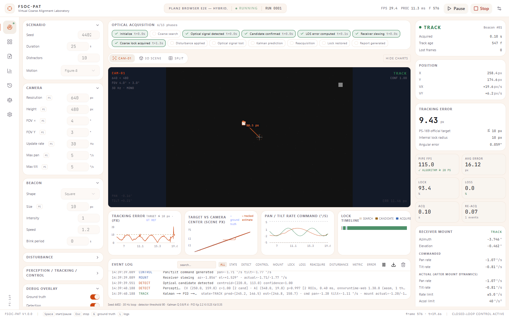
<p class="caption">Figure 11. Laboratory view during a hybrid run in Chrome (production build).</p>

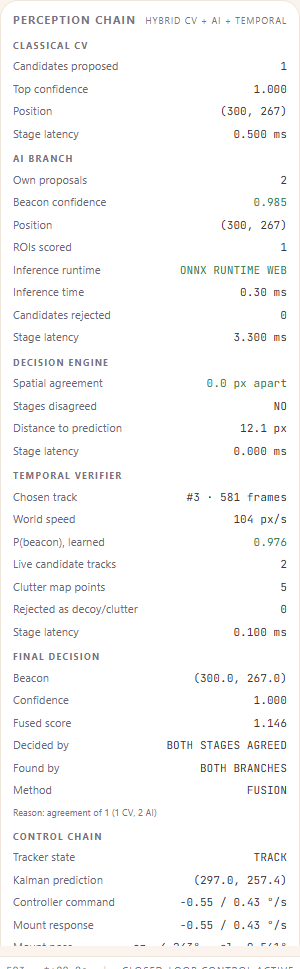
<p class="caption">Figure 12. Perception Chain panel, same run: inference runtime ONNX RUNTIME WEB.</p>

Evidence value: every number shown is read from the engine's per-frame provenance; the browser test
`scripts/browser-e2e.ts` asserts 15 checks against what the UI holds (15/15 passed, 2026-10-04).

---

## 33. Logging and Provenance

| Output | Content |
|---|---|
| `events.csv` (per frame) | timestamp, frame_index, source_mode, gt_x, gt_y, detected_x, detected_y, predicted_x, predicted_y, confidence, tracking_state, pan_deg, tilt_deg, pan_command, tilt_command, error_px, processing_ms, locked, lost |
| `metrics.json` | all metrics of §23, configuration, PS gate verdicts |
| `summary.html` | human-readable performance report |
| Event log (UI) | typed entries (SYSTEM, STATE, DETECT, TRACK, CONTROL, MOUNT, LOSS, REACQUIRE, …); a "Perception chain" and "Kalman → PID → mount" entry once per second |
| Detection provenance (per frame) | CV pick, AI pick, candidate counts, chosen-by rule, rejections, chosen source (`cv`/`ai`/`both`), track ID/age/P/speed, clutter points, **AI runtime**, per-stage latencies, decision reason |
| Run registry | SQLite via Prisma, `/api/runs` |

AI-specific columns are **not** in `events.csv`; they are in per-frame provenance and the event log.
Provenance matters because "this was a fusion decision made by ONNX Runtime" is then a checkable fact
in the run record, not a claim. Appendix F shows real log lines.

---

## 34. Software Architecture

| Module | Responsibility | Inputs → outputs |
|---|---|---|
| `src/engine/config.ts` | Zod-validated configuration, defaults | raw config → `ScenarioConfig` |
| `src/engine/scene.ts`, `trajectories.ts` | scene raster, beacon, decoys, blur, smear | t, config → scene buffer, ground truth |
| `src/engine/camera.ts` | crop, disturbances, platform motion | scene, pose → observed frame |
| `src/engine/detector.ts` | classical CV | frame → `Detection` / candidates |
| `src/engine/proposer.ts` | AI-branch local-contrast proposer | frame → candidates |
| `src/engine/nn.ts` | CNN forward pass, preprocessing, Mode 1, batch interfaces | crops → scores |
| `src/engine/candidate-tracks.ts` | track bank, world motion, clutter map | candidates, pose → tracks, features |
| `src/engine/track-verifier.ts` | verifier forward pass | features → P(beacon) |
| `src/engine/fusion.ts` | decision engine | candidates, scores, evidence → decision |
| `src/engine/detector-ai.ts`, `detectors.ts` | detector implementations, registry | frame, context → `Detection` |
| `src/engine/kalman.ts`, `tracker.ts` | estimation, state machine | detection → `TrackState` |
| `src/engine/pid.ts`, `mount.ts` | control, actuation | estimate → command → pose |
| `src/engine/pipeline.ts`, `simulation.ts` | one frame, the canonical loop | config, model → step result |
| `src/engine/metrics.ts`, `export.ts` | scoring, reports | per frame → `RunResult`, files |
| `src/engine/mission.ts`, `link.ts`, `demo.ts` | mission phases/integrity, simulated link model, judge demo | step results → snapshots |
| `src/workers/simulation.worker.ts` | live loop, pacing, ORT loading, telemetry | messages → frames, logs |
| `src/lib/ort-runtime.ts`, `load-model.ts` | ONNX Runtime Web backends, asset loading | ONNX bytes → scorers |
| `src/components/**` | UI views and panels | store → rendering |

---

## 35. Technology Stack

| Layer | Technology |
|---|---|
| Frontend | Next.js 16, React 19, TypeScript 5, Tailwind CSS 4, shadcn/ui (Radix), Zustand 5 |
| Visualisation | Recharts 2 (charts), three.js 0.186 + React Three Fiber 9 (3-D view) |
| Simulation, CV, tracking, control | pure TypeScript engine (no browser APIs), Web Worker |
| AI training | Python 3.12, PyTorch 2.14.0 (CPU), NumPy, Pillow |
| Model export / check | torch.onnx (TorchScript exporter, opset 17), onnx 1.23, onnxruntime 1.30 (Python) |
| Model runtime | ONNX Runtime Web 1.30.0 (WebAssembly) |
| Validation of config | Zod 4 |
| Persistence | Prisma 6 + SQLite (run registry) |
| Build / run | Bun 1.4.2, Next.js standalone server |
| Testing | `bun test` (122 tests, 7 files); puppeteer-core 25 + Chrome for the browser test |
| Figures | matplotlib |

---

## 36. Computational Complexity

| Stage | Complexity | Measured (§28.4) |
|---|---|---|
| Classical CV | O(N_pixels) threshold + labelling | ~0.45 ms |
| AI proposer | O(N_pixels) summed-area table and box means + O(P log P) peak sort | ~3 ms on noisy frames |
| CNN | O(k) crops × ~230 k multiply-accumulates each | ~0.3–0.8 ms per frame in ORT |
| Track bank | O(T·k) association, T tracks, k candidates (≤ 18) | ~0.1 ms |
| Kalman | constant 4 × 4 | negligible |
| PID / mount | O(1) | negligible |
| Mode 1 full-frame CNN | O(N_pixels) convolutions + dense head per position | ~290–820 ms |

Theoretical complexity alone does not prove real-time behaviour; the measured per-frame times and p95
values in §28.4 do.

---

## 37. Security and Reliability

| Concern | Handling (IMPLEMENTED unless stated) |
|---|---|
| Input validation | every configuration passes a Zod schema with ranges and cross-field rules |
| Model integrity | weight-count check (CNN) and feature-order/shape check (verifier) refuse mismatched files; SHA-256 recorded in `onnx-manifest.json` and verified by tests — **not** verified at runtime |
| Model missing | learned detectors refuse to construct; the UI disables them; the worker reports the load error |
| ORT failure | logged warning; labelled fallback to the TypeScript forward pass |
| Determinism | seeded RNG; identical reruns asserted in tests |
| Numerical stability | Kalman skips singular updates; Δt guards in Kalman and PID |
| Safe limits | controller saturation, integrator clamp, mount rate/acceleration/travel limits |
| Runtime exceptions | worker catches step errors, logs them and stops the run |
| Invalid frames | simulator frames are generated internally at a fixed size; robustness of the MP4 path to malformed video was **not verified** in this audit |

---

## 38. Limitations

* **Simulation-to-real gap.** No optical hardware; disturbances are simplified models.
* **Training data.** Real data is laser pointers on indoor surfaces, not FSOC beacons; the FSOC domain is
  synthetic.
* **Motion assumption.** The verifier learned that the beacon moves; a stationary beacon among equally
  bright, equally sized static decoys is not separable without modulation.
* **Camera model.** Planar angular scene; no lens model, no perspective, no 3-D world.
* **Atmosphere.** Contrast/brightness model only; no turbulence, scintillation or beam wander;
  `low_light` brightens the background (defect).
* **Single target.** Multiple beacons not implemented.
* **MP4 benchmark path.** Perception-only and classical-only; the learned detectors are not wired to
  video input.
* **Runtime.** Single-thread WASM; latency measured on one laptop only.
* **Weak conditions.** Strong jitter, blur + smear, bright decoys + jitter (§27).
* **Executable.** A standalone Node/Bun server, not a single native executable.

---

## 39. Future Work (none of this exists)

Physical camera and pan-tilt integration; real optical beacon with modulation (which would also resolve the
static-beacon ambiguity); hardware-in-the-loop testing; more FSOC-specific real data and domain
adaptation; turbulence and scintillation models; wiring the hybrid detector into the MP4 benchmark path;
multi-target tracking; GPU/WebGPU inference; embedded deployment; fine-alignment hand-over; satellite and
UAV motion models.

---

## 40. Reproducibility

```bash
# 1–2. open the project and install dependencies (Bun 1.x)
bun install
bun run db:generate                      # Prisma client for the run registry
# 3. environment: .env holds DATABASE_URL=file:../db/custom.db (no API keys)
# 4. models are in public/models/ (rebuild below); ORT WASM is copied automatically
# 5. start the application
bun run build && bun run start           # production, http://localhost:3000  (or: bun run dev)
# 6–8. in the UI: Scenario → choose; Perception/Tracking/Control → Perception:
#       Classical CV | Learned AI branch | Hybrid CV + AI + temporal; press Start (Space)
# 9. logs: Event log panel; export events.csv / metrics.json / summary.html at run end
# 10. benchmarks
bun test tests/                          # 122 tests
bun scripts/batch-test.ts                # PS-169, 14 scenarios × 5 seeds
bun scripts/judge-demo.ts                # judge demonstration, headless
bash scripts/eval-resumable.sh           # classical vs AI vs hybrid (ONNX Runtime Web)
bun scripts/bench-latency.ts             # per-stage latency on this machine
bun scripts/browser-e2e.ts               # real-browser runtime check (server running)
# rebuild the models from scratch
bun scripts/gen-synthetic-dataset.ts && python scripts/ai/build_roi_dataset.py && python scripts/ai/train_roi.py
bun scripts/ai/gen-track-dataset.ts && python scripts/ai/train_track_verifier.py
python scripts/ai/export_onnx.py
# report
bun scripts/report-timeseries.ts && python scripts/report-figures.py && bun scripts/build-report.ts
```

The real dataset is expected at `datasets/train_yolo/` and `datasets/test_coco/` (copies of
`train_yolo_format/` and `test_comparison_coco_format/`).

---

## 41. Project Directory Structure

```
workspace/
├── src/
│   ├── engine/            simulation, CV, AI, fusion, tracking, control, metrics (pure TypeScript)
│   ├── workers/           simulation.worker.ts — live loop, ORT loading, telemetry
│   ├── lib/               ort-runtime.ts, load-model.ts, engine-client.ts, store.ts
│   ├── components/        UI: views, camera viewport, telemetry, perception panel, charts, 3-D
│   └── app/               Next.js app shell and /api/runs
├── public/
│   ├── models/            beacon-roi-v2.{bin,json,onnx}, track-verifier-v1.{json,onnx}, onnx-manifest.json
│   └── ort/               ONNX Runtime Web WASM (copied at build)
├── scripts/               benchmarks, demos, evaluation, report builders
│   └── ai/                dataset building, training, ONNX export
├── tests/                 unit, integration, anti-cheating, parity, runtime tests
├── datasets/              (git-ignored) real + synthetic data, ROI and track sets
├── benchmark-results/     PS-169 runs, detector comparison, browser evidence, latency
├── docs/                  AI-DETECTOR.md (model card), report/ (this report)
├── prisma/, db/           run registry
└── README.md, USER_MANUAL.md, IMPLEMENTATION_STATUS.md
```

---

## 42. Traceability Matrix

| PS-169 requirement | Implementation | Source | Test | Evidence |
|---|---|---|---|---|
| Configurable virtual environment | scene, decoys, background | `scene.ts`, `config.ts` | `engine-unit` (config, RNG) | GUI Scenario panel |
| One or more moving targets | 1 beacon, 6 motions | `trajectories.ts` | `engine-unit` (trajectories) | Fig. 4 |
| Movable virtual camera | pose, crop, mount | `camera.ts`, `mount.ts` | `engine-evidence` (pose only via mount) | Fig. 2 |
| Automatic beacon detection | classical + AI branch | `detector.ts`, `proposer.ts`, `nn.ts` | `engine-unit`, `ai-parity`, `ai-temporal` | §27.2 |
| Continuous tracking with CV | Kalman + state machine + fusion | `kalman.ts`, `tracker.ts`, `fusion.ts` | `engine-integration`, `ai-runtime` | Fig. 3 |
| Control and reposition camera | PID + mount | `pid.ts`, `mount.ts` | `engine-unit` (PID), `ai-runtime` chain test | Fig. 2 |
| Disturbances | noise, atmosphere, jitter, platform, blur | `camera.ts`, `scene.ts` | `engine-unit` (disturbances), `ai-temporal` (blur) | §25 |
| Real-time display | Laboratory view, Perception Chain | `src/components/**` | `browser-e2e` (15 checks) | Fig. 11–12 |
| AI-assisted tracking | hybrid in ONNX Runtime Web | `detector-ai.ts`, `ort-runtime.ts` | `ai-runtime`, `browser-e2e` | §27 |
| Performance report | metrics + exports | `metrics.ts`, `export.ts` | `engine-integration` | §33 |
| Acquisition ≤ 2 s | — | `metrics.ts` | `batch-test` | §26 |
| Tracking error ≤ 10 px | — | `metrics.ts` | `batch-test` | §26 |
| Target loss < 5 % | — | `metrics.ts` | `batch-test` | §26 |
| Re-acquisition ≤ 1 s | — | `metrics.ts` | `batch-test`, `judge-demo` | §26, §29.2 |
| ≥ 20 FPS | — | `metrics.ts` | `batch-test`, `bench-latency` | §26, §28.4 |
| Centroiding-error log | detector vs truth | `metrics.ts` | `batch-test` | §26 |
| MP4 input (Benchmark-2) | WebCodecs decode → classical pipeline | `src/lib/video-benchmark.ts`, `scripts/mp4-demo.ts` | not re-run in this audit (ffmpeg absent) | §30 row 12 |

---

## 43. PS-169 Compliance

| PS-169 requirement | Implemented | Evidence |
|---|---|---|
| Screen ≥ 2000 × 2000 | Yes | `config.ts` |
| Monochrome FPA | Yes | 8-bit frames |
| 640 × 480 | Yes | `config.ts` |
| FOV user-defined, 4° × 3° | Yes | `config.ts` |
| ≥ 30 Hz | Yes | 30 Hz loop |
| Initial camera at centre | Yes | `createCamera` |
| Beacon spot target | Yes | `scene.ts` |
| 1 target / multiple optional | 1 yes; multiple **no** | §38 |
| Shape user-defined, square default | Yes (square, circle) | `config.ts` |
| Size 5–20, default 10 | Yes | `config.ts` |
| Initial location random/user | Yes | `scene.ts` |
| Straight, circular, figure-8, random (+ spiral, sinusoidal) | Yes | `trajectories.ts` |
| Pan/tilt 5–10 °/s, default 5 | Yes | `config.ts`, `mount.ts` |
| Update ≥ 20 Hz | Yes | 30 Hz |
| Acquisition ≤ 2 s | Yes, 14/14 scenarios | §26 |
| Tracking error ≤ 10 px | Yes, 14/14 | §26 |
| Target loss < 5 % | Yes, 14/14 (fails in 7 s blackout demo) | §26, §29.2 |
| Re-acquisition ≤ 1 s | Yes where loss occurs in the 14 scenarios; fails in blackout demo | §26, §29.2 |
| ≥ 20 FPS | Yes | §26, §28.4 |
| Salt & pepper, Gaussian, Poisson | Yes | §9 |
| Noise σ ≤ 20 | Yes | §9 |
| Jitter ±20 px/frame | Yes | §9 |
| Clear, haze, fog, rain, low light | Yes | §9 |
| Platform motion, linear + optional | Yes | §9 |
| AI-assisted detection | Yes (ONNX Runtime Web) | §11, §15 |
| Display performance in real time | Yes | §32 |
| Standalone executable | Standalone server build | §38 |
| Source code, documented | Yes | repository |
| Technical report | This document | — |
| User manual | Yes | `USER_MANUAL.md` |
| Automatic performance log | Yes | §33 |
| MP4 input bypassing the PTZ camera | Yes (perception-only, classical) | §30 row 12 |

---

## 44. Conclusion

FSOC-PAT implements the complete coarse-alignment loop that PS-169 describes, in software: a configurable
scene, a moving beacon, a virtual monochrome camera, a disturbance chain, perception, Kalman tracking,
angular LOS error, PID control and a bounded virtual mount, with automatic, ground-truth-scored
performance logging. With classical computer vision it passes all five PS-169 gates in all 14 benchmark
scenarios (MEASURED). A learned perception stage — a 2,989-parameter CNN trained on real laser-spot data
and simulator data (F1 0.9589 on a locked, different-camera test set) and a learned track verifier (AUC
0.961) — runs on the live loop in ONNX Runtime Web in the browser.

The hybrid was selected because the measurements showed neither stage suffices alone: classical CV is the
better localiser but false-locks onto bright decoys and cannot see below its threshold; the CNN recognises
spots but cannot tell a decoy from the beacon; only temporal evidence does. The hybrid holds the true
beacon ~97 % of the time with bright decoys (classical 0 %), finds a beacon below the classical threshold
(95.7 % vs 0 %), and equals classical CV elsewhere, at ten times the per-frame cost, with slower dim-beacon
acquisition and with strong jitter and blur still unsolved for every detector. These are evidence-based
results on simulated data; the system has not been validated against optical hardware.

---

## 45. References

[1] Department of Space / ISRO, "Development of an AI-Based Virtual Camera Tracking System for Coarse
Alignment of Mobile Free Space Optical Communication (FSOC) Terminals," Problem Statement PS-169, Smart
India Hackathon 2026.

[2] D. Torielli, "Laser Pointer Spot Annotated RGB Images," Zenodo, v2, Apr. 2025, doi:
10.5281/zenodo.15230870.

[3] D. Torielli, "Laser Pointer Spot Detection Models," Zenodo, v1, Jan. 2024, doi:
10.5281/zenodo.10471835 (Faster R-CNN and YOLOv5 laser-spot detectors; not used by this system).

[4] ADVRHumanoids, "nn_laser_spot_tracking," GitHub repository. [Online]. Available:
https://github.com/ADVRHumanoids/nn_laser_spot_tracking

[5] D. Torielli, L. Muratore, and N. Tsagarakis, "An intuitive tele-collaboration interface exploring
laser-based interaction and behavior trees," *Robotics and Autonomous Systems*, vol. 193, 2025, doi:
10.1016/j.robot.2025.105054.

[6] D. Torielli *et al.*, "A Laser-Guided Interaction Interface for Providing Effective Robot Assistance
to People With Upper Limbs Impairments," *IEEE Robotics and Automation Letters*, vol. 9, no. 9, pp.
7653–7660, 2024, doi: 10.1109/LRA.2024.3430709.

[7] R. E. Kalman, "A New Approach to Linear Filtering and Prediction Problems," *Journal of Basic
Engineering*, vol. 82, no. 1, pp. 35–45, 1960.

[8] K. J. Åström and T. Hägglund, *PID Controllers: Theory, Design, and Tuning*, 2nd ed. Research
Triangle Park, NC, USA: ISA, 1995.

[9] Microsoft, "ONNX Runtime Web," v1.30.0. [Online]. Available: https://onnxruntime.ai

[10] A. Paszke *et al.*, "PyTorch: An Imperative Style, High-Performance Deep Learning Library," in
*Advances in Neural Information Processing Systems 32*, 2019.

[11] H. Kaushal and G. Kaddoum, "Optical Communication in Space: Challenges and Mitigation Techniques,"
*IEEE Communications Surveys & Tutorials*, vol. 19, no. 1, pp. 57–96, 2017.

OpenCV and YOLO are not used by this implementation and are therefore not cited.

---

## Appendix A — Configuration Parameters (defaults, `src/engine/config.ts`)

| Parameter | Default | Parameter | Default |
|---|---|---|---|
| `seed` | 42 | `tracking.lockRadiusPx` | 10 |
| `durationS` | 60 | `tracking.acquisitionConfirmFrames` | 3 |
| `scene.width` | 2000 | `tracking.candidateDisconfirmFrames` | 8 |
| `scene.height` | 2000 | `tracking.lostTimeoutFrames` | 30 |
| `scene.distractorCount` | 2 | `tracking.searchPattern` | raster |
| `scene.backgroundLevel` | 18 | `tracking.searchRateFactor` | 0.9 |
| `scene.distractorIntensityMin` | 0.36 | `tracking.countPredictionAsLocked` | true |
| `scene.distractorIntensityMax` | 0.44 | `tracking.threshold` | 90 |
| `camera.resolutionWidth` | 640 | `tracking.minDetectionConfidence` | 0.5 |
| `camera.resolutionHeight` | 480 | `tracking.controllerEnabled` | true |
| `camera.fovXDeg` | 4 | `tracking.detectorEnabled` | true |
| `camera.fovYDeg` | 3 | `tracking.minAreaPx` | 4 |
| `camera.updateHz` | 30 | `tracking.maxAreaPx` | 1200 |
| `camera.maxPanSpeedDegS` | 5 | `tracking.kalmanQ` | 0.6 |
| `camera.maxTiltSpeedDegS` | 5 | `tracking.kalmanR` | 4 |
| `camera.mountAccelDegS2` | 40 | `tracking.kp` | 2.2 |
| `camera.exposureMs` | 0 | `tracking.ki` | 0.25 |
| `camera.monochrome` | true | `tracking.kd` | 0.35 |
| `beacon.count` | 1 | `tracking.deadbandDeg` | 0.02 |
| `beacon.shape` | square | `noise.saltPepperPercent` | 0 |
| `beacon.sizePx` | 10 | `noise.gaussianSigma` | 0 |
| `beacon.intensity` | 1 | `noise.poissonEnabled` | false |
| `beacon.motion` | figure8 | `jitter.enabled` | false |
| `beacon.speed` | 1.2 | `jitter.maxPxPerFrame` | 8 |
| `beacon.startX` | null | `atmosphere.mode` | clear |
| `beacon.startY` | null | `atmosphere.contrastFactor` | 1 |
| `beacon.blinkPeriodS` | 0 | `atmosphere.brightnessFactor` | 1 |
| `beacon.blurSigmaPx` | 0 | `platformMotion.mode` | none |
| `tracking.detector` | cv_classical | `platformMotion.maxPxPerFrame` | 8 |
| `tracking.tracker` | kalman_cv | `platformMotion.speed` | 0.4 |
| `tracking.controller` | pid_angle_space |  |  |

## Appendix B — Model Configuration

```json
{
  "generatedAt": "2026-09-28T05:38:36+00:00",
  "exporter": "torch 2.14.0+cpu (TorchScript exporter), opset 17",
  "models": {
    "beacon-roi-v2": {
      "file": "beacon-roi-v2.onnx",
      "sha256": "1bb8a7ded0f6d9b1bd34b103e383ef66f1be33af3ae000f2f8b623a24e84ffbb",
      "bytes": 14422,
      "sourceWeights": "beacon-roi-v2.bin",
      "sourceWeightsSha256": "73f5b53c8826bbc683a887e841ed2bf987fa86c5e44ac2df351a64ce8bc3b151",
      "input": {
        "name": "patches",
        "dtype": "float32",
        "shape": [
          "N",
          1,
          24,
          24
        ],
        "preprocessing": "crop 24x24 at candidate centroid (edge replication), subtract median of 2-px border ring, /128, clip [-1, 2]"
      },
      "output": {
        "name": "p_beacon",
        "dtype": "float32",
        "shape": [
          "N",
          1
        ],
        "meaning": "sigmoid P(ROI contains the beacon)"
      },
      "parity": {
        "maxAbsVsTorch": 3.5762786865234375e-7,
        "maxAbsVsFixture": 4.172325134277344e-7
      }
    },
    "track-verifier-v1": {
      "file": "track-verifier-v1.onnx",
      "sha256": "c5fd64314968a0b0a5189f9dc02b313076beca9174b3e7221a40e8de729d67ad",
      "bytes": 1196,
      "sourceWeights": "track-verifier-v1.json",
      "sourceWeightsSha256": "0c482259b8b4d152be4acb8fa3bbd2ed76a589b0203cad14cc5ec0943b2468a4",
      "input": {
        "name": "features",
        "dtype": "float32",
        "shape": [
          "N",
          8
        ],
        "features": [
          "ai_mean",
          "cv_mean",
          "size_mean",
          "bright_mean",
          "speed",
          "speed_reliability",
          "moving_evidence",
          "persistence"
        ]
      },
      "output": {
        "name": "p_beacon",
        "dtype": "float32",
        "shape": [
          "N",
          1
        ],
        "meaning": "sigmoid P(candidate track is the beacon), calibrated"
      },
      "parity": {
        "maxAbsVsTorch": 7.450580596923828e-8,
        "maxAbsVsFixture": 7.450580596923828e-8
      }
    }
  }
}
```

## Appendix C — Dataset Structure

```
datasets/
├── train_yolo/yolo_format/{train,valid}/{images,labels}   Zenodo D435 (309 / 76 images)
├── test_coco/{images,annotations/instances_default.json}  Zenodo smartphone (56, LOCKED)
├── fsoc_synth/{train,valid,test_stress}/{images,labels}   simulator (5,040 / 1,260 / 1,120)
├── roi/*.npz                                              24×24 patch splits (§12.3)
└── tracks/{train,valid,test}.csv                           track-verifier samples
```

## Appendix D — Important APIs

| API | Purpose |
|---|---|
| `SimulationRunner.step(dt)` / `stepAsync(dt)` | advance one frame (sync TS / async ORT path) |
| `Pipeline.step(packet)` / `stepAsync(packet)` | perception → tracking → control → metrics |
| `BeaconDetector.detect(...)` / `detectAsync(...)` | one frame of perception; no ground-truth parameter |
| `fuse(candidates, aiScores, context, opts)` | decision engine |
| `CandidateTrackBank.update(...)` | world-frame candidate tracks |
| `createOrtBackends(cnn, verifier, wasmPaths)` | ONNX Runtime Web scorers |
| `MetricsEngine.onFrame(...)` / `finalize()` | scoring and `RunResult` |
| `GET /api/runs`, `GET /api/runs/[id]` | run registry |

## Appendix E — Benchmark Configuration

Detector comparison: seeds 4200, 4301, 4402, 4503, 4604, 4705; 25 s per run; hit radius 8 px; divergence 50 px;
lock radius 10 px. PS-169 benchmark: 14 presets, 5 seeds each, mean gated against acquisition ≤ 2 s,
error ≤ 10 px, loss < 5 %, re-acquisition ≤ 1 s, ≥ 20 FPS.

## Appendix F — Example Runtime Logs (real browser run, 2026-10-04)

```
      SYSTEM  Learned model loaded — beacon-roi-v2 — 2989 parameters
      SYSTEM  ONNX Runtime Web ready — onnxruntime-web 1.30.0 (wasm, 1 thread) — beacon-roi-v2.onnx 14422 B + track-verifier-v1.onnx 1196 B, sessions created in 477 ms
      SYSTEM  Track verifier loaded — track-verifier-v1 — temporal decoy rejection + clutter map active
      SYSTEM  Mission initialized — scene 2000×2000, cam 640×480 @ 30Hz, seed 4402
f   1 SYSTEM  Runtime parity on live frame — ROI (257.5, 268.5): ORT 0.883459 vs TS 0.883459 · |Δ| 5.52e-8
f  30 DETECT  Perception chain — CV (283.5, 235.5) c=1.00 [3 cand] · AI (439.0, 278.0) p=0.985 [3 ROIs, 0.40 ms, onnxruntime-web 1.30.0 (wasm, 1 thread)] · FUSION track-verified trackP=0.99 → (439.0, 278.0) conf=1.00 · track-verified of 3 (3 CV, 5 AI); 2 rejected
f  30 TRACK   Kalman → PID → mount — state=TRACK pred=(440.1, 302.1) est=(439.7, 293.2) · cmd pan=1.65 tilt=0.17 °/s · mount actual=1.65/0.17 °/s az=-0.107° el=0.212°
f  60 DETECT  Perception chain — CV (397.0, 195.0) c=1.00 [4 cand] · AI (397.0, 195.0) p=0.985 [4 ROIs, 0.40 ms, onnxruntime-web 1.30.0 (wasm, 1 thread)] · FUSION agreement trackP=0.99 → (397.0, 195.0) conf=1.00 · agreement of 4 (4 CV, 6 AI); 2 rejected
f  60 TRACK   Kalman → PID → mount — state=TRACK pred=(399.7, 182.6) est=(398.8, 186.8) · cmd pan=1.16 tilt=-0.64 °/s · mount actual=1.16/-0.64 °/s az=1.339° el=-0.513°
```

## Appendix G — Screenshots

Figures 11 and 12 (§32); further screenshots in `benchmark-results/browser-e2e/`.

## Appendix H — Glossary

| Term | Meaning |
|---|---|
| AUC | area under the ROC curve; probability a random positive outranks a random negative |
| Boresight | the camera's optical axis, i.e. the image centre |
| Calibration | agreement between predicted probability and observed frequency |
| Centroid | intensity-weighted centre of a blob |
| Clutter map | remembered world positions of rejected static objects |
| F1 | harmonic mean of precision and recall |
| FOV | field of view |
| Hysteresis | requiring more evidence to change a decision than to keep it |
| Kalman filter | recursive estimator combining a motion model with noisy measurements |
| LOS | line of sight |
| ONNX | open neural-network model format |
| PID | proportional-integral-derivative controller |
| ROI | region of interest — the 24 × 24 crop around a candidate |
| WASM | WebAssembly, the browser's portable binary execution format |

---

## Final Summary for the Evaluation Committee

**A. Architecture** — Figure A (§5): simulation → camera → disturbances → classical CV ∥ AI branch →
track bank → track verifier → decision engine → Kalman → LOS → PID → mount → next frame; ground truth to
metrics only.

**B. Technology stack** — §35.

**C. Model specification** — §11; CNN `beacon-roi-v2` 2,989 parameters, track verifier `track-verifier-v1`
121 parameters; ONNX opset 17; ONNX Runtime Web 1.30.0, WASM, CPU.

**D. Dataset specification** — §12; Zenodo 385 + 56 images [2]; 7,420 synthetic images; locked smartphone
and stress tests.

**E. Benchmark** — §26 (PS-169 gates, 14/14), §27 (classical vs AI vs hybrid), §28 (AI metrics, latency).

**F. Compliance** — §43.

**G. Limitations** — §38.

**H. Reproducibility** — §40.

**I. References** — §45.
