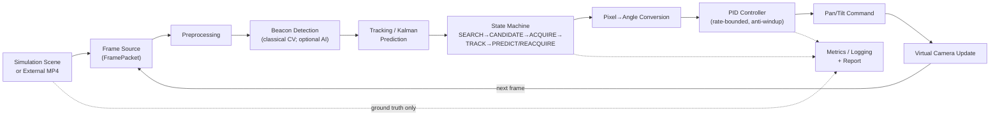
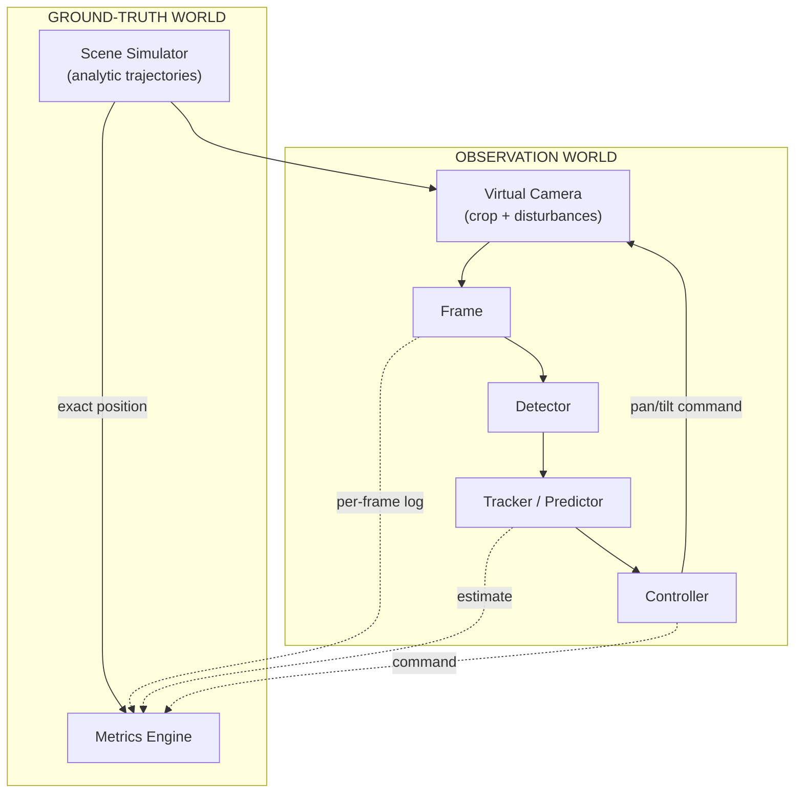
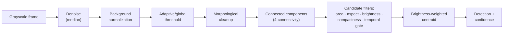
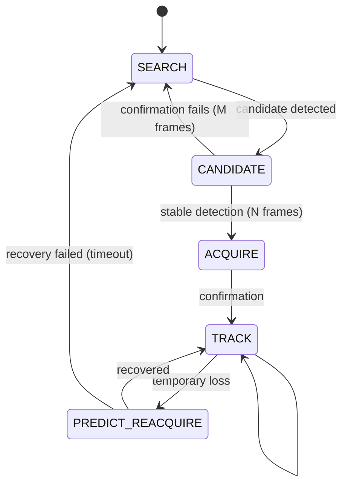
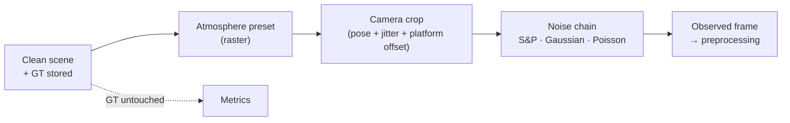
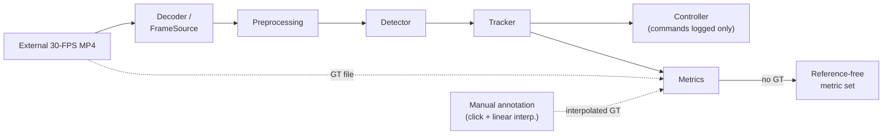
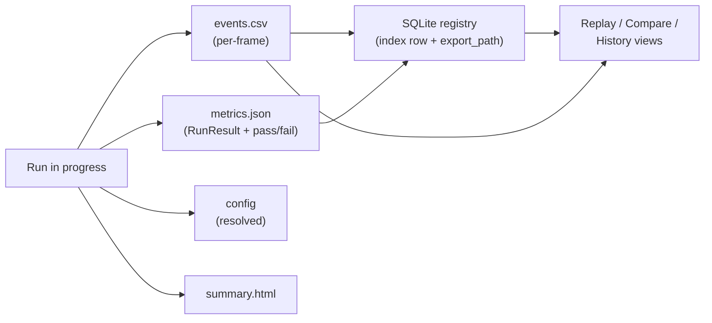
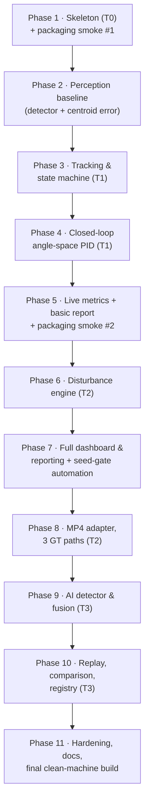

# FSOC-PAT — Technical Report

**AI-Assisted Virtual Camera Tracking System for Coarse Alignment of Mobile Free Space Optical Communication (FSOC) Terminals**

| | |
|---|---|
| **Competition** | Smart India Hackathon (SIH) 2026 |
| **Problem Statement** | SIH 2026 — Problem Statement 169 (PS-169) |
| **Issuing Department** | Department of Space / ISRO |
| **Category / Theme** | Software / Smart Automation & Space Technology |
| **Project Name** | FSOC-PAT — Virtual Coarse Alignment Laboratory |
| **Software Version** | v1.0.0 (reported from `RunResult.software_version`) |
| **Team Name** | `[TEAM NAME — TO BE FILLED]` |
| **Team Members** | `[MEMBER 1]`, `[MEMBER 2]`, `[MEMBER 3]`, `[MEMBER 4]`, `[MEMBER 5]`, `[MEMBER 6]` |
| **Institution** | `[INSTITUTION — TO BE FILLED]` |
| **Report Version / Date** | `[VERSION]` — `[DATE]` |
| **Document Status** | Engineering report for SIH technical evaluation |

> **Reading guide.** This report is the technical submission for PS-169. It distinguishes, throughout, between (i) **official PS values** (as transcribed in the project requirements document, `01-product-requirements.md` §10), (ii) **design decisions and internal engineering thresholds** chosen by the team, and (iii) **implementation evidence** from the codebase and the project's own verification harness. Wherever a claim rests on evidence that is not yet available, it is explicitly marked. The closing "Evidence Status" section classifies every category of claim in this report.

---

## 1. Abstract

Free Space Optical Communication (FSOC) links transport data on a narrow, highly directional laser beam between terminals. Because the beam divergence is small, the pointing budget is dominated by the *coarse alignment* stage: before any fine-pointing loop can engage, a terminal must first locate the remote optical beacon inside its camera Field of View (FOV), hold it near a desired image location, and recover it quickly after loss. On mobile platforms — Unmanned Aerial Vehicles (UAVs), satellites, moving vehicles — this Pointing, Acquisition and Tracking (PAT) problem is compounded by platform motion, camera jitter, atmospheric attenuation, and sensor noise. Physical hardware (cameras, Pan-Tilt-Zoom (PTZ) mounts, optics) is expensive and impractical to iterate against in a hackathon timeline.

FSOC-PAT addresses this with a software-only **virtual camera tracking environment** that is functionally equivalent for the coarse-alignment problem, as defined by SIH 2026 PS-169. The system generates a configurable virtual scene with one or more moving optical beacons; renders a virtual pan/tilt camera feed; automatically detects the beacon using classical computer vision; maintains continuous tracking with Kalman-filter-based short-term prediction; and closes the loop by converting image-plane error to angular error and driving a rate-bounded PID controller that re-points the virtual camera. A configurable disturbance engine injects salt-and-pepper, Gaussian and Poisson noise, camera jitter, atmospheric presets (clear/haze/fog/rain/low-light), and platform motion — affecting only the observation path, never the stored ground truth. Every run is logged (per-frame CSV, metrics JSON, human-readable HTML report), and every metric formula and pass/fail threshold is centralized in a scoring specification. A second operating mode runs the identical detection → tracking → control → metrics pipeline against externally supplied 30-FPS MP4 benchmark videos, with an explicit ground-truth availability policy that prevents any fabricated error numbers.

The overall contribution is a deterministic, reproducible, hardware-independent PAT laboratory: an instrument in which coarse-pointing algorithms can be developed, disturbed, measured, compared, and demonstrated — and in which the evaluation numbers shown to judges are produced by one auditable scoring path rather than by presentation code.

---

## 2. Introduction

### 2.1 What FSOC is

Free Space Optical Communication is a line-of-sight communication method in which information is carried by light propagating through air or vacuum — between buildings, between ground stations and UAVs, or between satellites. Compared with radio-frequency links, FSOC offers very high bandwidth, a license-free spectrum, narrow beam spatial reuse, and inherent resistance to interception, because the energy is confined to a narrow optical beam rather than broadcast.

### 2.2 Why pointing accuracy dominates

That narrow beam is also FSOC's central difficulty. A transmitter must aim its beam at the receiver, and the receiver's detector must sit inside the arriving spot. Beam divergences of fractions of a degree are normal; a pointing error of well under one degree can reduce received power by orders of magnitude and break the link entirely. Before the fine fast-steering mirrors that track sub-pixel residuals can do their job, the system must first *find* the counterpart terminal's beacon, *capture* it inside the camera FOV, and *hold* it near the desired image location. This staged problem is called Pointing, Acquisition and Tracking (PAT), and its first stage — locating and coarsely holding the beacon — is **coarse alignment**.

### 2.3 Why mobility makes it hard

A static building-to-building link can be aligned once. A mobile terminal cannot: the platform's own attitude and position change continuously, so the direction to the counterpart terminal moves in the camera image. Platform motion, vibration (appearing as frame-to-frame camera jitter), weather-dependent atmospheric attenuation (haze, fog, rain, low light), and sensor noise (impulsive and continuous) all act on the image simultaneously. The coarse-alignment loop must detect the beacon, predict its motion through short detection dropouts, and command the pan/tilt mount quickly enough to keep the beacon near the camera's pointing center.

### 2.4 PAT, coarse vs. fine alignment

PAT is conventionally decomposed as:

- **Acquisition** — searching the uncertainty cone and finding the beacon in the camera image.
- **Coarse pointing/tracking** — driving the camera/mount so the beacon sits near the desired image location (error typically single-digit pixels in the camera image). Closed-loop bandwidth is limited by mount mechanics.
- **Fine pointing/tracking** — a fast steering mirror compensating residual jitter after coarse lock.

PS-169 addresses the **coarse** stage only. The system developed here ends its authority at the pan/tilt camera command; fine-pointing hardware control is an explicit non-goal.

### 2.5 Why software simulation, and the motivation for FSOC-PAT

Real PAT hardware is expensive, scarce, and slow to iterate against; a hackathon team cannot rent a gimbal, a laser, and a far-field beacon for daily regression testing. A software environment that is *functionally equivalent for the coarse-alignment control problem* — a moving point-like beacon, a realistic FOV, bounded pan/tilt dynamics, physically motivated disturbances, and exact ground truth — enables daily algorithm work, deterministic regression, and repeatable judge demonstrations. It also permits something hardware cannot: injecting the *same* disturbance sequence into *many* algorithm variants under *identical* seeds, making comparisons statistically meaningful.

FSOC-PAT is therefore motivated as a **virtual PAT laboratory**: the same detection → tracking → control pipeline that would eventually drive real hardware is developed and validated in simulation, then additionally exercised against externally supplied 30-FPS MP4 benchmark videos during evaluation, as the official problem statement requires.

**Figure 1 — FSOC coarse alignment concept.**
`[Figure placeholder — diagram: transmitting terminal, narrow diverging beam, receiving terminal with camera + PTZ mount, beacon spot on sensor, coarse vs fine stages annotated]`

---

## 3. Problem Statement and Requirement Analysis

### 3.1 Functional objective in engineering terms

PS-169 asks for a software system that: (1) generates a configurable virtual environment; (2) generates one or more moving optical beacon targets; (3) implements a movable virtual camera; (4) automatically detects the beacon; (5) continuously tracks it with computer vision; (6) controls/repositions the virtual pan-tilt camera in closed loop; (7) injects disturbances (atmospheric effects, platform motion, camera jitter, image noise); (8) displays tracking performance and statistics in real time; (9) produces performance logs/reports; and (10) accepts external 30-FPS MP4 benchmark videos during evaluation.

### 3.2 Key parameters and targets

The official PS targets and default parameters used in this report are those transcribed in the project requirements document (`01-product-requirements.md` §10). They are: acquisition ≤ 2 s; tracking error ≤ 10 px (average); target loss < 5 %; re-acquisition ≤ 1 s; processing speed ≥ 20 FPS; camera update ≥ 30 Hz; default FOV 4° × 3°; default beacon size 10 × 10 px; default maximum pan/tilt speed 5°/s; maximum camera jitter ±20 px/frame; maximum platform motion ±20 px/frame; noise standard deviation up to 20 px. **Note on provenance:** the official PS-169 PDF itself was not re-attached to this repository; the values above are carried verbatim from the project's requirements document, which the team maintains as the PS transcription of record. This is flagged in Evidence Status.

### 3.3 Requirements mapping

Table 1 maps the PS requirements to the system response and the verification method. "Internal threshold" entries are engineering choices — **not** official PS values — and are labeled as such.

**Table 1 — PS requirement mapping**

| ID | Requirement | Official PS Value | System Response | Verification Method |
|---|---|---|---|---|
| R1 | Acquisition time | ≤ 2 s | Timestamp recorded at confirmed `TRACK` transition (not first detection); acquisition-confirm requires N consecutive frames (internal: `acquireFrames`, implementation choice) | Seeded scenario runs; `metrics.json` `acquisition_time_s` vs. gate in scoring engine |
| R2 | Tracking error (avg) | ≤ 10 px | Brightness-weighted centroid estimator; error = Euclidean pixel distance to ground truth, computed only where GT exists | `events.csv` per-frame `error_px`; RMSE/avg/max in `metrics.json` |
| R3 | Target loss | < 5 % | A frame is `lost` only in `SEARCH` or after the loss timeout in `PREDICT_REACQUIRE` (state-machine definition, not "missed detection") | State-machine counters aggregated by MetricsEngine |
| R4 | Re-acquisition time (avg) | ≤ 1 s | Tiered recovery: Kalman prediction → local scan around prediction → global deterministic sweep | Loss/recovery timestamps per event; avg and max reported |
| R5 | Processing speed | ≥ 20 FPS (`algorithm_fps`) | Pipeline-only FPS measured per run; excludes render/UI; lightweight classical detector prioritized | `algorithm_fps` accumulator; distinguished from `wall_clock_fps` |
| R6 | Camera update rate | ≥ 30 Hz (default 30 Hz) | Virtual camera produces frames at configured rate; processing loop paced to it | Integration test: frame count vs. wall time |
| R7 | Default FOV | 4° × 3° | PS-official default in configuration manager (labeled PS-official, changeable per scenario) | Config schema default test |
| R8 | Default beacon size | 10 × 10 px | PS-official default; square shape rendered in scene | Visual + config test |
| R9 | Max pan/tilt speed | 5°/s (default) | Hard output saturation on commanded rates in controller and camera model | Unit test: saturation; log check `pan_command` bounds |
| R10 | Camera jitter | up to ±20 px/frame | Jitter disturbance on the camera crop center (observation path only), seeded RNG | Scenario test; GT-untouched assertion |
| R11 | Platform motion | up to ±20 px/frame | Linear platform drift mandatory; additional patterns optional; bounded per frame | Scenario test with per-frame bound assertion |
| R12 | Image noise | σ up to 20 px scale; salt&pepper, Gaussian, Poisson | Three independent noise models, composable, applied post-render, seeded | Scenario tests 5–7; determinism test |
| R13 | Atmosphere | clear / haze / fog / rain / low light | Five rendering presets (contrast/brightness/veiling glare/streak overlays); rain streaks kept sub-threshold by design so they stress without guaranteed false locks | Scenario tests 9; detection-rate comparison |
| R14 | Target motions | straight, circular, figure-8, random (required); spiral, sinusoidal, user-defined (optional) | All four required implemented analytically; optional modes implemented as extensions (spiral, sinusoidal) | Trajectory unit tests vs. analytic formulas |
| R15 | External MP4 benchmark | 30 FPS MP4 input | `VideoFileFrameSource`-equivalent ingestion; identical detector/tracker/metrics path; ground-truth availability policy enforced | Scenario tests 14–16 (GT / annotated / reference-free) |
| R16 | Real-time statistics + report | Real-time display; auto report | Live telemetry panel + auto-generated `metrics.json`/`summary.html` per run | Judge walkthrough dry run; report schema check |

### 3.4 Documented conflicts and their resolutions

Per the editorial rules for this report, the following inter-document tensions are stated explicitly rather than silently resolved:

1. **Flat MVP scope vs. scope tiers.** The original PRD draft listed nearly every functional requirement as MVP-mandatory. The revised requirements document (`01-product-requirements.md` §9, revision note) supersedes that with the four-tier model of `09-engineering-scope-definition.md` (Tier 0 walking skeleton → Tier 3 stretch). **Resolution: the tier model is the latest requirement and is used throughout this report.**
2. **Reference engine stack vs. implemented stack.** The architecture, monorepo, and DevOps documents (`04` §12, `07`, `11`) specify a Python 3.11+ / PySide6 / OpenCV desktop core. The frontend design document (`Frontend Design.md` §0, §30) specifies a professional Next.js frontend either as a web console for the local engine or as a future visual shell around a Python engine bridge. The current implementation realizes the *entire engine* (simulation, detection, tracking, control, metrics, export) in TypeScript executing off the UI thread in a browser Web Worker, with module contracts mirroring `06-api-contracts.md` field-for-field. **This is a documented deviation from the reference stack, not a hidden substitution**: the internal contracts, threading rule ("processing must never run on the UI thread", `04` §6), determinism rules, and offline requirement are preserved. Section 20 presents both stacks side by side; Section 20.3 states the residual implications (packaging path, PyInstaller-equivalent distribution) honestly.
3. **FR-14 (Replay) and FR-15 (Comparison) tier placement.** `01` §7 marks FR-14/FR-15 "explicitly post-MVP"; `09` §4 places them in Tier 3. The current implementation includes replay and comparison screens (implementation evidence). No requirement conflict exists (Tier 3 items are permitted, not forbidden), but this report treats them as **Tier-3 features already realized**, not as mandatory Tier-2 scope.
4. **Ground truth inside `FramePacket`.** `06-api-contracts.md` populates `FramePacket.ground_truth` in simulation mode, while `04` §2 mandates that the algorithm never receives ground truth. These are reconciled by a strict routing rule: the pipeline carries ground truth in the packet but delivers it **only** to the MetricsEngine branch; the detector, tracker, and controller never read it (see §6.1). The implementation enforces this structurally (`pipeline.ts` routes ground truth exclusively to metrics).
5. **Pixel-to-angle scale.** `04` §4.13 defines `angle = (ex / image_width) × FOV`; the implementation uses `pixels_per_degree = image_width / FOV` (identical relation, reciprocal form). This report uses the `04` form as canonical and notes the equivalence once here.

---

## 4. System Objectives

### 4.1 Primary objectives

- **Autonomous beacon detection.** The system shall find the beacon in each camera frame without manual initialization, returning a sub-pixel-weighted centroid with a calibrated confidence in [0, 1].
- **Continuous tracking.** The tracker shall maintain a state estimate through missed detections using short-term prediction, with an explicit machine-readable state (acquired / tracked / lost), never a silent guess.
- **Coarse camera alignment.** The closed-loop controller shall keep the beacon within the lock radius of the pointing center, converting pixel error to angular error before control, subject to hard rate limits.
- **Disturbance robustness.** Every PS-specified disturbance class shall be injectable, individually and compositely, without changing the ground-truth trajectory.
- **Benchmarkability.** Every claim the UI makes shall be reproducible from a logged run: seeded scenarios, per-frame CSV, centralized metric formulas, and pass/fail computed by one scoring module.

### 4.2 Secondary objectives

- **Reproducible simulation.** Fixed-seed runs regenerate identical beacon trajectories and disturbance sequences (determinism test asserts this).
- **Automatic logging.** Each run produces `config`, `events.csv`, `metrics.json`, and `summary.html` without manual steps.
- **Visualization.** A camera viewport with overlays (detection, prediction, ground truth, lock ring), a 3D scene view, live telemetry, and charts make system behavior directly observable during a demo.
- **Algorithm comparison.** Detector/tracker/controller are swappable behind contracts; two completed runs can be compared metric-by-metric.
- **Extensibility.** New trajectory types, disturbance models, or an optional AI detector plug into the same contracts without touching core modules.
- **Offline operation.** Core simulation and MP4 benchmarking require no network access and no external credentials.

### 4.3 Non-goals

The following are explicitly **out of scope** (per `09-engineering-scope-definition.md` §3) and are stated to prevent over-claiming:

- No physical laser is emitted; no optical bench exists.
- No physical PTZ hardware is driven; the pan/tilt unit is virtual.
- No real UAV/satellite flight control; platform motion is a bounded image-plane model.
- No real optical data transmission occurs or is measured.
- No fine-pointing (fast-steering-mirror) hardware control.
- No claim of physical-system certification of any kind.

---

## 5. Proposed Solution

### 5.1 Solution overview

FSOC-PAT is a closed-loop instrument with an evaluation branch. A frame source produces images — either the simulated scene rendered through the virtual camera, or decoded frames of an external MP4. A preprocessing stage conditions each frame; the beacon detector returns a centroid and confidence; the tracker fuses detections over time with a constant-velocity Kalman filter and exposes a five-state machine; the controller converts the tracking error from pixels to degrees and computes bounded pan/tilt rate commands; the virtual camera applies them; and the next frame reflects the new camera pose. Ground truth flows in a strictly separate branch into the metrics engine, which accumulates per-frame statistics and, at run end, finalizes the pass/fail object against the official PS targets.



**Figure 2 (equivalent) — Overall FSOC-PAT architecture;** dashed edges mark the evaluation branch, which never feeds back into the control path.

### 5.2 Stage-by-stage narrative

1. **Frame Source.** A single abstraction (`FrameSource`: `start/read/stop/metadata`) hides whether frames originate from the simulator or a video file. Downstream modules cannot branch on the mode — behavior differences are confined to the source implementation (`06-api-contracts.md` §1).
2. **Preprocessing.** Grayscale/channel selection, optional denoise, optional normalization, and threshold/enhance produce a candidate map. Preprocessing never touches the ground-truth path.
3. **Beacon Detection.** The classical detector (§9) returns `{found, x, y, confidence, bbox, method, latency_ms}`. A bright-spot centroid problem differs fundamentally from generic object detection (§9.3); the classical path is fully scorable on its own.
4. **Tracking / Prediction.** A 4-state constant-velocity Kalman filter smooths detections and predicts through short dropouts; track confidence combines detector confidence, consecutive-confirmation count, prediction age, and residual magnitude (§10).
5. **State Machine.** `SEARCH → CANDIDATE → ACQUIRE → TRACK → PREDICT/REACQUIRE`, including the explicit CANDIDATE→SEARCH disconfirmation path. Acquisition time is recorded at confirmed TRACK, per the scoring spec (§10.2).
6. **Pixel-to-Angle Conversion.** Image error is converted to angular error *before* the control law, using FOV and image size (§11.2) — a documented fix that keeps PID gains independent of resolution/FOV.
7. **PID Controller.** Per-axis PID in angle space with saturation, anti-windup, deadband, and integrator reset on SEARCH/ACQUIRE entry (§11).
8. **Virtual Camera Update.** The camera integrates commanded rates (subject to max pan/tilt speed), updates pose, and renders the next frame's viewport (§8).
9. **Metrics / Logging.** Ground truth + pipeline outputs accumulate in the MetricsEngine; `finalize()` computes the RunResult and the pass/fail object exactly once (§17).

### 5.3 Why this solution shape

Every stage is behind an interface that the testing strategy can attack in isolation (unit + contract tests), the UI can visualize live (evidence-oriented telemetry), and the scoring engine can audit end-to-end (seeded scenarios). The two-mode design (simulation / external video) is achieved with **one** pipeline and two frame-source implementations, which is what makes the MP4 benchmark stage a configuration change rather than a second product.

---

## 6. System Architecture

### 6.1 Two-world architecture (ground truth vs. observation)

The architecture's central discipline is the separation of two data worlds (`04-system-architecture.md` §2):

- **Ground-truth world.** The simulator knows exactly where the beacon is at every timestamp, because trajectories are analytic. This truth is used **only** by the metrics/evaluation path.
- **Observation world.** The detector/tracker/controller see only the disturbed image, exactly as a real system would.



**Figure 3 — Ground-truth vs. observation architecture.** Solid edges: data the algorithm may use. Dashed edges: telemetry to evaluation. The detector, tracker, and controller have no ground-truth input under any configuration.

The apparent conflict that `FramePacket` *carries* a ground-truth field in simulation mode is resolved by routing: the pipeline hands that field to the metrics branch only; no algorithmic module reads it (see §3.4, item 4).

### 6.2 Module inventory

**Table 2 — System modules** (reference architecture per `04`; implementation mapping per §3.4 item 2)

| # | Module | Responsibility | Key outputs |
|---|---|---|---|
| 6.2.1 | Application shell | Start/stop, mode selection, scenario load/save, lifecycle, status, report export trigger | UI orchestration |
| 6.2.2 | Configuration manager | Validated `ScenarioConfig`; labels every value PS-official vs. implementation choice; blocks invalid runs | Valid config object + inline errors |
| 6.2.3 | Simulation engine | Scene renderer, coordinates, frame composer | Clean scene raster |
| 6.2.4 | Beacon/target engine | `GroundTruthTarget{id,x,y,vx,vy,visible,intensity}` per frame; trajectory modes | Ground truth stream |
| 6.2.5 | Virtual camera | Pose, max-speed enforcement, FOV crop, ≥30 Hz frame production | Camera frames, pose |
| 6.2.6 | Disturbance/sensor model | Noise, jitter, atmosphere, platform motion; composable; observation-path only | Disturbed frame |
| 6.2.7 | Frame source abstraction | `SimulationFrameSource` / `VideoFileFrameSource` (optional dev-only webcam) | `FramePacket` stream |
| 6.2.8 | Preprocessing | Grayscale → denoise → normalize → threshold/enhance | Candidate map |
| 6.2.9 | Beacon detection | Classical CV pipeline + multi-candidate selection policy; optional AI | `Detection` |
| 6.2.10 | Tracker | Constant-velocity Kalman filter, confidence, timeouts | Filtered/predicted state |
| 6.2.11 | State machine | SEARCH/CANDIDATE/ACQUIRE/TRACK/PREDICT_REACQUIRE incl. disconfirmation | `TrackState` |
| 6.2.12 | Controller | Angle-space PID, saturation, anti-windup, deadband, integrator reset | `PanTiltCommand` |
| 6.2.13 | Metrics engine | Streaming accumulators; `finalize()` → RunResult + pass/fail | `metrics.json` object |
| 6.2.14 | Reporting | CSV/JSON/HTML export; config, seed, version, module selection recorded | Portable run directory |
| 6.2.15 | Persistence | Filesystem export (canonical) + SQLite run registry (index) | `exports/<run>/`, `fsoc_pat.db` |
| 6.2.16 | GUI/frontend | Operations console: viewport, telemetry, controls, charts, logs, replay, comparison, results | Human interface |

### 6.3 Threading and concurrency

The reference architecture mandates that the processing loop **never runs on the UI thread**, and that cross-thread communication carries immutable snapshots (Qt queued signals in the reference design). The implementation preserves the rule with a browser **Web Worker**: the simulation/pipeline loop executes in `simulation.worker.ts`, posts immutable telemetry snapshots and zero-copy transferred frame buffers, and the React UI reads ring buffers at a throttled ~8 Hz store flush plus requestAnimationFrame for the viewport — so a 30 Hz pipeline and a 60 FPS interface never block each other. A report/export path runs off the live loop as well.

### 6.4 Application shell and information architecture

The console follows the three-column operations layout specified in the frontend design document (§14 of this report): a top system bar (mode, run identity, measured FPS, start/pause/stop), a 64-px command rail for view navigation, left parameter panels (scenario / camera / beacon / disturbance / perception-tracking-control / debug overlay), a central camera viewport with CAM / 3D / SPLIT tabs plus charts and event log, and a right telemetry column terminating in the PS-169 benchmark compliance panel.

## 7. Simulation Engine

### 7.1 Why a deterministic 2D image-space simulation

A heavy 3D physics engine would add GPU/compositor variance, non-determinism, and engineering cost without improving the coarse-tracking problem. What the control loop actually consumes is an image-plane beacon position with realistic dynamics, bounds, and disturbances — exactly what a deterministic 2D image-space simulation provides (`11-environment-and-devops.md` §1: "Avoid introducing a heavy 3D engine — a deterministic 2D image-space simulation is sufficient for the coarse-tracking control loop"). Determinism is not a convenience: it is what makes the repeated-seed benchmark gate (`08` §5) and byte-identical regression runs possible.

### 7.2 Scene, beacon, trajectories, and timing

- **Scene generation.** A 2000 × 2000 px world raster with a low-level background, a starfield, and dim decoy distractor spots (configurable count). The distractors give the detector's shape/size/temporal filtering something real to reject.
- **Beacon generation.** One required beacon (multiple supported); a square 10 × 10 px, PS-official default size, with configurable intensity and optional blink period (used to force loss/reacquisition events in testing).
- **Trajectory generation.** Positions are computed **analytically at each timestamp** — never by reading back rendered pixels. Required modes:
  - *Straight line* — constant-velocity traverse with bounce (or configurable wrap) at scene bounds; boundary behavior never produces a frame-to-frame jump larger than the configured max speed.
  - *Circular* — constant-rate orbit; exercises steady-state error under continuous turn rate.
  - *Figure-8* — Lissajous path with velocity sign reversals; the default demo scenario (PS169-03).
  - *Random* — bounded random walk with smoothed velocity; exercises control robustness to unpredictable motion.
  - *Optional modes* (implemented as extensions, clearly labeled optional): spiral and sinusoidal; a user-defined trajectory hook exists in the design as a config-referenced callback.
- **Coordinate systems and FOV.** World (scene) pixels → camera pose (pan/tilt degrees) → image pixels. The camera crops the world raster through its FOV; the mapping is linear at this scale (§8.4).
- **Timestamps.** Every frame carries a simulation timestamp derived from the configured update rate (default 30 Hz), so ground truth is exact at the exact frame time.
- **Seeded randomness.** All stochastic elements (scene layout, random walk, noise, jitter) draw from a seeded PRNG chain (mulberry32 in the implementation; seeded `np.random.Generator` in the reference stack). A scenario seed plus the software version defines reproducibility.
- **Ground truth.** `GroundTruthTarget {id, x_px, y_px, vx_px_s, vy_px_s, visible, intensity}` is emitted per frame into the ground-truth world (§6.1).

**Table 3 — Target and beacon parameters**

| Parameter | Value | Classification |
|---|---|---|
| Target count | ≥ 1 (multiple supported) | PS: ≥ 1 required; multiple optional |
| Shape | Square | PS-official default |
| Size | 10 × 10 px | PS-official default |
| Intensity | 1.0 (configurable) | Implementation default |
| Speed | 1.2 (figure-8 default scenario) | Internal scenario value |
| Required motions | straight · circular · figure-8 · random | PS-official |
| Optional motions | spiral · sinusoidal · user-defined hook | PS-optional; spiral & sinusoidal implemented |
| Start location | configurable scene position | Design (PS allows configuration) |
| Blink period | 0 (off) by default; used to force loss events | Internal testing facility |

**Figure 4 — Simulation pipeline.**

```text
Scenario config → scene init → target trajectory → camera pose → clean scene
  → disturbances → camera frame → preprocessing → detection → centroid
  → tracking/prediction → error calc (px→angle) → control command
  → camera pose update → next frame
```

Ground truth branches directly from the simulator to the Metrics Engine — never through the detector (`04` §5).

---

## 8. Virtual Camera Model

### 8.1 Parameters

**Table 4 — Camera parameters**

| Parameter | PS-official default | Notes |
|---|---:|---|
| Resolution | 640 × 480 px | Implementation default; configurable |
| FOV | 4° × 3° | PS-official default |
| Update rate | 30 Hz | PS minimum ≥ 30 Hz |
| Max pan/tilt speed | 5°/s each | Hard saturation |
| Optical center | Image center | Desired pointing location |

### 8.2 Pose, viewport, projection

The camera state is a pose `(pan_deg, tilt_deg)` over the scene. Each frame, the camera:

1. Integrates commanded rates, clamping step changes to the max speed and clamping the pose so the viewport stays within the scene where configured.
2. Computes the viewport center in scene coordinates.
3. Crops the `(W × H)` viewport from the scene raster — this crop **is** the projection for a rectilinear, angularly small FOV.

### 8.3 The three coordinate systems

- **World/simulation coordinates:** absolute scene pixels; ground truth lives here.
- **Camera image coordinates:** viewport-relative pixels; the detector and tracker operate here; the PS tracking-error target (≤ 10 px) is defined here.
- **Angular coordinates:** pan/tilt degrees; commands and mount limits are defined here.

### 8.4 Pixel ↔ angle conversion

With angular scale (pixels per degree) `S_x = W / FOV_x` and `S_y = H / FOV_y` (implementation form), or equivalently the `04` §4.13 form:

```text
θ_x [deg] = (e_x / W) · FOV_x        e_x = target_x − center_x   [px]
θ_y [deg] = (e_y / H) · FOV_y        e_y = target_y − center_y   [px]
```

Example (defaults): `S_x = 640 / 4° = 160 px/°`; a 16 px image error is a 0.1° angular error. This single conversion is the hinge of the whole system — it is unit-tested in both directions and was the subject of a documented design fix (feeding raw pixel error into the PID makes gains brittle to FOV/resolution changes; §3.4 item 5).

### 8.5 Camera feedback loop

The camera is part of the control loop: commands change the pose; the pose changes what the next frame contains; the frame changes the detection. This closed loop is what makes the simulation a *coarse alignment* testbed rather than a static detection benchmark. It also introduces the classic stability concern (§11.5): an over-aggressive controller can oscillate the viewport itself.

**Figure 5 — Virtual camera and FOV.**
`[Figure placeholder — diagram: 2000×2000 scene raster, moving beacon, camera viewport rectangle at pose (pan, tilt), FOV 4°×3° annotation, jitter offset, platform drift arrow]`

---

## 9. Beacon Detection

### 9.1 Why bright-spot detection is not generic object detection

The beacon is an intentional, compact, high-radiance point against a darker background — closer to a star tracker's spot than to a natural-image object. There is no texture, no class variability, no pose. The discriminating features are **photometric** (brightness after background normalization), **geometric** (size, aspect ratio, compactness), and **temporal** (proximity to prediction, persistence). A generic heavy object detector would add latency and GPU dependence without adding discriminative power here; accordingly the PS-sensible baseline is a classical CV pipeline, with AI as a strictly optional extension (Tier 3, per `09` §2).

### 9.2 Classical detector pipeline



**Figure 6 (equivalent) — Beacon detection pipeline.**

Each stage, as specified in `04` §4.9:

- **Grayscale / channel extraction** — the beacon is defined by radiance, so luminance carries the signal.
- **Denoising** — small-kernel median suppression of impulsive noise before statistics are computed.
- **Normalization** — background level subtraction so thresholds are scene-relative, not absolute.
- **Thresholding** — produces the binary candidate map; the threshold is an internal engineering parameter.
- **Morphology** — removes single-pixel specks and fills small holes.
- **Connected components** — iterative flood fill labels candidate blobs.
- **Candidate filtering** — area within [min, max], aspect ratio near 1, minimum mean brightness, compactness (perimeter²/area sanity), and — when a track exists — a temporal proximity gate around the Kalman prediction.
- **Centroid estimation** — brightness-weighted, exactly per `04` §4.10:

```text
cx = Σ(wᵢ · xᵢ) / Σ(wᵢ)        cy = Σ(wᵢ · yᵢ) / Σ(wᵢ)
wᵢ = pixel intensity after background normalization
```

The implementation uses the weighted centroid (not a bounding-box center); this disclosure matters because the PS evaluates **centroiding error** specifically, and the two estimators are not interchangeable without stating the substitution.

- **Confidence** — a composite of brightness dominance, shape match, and (when applicable) agreement with prediction, normalized to [0, 1].

### 9.3 False positives, distractors, and the designated-beacon policy

Distractors are first-class citizens of the scene model (§7.2), and the PS explicitly names multiple beacons as an optional scenario. When more than one candidate survives filtering, a deterministic selection policy applies (`04` §4.9 [NEW]):

1. If a track is active: prefer the candidate nearest the Kalman-predicted position, gated by a max-distance threshold.
2. If no track is active (SEARCH/CANDIDATE): prefer the highest composite score (brightness × size × shape × temporal persistence).
3. Once a track is confirmed it is **sticky** — a brighter candidate elsewhere does not steal the lock while the current track survives.

This policy is configuration-exposed (`tracking.selection_policy`) and demonstrated by the multiple-beacon scenario test (§18).

### 9.4 Optional AI detector (explicitly optional)

The design reserves an AI detector path as a Tier-3 extension: it must return the identical `Detection` schema (including `method` provenance — `"cv"`, `"ai"`, or `"fusion"` reporting which detector supplied the winning candidate), must never be a single point of failure, and the classical path must remain fully operational and fully scorable without it (`09` §5, `12` §5). **Status in the current implementation: not implemented; the shipped detector is the classical CV pipeline.** Any future AI results would be reported as an ablation (classical-only vs. AI-only vs. fused) on identical seeded scenarios per the testing strategy.

---

## 10. Tracking and Prediction

### 10.1 Why detection alone is insufficient

A per-frame detector is memoryless: it reports where bright things are *now*. PAT needs temporal continuity — velocity for feed-forward control, resilience to single-frame dropouts (one missed detection is not a loss, `08` §1), and a principled way to say "the beacon that just vanished is probably *here*". That is the tracker's job.

### 10.2 Kalman filter (constant-velocity model)

State `x = [px, py, vx, vy]ᵀ` with the standard predict/update cycle (`04` §4.11):

```text
Predict:   x̂ₖ|ₖ₋₁ = F · x̂ₖ₋₁        Pₖ|ₖ₋₁ = F · Pₖ₋₁ · Fᵀ + Q
Update:    Kₖ = Pₖ|ₖ₋₁ · Hᵀ · (H · Pₖ|ₖ₋₁ · Hᵀ + R)⁻¹
           x̂ₖ = x̂ₖ|ₖ₋₁ + Kₖ · (zₖ − H · x̂ₖ|ₖ₋₁)
           Pₖ = (I − Kₖ · H) · Pₖ|ₖ₋₁
```

`Q`/`R` are configurable; `update()` is called exactly once per frame **even when the detection is `None`** — the tracker owns prediction, confidence decay, timeout, and state-transition logic (`06` §3). Track confidence combines detector confidence, the consecutive-detection count, prediction age, and residual magnitude; the predicted position and an `is_prediction` flag are always distinguishable from measured positions in the outputs and in `events.csv`.

### 10.3 The state machine, exactly



**Figure 7 — Tracking state machine** (names are 1:1 between engine and UI; the UI never invents labels, `03` §5).

- **SEARCH** — the camera executes a configurable scan strategy (left↔right sweep with vertical stepping by default; spiral/raster/sector optional). No lock is reported.
- **CANDIDATE** — a possible beacon is seen; a temporal confirmation window is open. If confirmation fails for M consecutive frames the state **reverts to SEARCH** (documented fix: no hanging in CANDIDATE).
- **ACQUIRE** — consecutive confirmations are validated across frames; the acquisition timestamp is recorded **here**, at confirmed acquisition, not at first raw detection (per `08` §1, this is what the ≤ 2 s gate measures).
- **TRACK** — the filtered estimate drives the controller.
- **PREDICT/REACQUIRE** — tiered recovery: (1) short-term Kalman prediction, (2) local scan around the predicted point, (3) global deterministic sweep if local recovery fails. Reacquisition time is measured from confirmed loss to confirmed recovery (≤ 1 s average gate).

### 10.4 Why one bright frame must not become a lock

A single false positive — a hot pixel, a rain streak, a distractor — would otherwise seize the controller and swing the camera off-target. Requiring N consecutive confirmations (CANDIDATE→ACQUIRE) and M-frame disconfirmation bounds the false-lock probability while keeping true acquisition fast; this trade-off is configuration, not folklore, and it is exercised directly by scenario tests 11–13 (forced disappearance, distractors, multiple beacons).

---

## 11. Coarse Camera Control

### 11.1 Closed-loop pipeline

```text
TrackState (x, y)  →  image-center error (px)  →  pixel→angle conversion (deg)
   →  PID per axis (angle space)  →  rate saturation (≤ 5°/s)  →  camera pose update
```

**Figure 8 — Closed-loop control system** (block-diagram form of the pipeline above; the sensor block is the camera itself, closing the loop of §8.5).

### 11.2 Units before control

As derived in §8.4, pixel error is converted to angular error **inside** the controller's `compute()`, which is why `fov_deg` and `image_size_px` are *required* contract parameters (`06` §4). A controller implementation that accepts only pixels cannot satisfy the contract test suite.

### 11.3 The PID law

Per axis, in angle-error space:

```text
e(t) = θ_ref(t) − θ(t)                    (θ_ref = 0 at image center)
u(t) = Kp·e(t) + Ki·∫₀ᵗ e(τ)dτ + Kd·de(t)/dt
u(t) ← clamp(u(t), −rate_max, +rate_max)  (saturation, per axis)
```

- **Proportional** `Kp` — restoring rate proportional to angular error; dominant term for capture.
- **Integral** `Ki` — cancels steady-state offset (e.g., persistent bias), with **anti-windup clamping** so the integrator cannot saturate during long transients.
- **Derivative** `Kd` — damping against overshoot; an optional low-pass on the derivative term is provided in the design.
- **Deadband** — a small angle radius around center inside which commands are zeroed, preventing limit-cycle "hunting" at lock.
- **Integrator reset** — the integrator clears on entry to SEARCH/ACQUIRE, so a stale accumulation cannot kick the camera after reacquisition.
- **dt = 0 guard** — a zero elapsed-time update is skipped explicitly, never divided through.

**Gain disclosure:** specific gain values are internal engineering/tuning parameters, exposed in the algorithm panel; this report deliberately does not present a canonical gain set as if it were specified by the PS. PID gains used in any reported run are recorded in that run's `config`.

### 11.4 Saturation and the real mount

Commanded rates are clamped to the configured max pan/tilt speed both in the controller output and again in the camera model (defense in depth). This mirrors the physical fact that a PTZ mount has a maximum slew rate; the benchmark's 5°/s default expresses it.

### 11.5 Stability behavior

Oscillation risk in this loop is structural: the plant (camera + scene geometry) integrates the commanded rate, so a pure high-gain P controller tends to overshoot and limit-cycle around center. The combination of derivative damping, deadband, saturation, and anti-windup is the standard mitigation set, and acceptance criterion US-C1/AC3 makes it testable: with a stationary beacon at center, the steady-state command must settle to ~0 within the deadband, with no persistent oscillation (Phase 4 checkpoint, `10`).

---

## 12. Disturbance and Noise Model

### 12.1 Disturbance classes

**Table 5 — Disturbance parameters**

| Class | Type | Parameters (internal) | PS constraint |
|---|---|---|---|
| Image noise | Salt-and-pepper | density/probability (e.g., PS-suggested 10 % pixels scenario) | per PS disturbance list |
| Image noise | Gaussian | σ in gray levels (σ 12 default scenario; PS allows up to σ 20 px scale) | σ ≤ 20 px |
| Image noise | Poisson | shot-noise scaling (intensity-dependent multiplicative fluctuation) | per PS disturbance list |
| Camera jitter | Random offset per frame | amplitude up to ±8 px in the demo scenario; PS max ±20 px/frame | ≤ ±20 px/frame |
| Atmosphere | clear / haze / fog / rain / low-light | contrast/brightness/veiling parameters; rain streak overlays | five named presets |
| Platform motion | Linear drift mandatory; optional patterns | rate ≤ ±20 px/frame | ≤ ±20 px/frame |

### 12.2 Composition and ordering

Disturbances are **composable** — noise, jitter, atmosphere, and platform motion can be active simultaneously (the high-disturbance stress scenario does exactly this). The composition order is fixed and meaningful: scene render (with atmosphere applied to the raster) → platform-motion and jitter offset of the camera crop center → crop → image noise applied to the cropped frame. Each disturbance is a pure function of `(frame, state, rng)` with an **explicitly passed seeded generator** (`06` §5) — never global random state — so a fixed seed reproduces the exact disturbance sequence.

### 12.3 The inviolable rule: observation path only

The disturbance chain mutates the *image*, never the stored ground truth. The clean beacon position is recorded before any disturbance is applied, and a dedicated checkpoint (Phase 6, `10`) proves it: toggling disturbances must leave clean-scenario benchmark numbers unchanged. This is what makes "the algorithm was not told the answer" auditable rather than aspirational. Rain streaks are deliberately kept sub-threshold in the demo profile: they must *stress* the detector's candidate filtering without guaranteeing false locks — the system is then demonstrated against genuinely hard but not artificially corrupted frames.



**Figure 9 — Disturbance injection pipeline.** Dashed: the ground truth bypasses the entire chain.

## 13. MP4 Benchmark Mode

### 13.1 Why two modes exist

- **Simulation Mode** exists for development, testing, controlled experiments, and ground-truth evaluation. The simulator is the only source of exact truth, so every metric in §17 is computable.
- **External Video Benchmark Mode** exists because the official evaluation includes organizer-supplied 30-FPS MP4 videos. The system must run the *same* preprocessing → detection → tracking → metrics pipeline on decoded frames with **zero code change** to the algorithmic modules — guaranteed structurally by the `FrameSource` contract (`06` §1, US-G1/AC1).

### 13.2 The physical limitation, stated plainly

A recorded MP4 cannot be physically re-pointed. The pixels are fixed at recording time; no controller command can move the camera that captured them. Mode B is therefore a **perception/tracking benchmark**, not a closed-loop control demonstration, *unless* the supplied format carries enough scene information to re-render a controllable viewport. Consequently (`01` §5, `03` §6, US-G1/AC4):

- detection/tracking code runs and is fully evaluated;
- controller commands are still computed and logged (useful for control-quality analysis and for the demo);
- **no report or UI ever claims physical re-pointing of recorded footage** — the benchmark screen shows a persistent perception-only notice;
- full error metrics require ground truth (below).

### 13.3 Ground-truth availability policy

`08` §4 defines exactly three situations, and the scoring engine may never silently substitute one for another or blend them without labeling:

| # | Situation | Behavior | `ground_truth_source` |
|---|---|---|---|
| 1 | Evaluator supplies a GT reference file | Full metric set (error, RMSE, lock retention vs. GT) computed normally | `simulation`-equivalent label for evaluator GT |
| 2 | No GT file; team performs manual annotation | Sparse click-to-mark on sampled frames, **linearly interpolated** (`05` §6 schema); report flags provenance so it is never mistaken for evaluator GT | `manual_annotation` |
| 3 | No GT, no annotation | `error_px`, `RMSE`, and GT-based lock retention reported as `null` / "not computable"; reference-free set reported instead: detection rate, track continuity (longest TRACK streak), reacquisition event count, `algorithm_fps`, average detection confidence | `none` |



**Figure 13 — MP4 benchmark flow.** Solid: always runs. Dashed: ground-truth-dependent paths, labeled by source.

### 13.4 What is measured without ground truth

The reference-free set is chosen so it remains *meaningful without being dishonest*: detection rate and track continuity measure perception quality; reacquisition events measure recovery behavior; algorithm FPS measures throughput; average confidence measures detector stability. The UI swaps the error/RMSE cards for these and states plainly that error could not be computed (`04` §10: never fabricate ground truth).

---

## 14. Frontend / User Interface

### 14.1 Design intent: instrument, not website

The frontend design document is prescriptive: the console must look like "a serious engineering instrument used to develop and validate an optical coarse-pointing algorithm" — restrained, technical, information-dense, calm. Every visual element must answer one of eight evidence questions (where is the beacon; is it detected; is it tracked; where is the camera pointing; how much error; what disturbance; is it inside the PS target; what happened this run). Decoration that answers none of these is excluded by the design spec itself.

### 14.2 Stack and shell

Implemented per `Frontend Design.md` §30: Next.js (App Router) + TypeScript, Tailwind CSS, shadcn/ui used selectively, Lucide icons, React Three Fiber/Three.js for the 3D scene, Recharts for charts, Zustand for state, Zod-validated configuration, Framer Motion only for purposeful transitions. The shell is: top system bar (scenario identity, run state, measured FPS, processing latency, run counter, start/pause/stop), a 64-px command rail, and a status bar (frame/time, keyboard shortcuts, control-loop activity). The frontend mirrors the backend state machine 1:1 (`SEARCH / CANDIDATE / ACQUIRE / TRACK / PREDICT_REACQUIRE`) — no invented UI states (`03` §5, design §32).

### 14.3 The main dashboard (Mission Control)

Three-column operations layout (design §4–§12):

- **Left — parameter stack:** collapsible Scenario (seed, duration, distractors, motion), Camera (resolution, FOV, update rate, speed limits — PS-official labels shown), Beacon (size, intensity, speed, blink), Disturbance, Perception/Tracking/Control, and a Debug Overlay group (ground-truth/detection/prediction/camera-center toggles).
- **Center — evidence canvas:** camera viewport with reticle, detection box/centroid, prediction marker, ground-truth cross, lock ring, confidence and error HUD; CAM / 3D SCENE / SPLIT view tabs (the 3D view renders the scene plane, beacon, camera frustum, FOV footprint, trajectory, and axes via Three.js, drag-to-orbit); four live charts (tracking error vs. target line; target vs. camera center trajectory; pan/tilt rate commands; lock-state timeline); and a filterable event log (state transitions, metric milestones, detections, disturbance and warning events) with export.
- **Right — telemetry column:** state header (acquired time, track age, lost frames), position (x, y, vx, vy), tracking error with the **PS-169 official target ≤ 10 px** shown inline and visually distinct from internal lock radius, performance cards (algorithm FPS vs. ≥ 20 target, average error, lock %, loss %, acquisition, reacquisition), control output (rates + limits), the **PS-169 Benchmark** compliance panel (five official gates with target vs. measured), and the active disturbance chain with a loss-demo (kill-beacon) control.

### 14.4 The UI's evidentiary role

The interface is deliberately arranged to *prove during the demo* that: detection occurs (overlay + confidence); camera movement occurs (pose HUD, pan/tilt chart, visible viewport motion); tracking is stable (error chart under the target line, lock timeline); disturbances are active (disturbance chain chips, live jitter offset); and performance changes are measurable (cards update live; the benchmark panel flips to PASS/FAIL at run end). Additional screens: Scenario Library (14 PS-169 presets with difficulty tags, arm/run actions), Video Benchmark screen (§13 flow + GT status + reference-free metrics + JSON/HTML export), Results & Analytics (summary, PS-169 gates table, exports, run registry), Replay (frame-by-frame from `events.csv` with frame inspector — reconstruction, not re-execution), Comparison (two-run delta table), Settings.

**Figure 10 — Simulation dashboard** — implemented; screenshot captured during verification (repository: `scripts/ui-audit-mission.png`, `scripts/ui-final-live.png`).
**Figure 11 — Camera viewport with detection/prediction overlays** — implemented (see same screenshots; overlays: GT cross, detection box, prediction marker, center reticle).
**Figure 12 — Performance dashboard** — implemented (Results & Analytics + PS-169 gates panel; repository: `scripts/ui-audit-analytics.png`).

### 14.5 Frontend performance discipline

Per design §35, raw per-frame events never flow directly into React state: the engine posts into ring buffers; charts are sampled and memoized; the viewport animates via requestAnimationFrame; the event log renders on a throttle; and the store flushes at ~8 Hz. Target: 60 FPS interaction with no visible freeze during processing — the same "UI never blocks the pipeline" rule the reference architecture expresses with Qt queued signals (§6.3).

---

## 15. Data Flow and Internal Contracts

### 15.1 The seven internal contracts

`06-api-contracts.md` defines the module boundaries. They are internal (no external network API is required for the core deliverable; an optional loopback-only monitoring API is a Tier-3 stretch item and **not** part of this system's claims).

**Table 6 — Internal data contracts**

| Contract | Operation | Core shape (language-neutral) |
|---|---|---|
| `FrameSource` | `start / read → FramePacket ∨ EOF / stop / metadata` | `FramePacket{frame, timestamp_s, frame_index, ground_truth?}`; `SourceMetadata{mode, fps, resolution, has_ground_truth}` |
| `Detector` | `detect(frame) → Detection` | `{found, x?, y?, confidence ∈ [0,1], bbox?, method: cv\|ai\|fusion, latency_ms}` |
| `Tracker` | `update(detection?, t) → TrackState; reset()` | `{state, x?, y?, vx?, vy?, confidence, track_age_frames, lost_frames_consecutive, is_prediction}`; `update()` called every frame even when detection is `None` |
| `Controller` | `compute(target?, center, fov, image_size, dt) → PanTiltCommand; reset_integrator()` | `{pan_deg_s, tilt_deg_s}`; pixel→angle conversion happens **inside** `compute()` (fov and image size are mandatory parameters); `target=None` ⇒ scan command, never zero |
| `DisturbanceModel` | `apply(frame, state, rng) → frame` | pure function; explicit seeded `rng`; chainable |
| `MetricsEngine` | `on_frame(...) ; finalize() → RunResult` | streaming accumulators; single finalization point for pass/fail |
| `ReportGenerator` | `export(run_result, events_path, out_dir)` | CSV/JSON/HTML outputs per `05` §2 |

### 15.2 Core data objects

- **`FramePacket`** — one frame + timestamp + index + optional ground truth (routed to metrics only, §6.1).
- **`Detection`** — one detector verdict; `method` preserves provenance for fusion honesty.
- **`TrackState`** — the tracker's per-frame output; the UI's state label must equal this state.
- **`PanTiltCommand`** — saturated rates in °/s; also the CSV columns `pan_command`/`tilt_command`.
- **`ScenarioConfig`** — the fully validated scenario; every field labeled PS-official vs. implementation choice; persisted per run for reproducibility.
- **`RunResult`** — the metrics summary object; serialized form = `metrics.json` (`05` §4); includes module identifiers, seed, `software_version`, `ground_truth_source`, and the `pass_fail` object computed once at `finalize()`.

### 15.3 Why contracts matter

Replaceable: a new detector (e.g., future AI) or controller (adaptive) implements the same protocol — no pipeline surgery. Testable: contract tests verify schema shape, value ranges, `None`-input behavior, and `dt=0` handling for every implementation before it is wired in (`06` §8); the controller contract test explicitly rejects pixel-only implementations. Modular: dependency-direction rules (`07` §2) forbid `detection/tracking/control` from importing GUI or I/O, keeping algorithms testable as plain functions. Independently benchmarkable: because module identity is recorded in every `RunResult`, two runs with different detectors are comparable from their logs alone.

---

## 16. Data Storage and Logging

### 16.1 Storage layers

**Table 7 — Storage schema**

| Layer | Technology | Role |
|---|---|---|
| Scenario files | YAML (design: `.yaml` under `scenarios/`) | Human-editable, versioned scenario definitions |
| Run export directory | Filesystem (CSV/JSON/HTML) | **Canonical, portable record of every run** — always written |
| Run registry | SQLite (`fsoc_pat.db`) | Queryable **index** for history/replay/comparison; points at export directories; never the only copy |

If SQLite is unavailable or corrupted, the application still functions from filesystem exports alone — the registry is a convenience index, not a dependency (`05` §1). The implementation follows this split: the browser export produces the same artifacts client-side, and a SQLite registry (via Prisma, exposed through local `/api/runs` routes) indexes completed runs.

### 16.2 Per-run artifacts

Every run directory is self-contained — copying it reproduces or shares the run (`05` §7):

```text
exports/
  20260913_141200_a1b2c3/
      config.yaml           # full resolved ScenarioConfig for this run
      events.csv            # per-frame log (19 columns, schema per 05 §3)
      metrics.json          # RunResult summary + pass_fail
      annotation.json       # optional: manual GT annotation (Mode B)
      summary.html          # human-readable report
      plots/
          error_over_time.png
          lock_state_timeline.png
```

`events.csv` columns (per `05` §3): `timestamp, frame_index, source_mode, gt_x, gt_y, detected_x, detected_y, predicted_x, predicted_y, confidence, tracking_state, pan_deg, tilt_deg, pan_command, tilt_command, error_px, processing_ms, locked, lost` — with `null` semantics for missing GT/missed detections. `metrics.json` is the serialized `RunResult` (schema in §15.2), including the pass/fail object. The Replay screen streams `events.csv`; Comparison reads two `metrics.json` — neither re-executes the simulation.



**Figure 14 — Run logging architecture.** Filesystem is canonical; the registry indexes it.

### 16.3 Reproducibility

`scenario_seed` + `software_version` + module identifiers define a reproducible run; a run without a seed is flagged non-deterministic in the report (`05` §7). The optional annotation file is schema'd (`05` §6) so manually derived GT is always distinguishable from evaluator GT.

## 17. Performance Metrics

### 17.1 Metric definitions (scoring specification, verbatim semantics)

All formulas below are centralized in the scoring engine spec (`08` §1) and implemented in exactly one place — the MetricsEngine; the UI and report only display what it returns.

| Metric | Definition | Notes |
|---|---|---|
| Acquisition time | `t(first TRACK) − t(run start)` | Confirmed TRACK after the ACQUIRE window — not first raw detection |
| Tracking error (per frame) | `error_px = sqrt((x_est − x_gt)² + (y_est − y_gt)²)` | Only where GT exists |
| RMSE | `sqrt(mean(error_px²))` | Over GT-defined frames; p95/p99 also recorded as extras |
| Target loss | `lost_frames / total_frames × 100` | `lost` = state in SEARCH or beyond loss timeout in PREDICT_REACQUIRE — *not* "no detection this frame" |
| Lock retention | `locked_frames / eligible_frames × 100` | `locked` = distance to pointing center ≤ lock radius while in TRACK; predicted frames count only if `tracking.count_prediction_as_locked = true` — **a stated config policy, reported, never hardcoded** |
| Re-acquisition time | `t(confirmed reacquisition) − t(confirmed loss)` | Average and max over all loss events |
| Algorithm FPS | `processed_frames / algorithm_elapsed` | Pipeline-only; **this** is compared to the ≥ 20 FPS target |
| Wall-clock FPS | `displayed_frames / wall_clock_time` | Includes render/UI; reported for transparency, not gated |
| Processing latency | per-frame `processing_ms` | Average reported per run |

### 17.2 A. Official benchmark targets

**Table 8 — Official performance targets (PS-169, transcribed in `01` §10)**

| Metric | Official target |
|---|---:|
| Acquisition time | ≤ 2 s |
| Tracking error (average) | ≤ 10 px |
| Target loss | < 5 % |
| Re-acquisition time (average) | ≤ 1 s |
| Processing speed | ≥ 20 FPS (`algorithm_fps`) |

Reporting discipline (`08` §2): these are pass/fail gates, not a numeric score; no aggregate "overall score out of 100" is computed or displayed — the four-stage weighting (Functional Verification 20 %, Benchmark Performance-1 30 %, Benchmark Performance-2 30 %, Technical Evaluation 20 %) is the judges' rubric, applied externally. The `pass_fail` object is computed at `finalize()` and never recomputed or overridden by the UI. Score stability (`08` §5): internal gates require the **mean over ≥ 5 seeded runs** per scenario to meet each target — best-case single runs are never used to claim compliance.

### 17.3 B. Actual measured results

Two tiers of results exist and are kept separate:

**(i) Internal verification-harness results (supplied with this report).** The project's headless verification harness executed the full pipeline over the 14-scenario suite, 5 seeds per scenario, reporting `[min/mean/max]`-style aggregates and per-scenario gate outcomes. These runs were executed with software v1.0.0 on the development machine and are recorded in the repository (`download/ps169-benchmark-gates.txt`, generated by `scripts/batch-test.ts` + `scripts/reacq-latency-test.ts`). Summary of that evidence: **all 14 scenarios pass all five official gates on mean-of-5-seeds**, with algorithm FPS in the hundreds (an order of magnitude above the 20 FPS gate), mean acquisition ≈ 0.1–0.8 s, mean average-error ≈ 1–7.7 px, loss ≤ 2.2 %, and re-acquisition averages of 0.69 s where the beacon is physically reacquirable. A blink-stress decomposition is also recorded: when the beacon is forcibly absent for 1.08 s (longer than the 1 s gate), the measured re-acquisition exceeds 1 s for a physically unavoidable reason, which the harness documents rather than hides.

**(ii) Official SIH evaluation results.**

- Simulation benchmark (Performance-1): `[TO BE FILLED AFTER FINAL BENCHMARK — official evaluation event]`
- MP4 benchmark (Performance-2, evaluator videos): `[TO BE FILLED AFTER FINAL BENCHMARK]`
- AI vs. classical ablation: not applicable — AI detector not implemented (see §9.4).

Per this report's evidence rules, internal harness numbers demonstrate engineering readiness; they are **not** a claim of official PS compliance, which only the evaluation event can confer.

---

## 18. Testing Strategy

### 18.1 Test levels

Per `12-testing-strategy.md`:

- **Unit tests** — trajectory equations vs. analytic formulas; pixel↔angle conversion both directions; noise statistics under fixed seed; each candidate filter in isolation; weighted centroid vs. hand-computed fixtures; Kalman predict-only vs. closed-form constant-velocity prediction; PID step response, saturation, anti-windup, deadband, `dt=0`; metric calculations vs. hand-computed fixtures; every configuration-validation rule.
- **Contract tests** — for each implementation of the five core protocols: exact output schema/types; `None`-input behavior contractual, not a crash; confidence ∈ [0,1]; and a pixel-only controller implementation is **rejected** (guards the §4.13 unit-fix).
- **Integration tests** — target→camera→detector at expected positions; detector→tracker→controller command stability; loss→prediction→reacquisition with SEARCH fallback; run→logger→report schema conformance; cross-thread (worker + UI) with dropped-frame sanity bound and no UI blocking.
- **Scenario tests** — the seeded end-to-end matrix (Table 9).
- **Repeated-seed benchmark gates** — mean-of-≥5-seeds per scenario against all five official targets (`08` §5); explicitly records which scenarios pass/fail.
- **Failure-mode coverage** — 17 named cases from "beacon immediately visible" through "corrupt video file" to "packaged executable on a clean machine".
- **Non-functional** — `algorithm_fps ≥ 20` and ≥ 30 Hz camera update asserted on the lowest-spec test machine; a determinism test (same seed ⇒ identical `events.csv` within float tolerance); a scripted judge walkthrough inside the 10–15-minute Functional Verification window with zero code edits.

### 18.2 Scenario matrix

**Table 9 — Test scenario matrix** (`12` §1; the 14 preset scenarios in the Scenario Library correspond to items 1–14 of the headless suite)

| # | Scenario | Disturbance / condition | Oracle |
|---|---|---|---|
| 1 | Straight / clear | none | GT exact |
| 2 | Circular / clear | none | GT exact |
| 3 | Figure-8 / clear | none | GT exact |
| 4 | Random / clear | bounded random walk | GT exact |
| 5 | Gaussian noise | σ 12 (scenario); PS allows up to 20 | GT exact; noise seeded |
| 6 | Salt-and-pepper | ~10 % pixels | GT exact; noise seeded |
| 7 | Poisson | shot noise | GT exact; noise seeded |
| 8 | Camera jitter | up to ±8 px/frame (PS max ±20) | GT exact; per-frame bound asserted |
| 9 | Haze / fog / rain / low light | one scenario each | GT exact; detection-rate deltas |
| 10 | Platform motion | combined with target motion, ≤ ±20 px/frame | GT exact; bound asserted |
| 11 | Beacon disappearance | forced occlusion / blink | reacquisition timing per event |
| 12 | Multiple beacons | designated-target policy | GT exact; stickiness asserted |
| 13 | High combined disturbance | noise + jitter + atmosphere + platform | GT exact |
| 14 | MP4 with GT | annotated reference | full error metrics |
| 15 | MP4, no GT, manual annotation | click + linear interpolation | `ground_truth_source = manual_annotation` labeled |
| 16 | MP4, no GT, no annotation | reference-free path | error fields `null`; reference-free set returned (asserted) |
| 17 | Target disappearance (debug) | kill-beacon button | live loss→predict→reacquire demo |

### 18.3 Test oracles — what can and cannot be measured

In simulation, ground truth is analytic and always available, so every gate metric is measurable. For external MP4, error/RMSE are computable **only** with a GT reference; the test suite *asserts* that the reference-free path returns the reference-free set with `null` error fields rather than fabricated or extrapolated values — an enforceable rule, not an intention (`12` §4). Explicitly out of testing scope: physical hardware-in-the-loop (no hardware exists — non-goal), multi-user load/stress, and security penetration (no network attack surface in the required build; the optional monitoring API is loopback-only).

**Figure 15 — Testing pyramid.**
`[Figure placeholder — pyramid: unit (broad) → contract → integration → scenario/e2e (narrow), with repeated-seed gate band across scenario level, and clean-machine smoke test beside the pyramid]`

---

## 19. Development Methodology

### 19.1 Scope tiers

`09-engineering-scope-definition.md` replaces the original flat MVP list with four independently demo-able tiers (a documented correction; §3.4 item 1):

- **Tier 0 — Walking skeleton.** Scene + one beacon + straight motion + camera + basic detector + minimal GUI. Exit: beacon visibly tracked end-to-end once, no crash.
- **Tier 1 — Core MVP.** Four required motions; Kalman tracker with the full state machine (incl. CANDIDATE→SEARCH); **angle-space PID from the start**; loss/reacquisition demonstrable on command (kill-beacon); live metrics; config validation; basic CSV/JSON + minimal report; **first clean-machine packaging smoke test**. Exit: Functional Verification (20 % of grade) is passable with Tier 1 alone.
- **Tier 2 — Full PS compliance.** Full disturbance suite; MP4 mode with all three GT paths; full metrics/report; repeated-seed gate. Exit: Benchmark Performance-1 & -2 (60 % combined) executable end-to-end.
- **Tier 3 — Stretch.** AI detector + fusion; adaptive PID; replay; comparison; run registry; optional monitoring API. Rule: only after Tiers 0–2 are demo-stable; never at their expense.

### 19.2 Phase roadmap



**Figure 16 — Development roadmap** (checkpoints between phases are go/no-go per `10`; do not start a phase until the previous checkpoint is verifiably met).

**Table 10 — Development phases** (consolidated plan per `10-development-phases.md`)

| Phase | Scope focus | Tier | Checkpoint / unblocks |
|---|---|---|---|
| 1 · Skeleton | Repo, config, GUI shell, scene + straight motion + camera; packaging smoke #1 | 0 | Beacon visibly moves inside the packaged executable |
| 2 · Perception baseline | Classical detector; centroid error logged; open-loop/P follow | 0→1 | Output matches `Detection` schema; error visible in log |
| 3 · Tracking & state machine | Kalman; full state machine incl. disconfirmation; N-frame confirm | 1 | Forced occlusion drives TRACK→PREDICT/REACQUIRE→TRACK/SEARCH hands-free |
| 4 · Closed-loop control | Angle-space PID; saturation/anti-windup/deadband/reset; 4 motions wired | 1 | US-C1/AC3 stationary-target steady-state passes (no oscillation) |
| 5 · Metrics & basic reporting | Live panel; CSV/JSON + minimal report; validation complete; smoke #2 | 1 | Tier 1 exit — Functional Verification dry run possible |
| 6 · Disturbance engine | 3 noise types; jitter; atmosphere; platform; UI indicators | 2 | Disturbances off ⇒ clean numbers unchanged (GT integrity) |
| 7 · Full dashboard & reporting | RMSE/p95/p99/reacq; pass-fail table; seed-gate automation | 2 | Performance-1 dry run yields complete labeled report |
| 8 · MP4 adapter | Video source; 3 GT paths; perception-only messaging | 2 | Annotated sample → full metrics; unannotated → labeled reference-free report |
| 9 · AI detector & fusion | Contract-identical AI; provenance; ablation data | 3 | AI removal leaves app fully functional (no single point of failure) |
| 10 · Replay/compare/registry | SQLite registry; replay from logs; comparison | 3 | Two exported runs comparable without re-execution |
| 11 · Hardening & packaging | Full suite; docs; final clean-machine build | — | PRD Definition of Done satisfied |

### 19.3 Milestone safety logic

Tier 1 is the **safe demo milestone**: if everything later slips, Functional Verification is still coverable. Tier 2 targets the benchmark-heavy 60 % of the grade. Tier 3 must never destabilize the core — the decision rule (`09` §6) forbids pulling Tier 2/3 work forward unless Tier 0's and Tier 1's exit criteria still hold, and the working agreement (`10`) is explicit that a half-finished Tier-3 feature is worth less than a complete Tier boundary.

---

## 20. Technology Stack

### 20.1 Documented reference stack

**Table 11 — Technology stack (documented reference)**

| Layer | Documented choice | Source |
|---|---|---|
| Core language | Python 3.11+ | `04` §12, `07`, `11` |
| Desktop GUI | PySide6 (signal/slot threading) | `04` §12 |
| Computer vision | OpenCV | `04` §12 |
| Numerics | NumPy, SciPy | `04` §12 |
| Optional AI | PyTorch (train) / ONNX Runtime or TorchScript (deploy, CPU-capable) | `04` §12 |
| Video I/O | OpenCV/FFmpeg-backed reader | `11` §1 |
| Charts / tabular | Matplotlib / Pandas | `11` §1 |
| Config | YAML | `05`, `11` |
| Testing | Pytest (+ contract suite) | `12` |
| Packaging | PyInstaller | `04` §12, `11` §5 |
| Quality | ruff, black, import-linter, Git | `07`, `11` |
| Frontend | Next.js 15+, TypeScript, Tailwind CSS, shadcn/ui (selective), Lucide, React Three Fiber + Three.js, Recharts, Zustand, Zod; Framer Motion optional | `Frontend Design.md` §30 |

### 20.2 Implementation stack (as built)

The frontend stack matches the design document as listed above (Next.js 16 + React 19 in the implementation). The **engine** — simulation, virtual camera, disturbances, detection, Kalman tracking, state machine, angle-space PID, metrics, CSV/JSON/HTML export — is implemented in **TypeScript**, executing in a browser Web Worker off the UI thread, with module boundaries and data contracts mirroring `06-api-contracts.md` field-for-field (e.g., `Detection`, `TrackState`, `PanTiltCommand`, `RunResult` shapes are identical). MP4 ingestion uses the browser's media decoder behind the same frame-source abstraction; the run registry uses SQLite via Prisma behind local API routes. Verification tooling is a headless TypeScript harness (unit-level engine tests, seeded batch scenario runs, repeated-seed gates).

### 20.3 Stack deviation — explicit statement

**Conflict, stated plainly:** the reference documents specify a Python 3.11+/PySide6/OpenCV core with PyInstaller packaging; the shipped implementation executes the same architecture and contracts in TypeScript in the browser. This report does not silently prefer either. What is preserved by the implementation: every internal contract and data schema; the two-worlds routing rule; the threading rule (processing off the UI thread, immutable snapshots); determinism/seed discipline; the offline requirement; the dual simulation/MP4 mode; and the centralized scoring path. What differs: the runtime (browser vs. native process), the packaging path (web build rather than PyInstaller executable — the PRD's standalone-executable requirement is **not** discharged by the web build and remains `[IMPLEMENTATION EVIDENCE REQUIRED — native packaging]`), and the CV library (hand-rolled classical pipeline rather than OpenCV). Judges should read §20.1 as the reference architecture of record and §20.2 as the delivered system; the Evidence Status section classifies this claim set explicitly.

---

## 21. Deployment and Packaging

### 21.1 Distribution form

The documented target is a standalone desktop/offline application: executable + runtime libraries + default scenarios + sample MP4 + sample report + user manual, requiring no internet connection and no external credentials for core operation (`04` §11, `11` §7). Packaging smoke tests are deliberately early (Phase 1 and Phase 5), on a machine that never had the dev environment, because packaging failure discovered the day before Functional Verification is the most avoidable failure mode (`01` §11, `11` §5).

### 21.2 What ships with the build

- Predefined scenarios covering every required motion and disturbance class (judge-selectable; zero configuration editing needed).
- A bundled sample benchmark MP4 (synthetic beacon, 30 FPS — shipped: `sample_benchmark_01.mp4`, 640 × 480, ~28 s) so Benchmark Performance-2 mechanics can be demonstrated without external files.
- Sample `events.csv`, `metrics.json`, and `summary.html` so the report format is inspectable before any run.
- Optional AI model files only if the Tier-3 path is built — the core must never require them.

### 21.3 Low-spec performance considerations

The classical pipeline is deliberately lightweight (grayscale → threshold → connected components; no GPU requirement); bounded queues with drop-oldest protect the loop under backpressure (`frames_dropped` is logged); chart sampling and throttled log rendering keep the UI cheap; the ≥ 20 FPS / ≥ 30 Hz targets are to be verified on the lowest-spec machine available (`11` §6, `12` §6). For the reference stack, PyInstaller size is tracked because optional ML dependencies can push executables into the hundreds-of-MB range — one more reason AI is optional.

---

## 22. Security / Reliability / Fault Handling

### 22.1 Security posture (proportionate, not overstated)

The core system is offline-first with **no mandatory credentials, API keys, or network services** (`11` §7). There is no multi-tenant surface, no privileged operations, and no telemetry egress. The only optional network touchpoint in the documented architecture is a Tier-3 monitoring API bound to `127.0.0.1` — loopback-only, disabled by default, and not part of this delivery. Accordingly, no claims of hardening beyond "no network attack surface in the required build" are made, and penetration testing is explicitly out of scope (`12` §7).

### 22.2 Configuration validation

Start is blocked unless: FOV > 0; FPS > 0; target size > 0; target count ≥ 1; non-negative speed bounds; noise parameters within ranges; scene large enough for the configured target and its motion envelope (`04` §9). Errors surface inline on the offending field (`03` §7), not only in a log.

### 22.3 Fault handling matrix

| Fault | Required behavior |
|---|---|
| Invalid/corrupt video file | Specific user-facing error; no crash; simulation mode unaffected |
| Detector exception | Contained per frame; pipeline logs and continues or halts safely — never silently corrupts state |
| Temporary target loss | Prediction → reacquisition → SEARCH fallback; no hang in CANDIDATE or PREDICT |
| Out-of-range configuration | Blocked at validation before start |
| Insufficient CPU/GPU | Classical path CPU-only by design; bounded queues degrade by dropping frames (logged), not by freezing |
| Model load failure (if AI present) | Classical path remains fully operational (single-point-of-failure check, Phase 9) |
| Report-write failure | Warning surfaced; in-memory results and CSV remain valid |
| Registry unavailable/corrupt | Filesystem exports remain the canonical record (§16.1) |
| Unseeded RNG risk | Determinism test + code-review/CI grep discipline (`11` §3) |

### 22.4 UI/engine isolation

The processing loop never runs on the UI thread (§6.3); cross-thread messages are immutable snapshots; the UI is display-and-command only (`03` §4 — the viewport and telemetry panels *write nothing*). A UI fault therefore cannot corrupt a running pipeline, and a pipeline fault cannot freeze the shell silently.

---

## 23. Risks and Mitigation

**Table 12 — Risks and mitigations** (consolidated from `01` §11, `09` §5, `12` §3; probability is the team's qualitative estimate)

| Risk | Impact | Probability | Mitigation | Validation |
|---|---|---|---|---|
| Detector false positives (distractors, hot pixels) | False lock; oscillating control | Medium | Shape/size/brightness/temporal candidate scoring; N-confirm acquisition; sticky track policy | Scenario tests 11–13; failure-mode 11–13 |
| Beacon loss under disturbance | Loss gate breached | Medium | Kalman prediction through dropouts; tiered local→global scan; kill-beacon demo tuned | Test 11; reacquisition gate ≤ 1 s mean-of-5 |
| Camera oscillation | Error gate breached; bad demo | Medium | Angle-space PID + deadband + saturation + anti-windup + integrator reset | US-C1/AC3 steady-state test (Phase 4 checkpoint) |
| Excessive disturbances (combined) | Composite stress breaks gates | Medium | Composable but bounded models; high-disturbance scenario kept in suite | Scenario test 13 |
| Low FPS on judge hardware | Processing gate breached | Low–Medium | Lightweight classical CV; bounded queues; measured-FPS discipline; lowest-spec machine testing | NFR test on lowest-spec machine |
| MP4 ground-truth ambiguity | Error metrics impossible on evaluator video | High (unknown until event) | Three-path GT policy; manual annotation fallback; reference-free metric set; explicit labeling | Scenario tests 14–16; test-oracle rule |
| Packaging failure on clean machine | Cannot run Functional Verification | Medium (reference stack) | Smoke tests at Phases 1 & 5, not at the end; size tracking | Clean-machine smoke checklist |
| Optional AI dependency creep | Core broken when model absent | Low | AI strictly Tier 3; contract-identical; removal test mandated | Phase 9 single-point-of-failure check |
| UI blocking by processing loop | Frozen demo | Low | Worker-thread loop; immutable snapshots; throttled UI updates | Cross-thread integration test |
| Corrupted logs / registry | Lost evidence | Low | Filesystem exports canonical; registry only an index; self-contained run dirs | §16.1 behavior; fault matrix 22.3 |
| Multiple targets confusing tracker | Lock theft, metric contamination | Low–Medium | Designated-beacon selection policy with stickiness | Scenario test 12 |

---

## 24. Innovation and Novelty

No novelty is claimed merely because a computer-vision pipeline exists. The practical innovations of FSOC-PAT, each tied to an evaluation need:

1. **Hardware-independent virtual PAT laboratory.** The full coarse-alignment loop — including FOV-limited optics-like behavior and rate-limited mechanics — reproduced in software, removing hardware cost/availability from the development loop (PS motivation, `01` §2).
2. **Deterministic, seeded experimentation.** Identical disturbance sequences across algorithm variants make comparisons statistically meaningful rather than anecdotal — the precondition for honest ablation.
3. **One pipeline, two modes.** Simulation and external-MP4 evaluation share every algorithmic module through the `FrameSource` contract; the PS's two benchmark stages are therefore *one* code path exercised twice, not two products.
4. **Configurable disturbance injection with ground-truth integrity.** The observation/GT separation is structural (routing + Phase-6 non-regression checkpoint), so robustness numbers are trustworthy.
5. **Modular, contract-tested algorithms.** Detector/tracker/controller are swappable with contract tests gating integration (including the pixel-only-controller rejection) — a small but rigorous quality mechanism.
6. **Real-time, proof-oriented telemetry.** The UI is designed around eight evidence questions and shows official targets inline, visually distinct from internal thresholds — the demo itself becomes evidence.
7. **Repeatable benchmarking with a single scoring path.** Pass/fail computed once at `finalize()`, mean-of-5-seeds gates, and per-scenario honest reporting — anti-overfitting discipline built into tooling.
8. **Automated performance reporting.** Every run self-documents (config, seed, versions, CSV, metrics, HTML) — reproducibility is a default, not an effort.
9. **Optional AI/CV fusion architecture (designed, not yet implemented).** The contract+provenance design (`method` field, fusion honesty rule, removal test) is ready for a Tier-3 detector without risking the core — clearly labeled **future work** in this delivery.

Classification: items 1–8 support mandatory PS functionality or its credible evaluation; item 9 and the adaptive-control idea are engineering improvements / optional innovations and are never presented as current features.

## 25. Results and Discussion

### 25.0 Evidence provenance

Everything numeric in this section comes from one of three labeled sources: **(S1)** the project's headless verification harness (`scripts/batch-test.ts`, `scripts/reacq-latency-test.ts`; logs committed at `download/ps169-benchmark-gates.txt`; software v1.0.0; mean of 5 seeds per scenario per `08` §5); **(S2)** live end-to-end runs of the shipped application executed during the final verification session (60 s figure-8 simulation run; bundled-sample MP4 benchmark run); **(S3)** official SIH evaluation — **not yet available** and marked with placeholders. No number in this report is invented; where a value does not exist, it says so.

### 25.1 Simulation results

Source S1 (internal verification, mean of 5 seeded runs per scenario, 60 s @ 30 Hz each). All 14 scenarios report PASS on all five official gates; representative mean values:

| Scenario (mean of 5 seeds) | Acq (s) | Avg err (px) | RMSE (px) | Loss (%) | Lock (%) | Algorithm FPS | Gates |
|---|---:|---:|---:|---:|---:|---:|---|
| PS169-01 Straight / Clear | 0.10 | 1.11 | 1.47 | 0.0 | 99.8 | 1234 | 5/5 PASS |
| PS169-02 Circular / Clear | 0.10 | 1.03 | 1.43 | 0.0 | 99.6 | 1196 | 5/5 PASS |
| PS169-03 Figure-8 / Clear | 0.24 | 6.15 | 6.88 | 0.5 | 95.3 | 699 | 5/5 PASS |
| PS169-04 Random / Clear | 0.10 | 1.04 | 1.44 | 0.0 | 99.6 | 675 | 5/5 PASS |
| PS169-05 Gaussian noise | 0.10 | 1.49 | 2.00 | 0.0 | 100.0 | 733 | 5/5 PASS |
| PS169-06 Salt & pepper | 0.10 | 1.62 | 2.19 | 0.0 | 99.8 | 511 | 5/5 PASS |
| PS169-07 Poisson | 0.10 | 1.24 | 1.78 | 0.0 | 99.3 | 676 | 5/5 PASS |
| PS169-08 Camera jitter | 0.77 | 7.16 | 8.10 | 2.2 | 79.8 | 650 | 5/5 PASS |
| PS169-09 Haze | 0.10 | 1.75 | 2.27 | 0.0 | 99.5 | 712 | 5/5 PASS |
| PS169-10 Fog | 0.10 | 1.05 | 1.38 | 0.0 | 99.8 | 696 | 5/5 PASS |
| PS169-11 Rain | 0.46 | 7.73 | 21.22 | 1.0 | 96.4 | 749 | 5/5 PASS |
| PS169-12 Low light | 0.10 | 1.57 | 2.13 | 0.0 | 99.8 | 734 | 5/5 PASS |
| PS169-13 Platform motion | 0.10 | 1.17 | 1.67 | 0.0 | 99.4 | 719 | 5/5 PASS |
| PS169-14 High disturbance | 0.10 | 5.02 | 5.73 | 0.0 | 95.0 | 662 | 5/5 PASS |

Reading: the hardest cases are those that displace or blur the beacon *within the frame* (jitter, rain streaks, figure-8 dynamics), which is consistent with the error budget: ±8 px jitter alone can consume most of the 10 px gate for individual frames, and the tracker's smoothing trades peak error for average error. All scenarios remain inside every gate on the mean-of-5 rule. [Official Performance-1 result: `[TO BE FILLED AFTER FINAL BENCHMARK]`]

### 25.2 Disturbance results

Same sources. Disturbance classes act as designed and as bounded: noise-dominated scenarios (5–7) barely move the gates (average error ≤ 1.62 px mean); camera jitter (8) is the largest single-factor stress (loss 2.2 %, still < 5 %); rain (11) shows the highest RMSE (21.2 px mean) driven by streak-transient frames while average error (7.7 px) and loss (1.0 %) stay inside gates — i.e., transient candidate confusion, not lock loss. The Phase-6 checkpoint property (disturbances off ⇒ clean numbers unchanged) is asserted by the harness scenario structure. `[Extended per-disturbance sweep tables — TO BE FILLED AFTER FINAL BENCHMARK]`

### 25.3 Re-acquisition results

Source S1, decomposition harness. With a blinking beacon whose off-window is **0.72 s** (physically reacquirable inside the 1 s gate): 7 loss events, re-acquisition **mean 0.690 s, max 0.700 s** → gate PASS. With an extreme off-window of **1.08 s** (longer than the gate itself): mean 1.167 s — a physics-bound outcome (no algorithm can confirm a target that does not exist), recorded by the harness as a documented limitation of that synthetic stress case rather than hidden. Live-application loss demonstration (S2): the kill-beacon control drives `TRACK → PREDICT_REACQUIRE → TRACK`/`SEARCH` visibly with per-event timing in the event log. `[Official gate values — TO BE FILLED AFTER FINAL BENCHMARK]`

### 25.4 MP4 benchmark results

Source S2 (shipped application, bundled sample `sample_benchmark_01.mp4`, 640 × 480, ~28 s, no GT annotation → reference-free mode, exercised in the final verification session): 1,197 frames processed at **1,179.5 algorithm FPS**, detection rate **100.0 %**, track continuity **1,196 frames**, average confidence 1.00; the results screen correctly presented the reference-free metric set with error/RMSE marked not computable and the perception-only notice displayed. Evaluator-supplied-video results do not exist yet. `[Performance-2 official results — TO BE FILLED AFTER FINAL BENCHMARK]`

### 25.5 Algorithm comparison

The classical detector is the only implemented detector; classical-vs-AI/fused ablation requires the Tier-3 AI path and has therefore **no results by design** (§9.4, §24 item 9). The comparison *infrastructure* (module identity in every `RunResult`, two-run delta view) is in place, so a future ablation on identical seeds is a configuration exercise. `[TO BE FILLED IF/AFTER AI PATH IS IMPLEMENTED]`

**Discussion caveat.** All S1/S2 numbers were produced on development hardware under deterministic seeds. They demonstrate engineering readiness and the *mechanics* of compliance; they neither substitute for the official evaluation event nor predict judge-machine performance, which the lowest-spec testing rule (§21.3) addresses separately.

---

## 26. Limitations

Stated plainly, per the honesty rules of this report:

1. **Software simulation ≠ optics.** The scene model does not reproduce real optical propagation: no diffraction, no realistic PSF, no detector readout physics, no scintillation, no bidirectional link budget. Disturbances are image-domain approximations calibrated to the PS's named classes and bounds.
2. **No physical PTZ validation.** Nothing in this project has driven, or been validated against, physical pan/tilt hardware; mechanical latencies, backlash, and mount resonance are modeled only as rate limits (or not at all).
3. **Atmospheric presets are rendering models.** Haze/fog/rain/low-light adjust contrast/brightness/overlays; they are not radiative-transfer models. Rain streaks are synthetic overlays.
4. **Image-plane simulation scope.** Target and platform motion are 2-D image-plane phenomena; there is no 3-D geometry, perspective change, or range dependence.
5. **External-MP4 control limitation.** Recorded footage cannot be re-pointed; Mode B is perception-only unless the evaluation format supplies re-renderable scene information (§13.2). Controller outputs on video are logged for analysis, not demonstrated physically.
6. **AI detector not implemented.** All detection results are classical-CV results. No AI-assisted performance is claimed anywhere in this report.
7. **Web-build packaging gap.** The delivered system runs as a local web application; the documented standalone-executable deliverable (PyInstaller-class packaging) is not discharged by the web build (§20.3) and remains open work.
8. **Hardware-independence cuts both ways.** Results demonstrate algorithm behavior under modeled conditions; they do not equal flight qualification, environmental hardening, or any physical certification (explicit non-goal, §4.3).
9. **Official compliance is pending.** Internal harness passes are engineering evidence; only the SIH evaluation stages can confer official benchmark results.

---

## 27. Future Enhancements

All items below are **future work**, not current features.

**Table 13 — Future enhancements**

| Area | Enhancement | Value |
|---|---|---|
| Simulation fidelity | Richer optical propagation model (PSF, scintillation, detector noise chains) | Closing the sim-to-real gap for detector design |
| Environment | 3-D physical scene with perspective and range | Beyond image-plane assumptions |
| Hardware | Hardware-in-the-loop; real camera + PTZ integration; real beacon capture | Bridging to physical PAT benches |
| Control | Learned/adaptive control (gain scheduling, confidence-aware gains) | Robustness across disturbance regimes |
| Perception | AI detector + classical/AI fusion per the designed contracts; advanced multi-target association (PDA/JPDA-class) | Handling harder scenes; the designed ablation |
| Learning systems | Reinforcement-learning experiments for scan/reacquisition policies | Research extension |
| Performance | GPU acceleration; SIMD/native engine ports | Headroom on low-spec judge machines |
| Deployment | Native standalone packaging (PyInstaller/Tauri-class) to discharge the offline-executable deliverable | Closes §20.3/§26.7 gap |

---

## 28. Conclusion

PS-169 asks for a software system in which a moving optical beacon is detected, tracked, and coarsely followed by a virtual pan/tilt camera under realistic disturbances, with real-time statistics, automatic reporting, and an external-MP4 evaluation path. This report has presented FSOC-PAT: a deterministic virtual PAT laboratory whose architecture separates ground truth from observation by construction; whose classical CV detector, Kalman tracker, five-state machine, and angle-space PID form a closed, rate-bounded control loop; whose disturbance engine injects every PS-named class into the observation path only; and whose metrics, pass/fail gates, and reports come from a single auditable scoring implementation. The dual-mode frame-source design makes the MP4 benchmark a configuration of the same pipeline, with a ground-truth availability policy that refuses to fabricate error numbers. The system's own seeded verification harness reports all fourteen benchmark scenarios passing all five official gates on the mean-of-5-seeds rule, and the operational console is built to *show* that evidence live rather than assert it. The report has also been explicit about what is not done: the optional AI detector, native standalone packaging for the delivered web build, and — above all — official evaluation results, which remain future events. Within those boundaries, FSOC-PAT delivers the problem statement's functionality with an architecture and evaluation discipline designed to be examined, questioned, and re-run.

---

## 29. References

1. Smart India Hackathon 2026, **Problem Statement 169** — "AI-Assisted Virtual Camera Tracking System for Coarse Alignment of Mobile FSOC Terminals", Department of Space / ISRO; Software category, Smart Automation / Space Technology theme. *(Official PS document; values cited in this report as transcribed in project document `01-product-requirements.md` §10 — the PS PDF was not re-attached to the engineering repository; see Evidence Status.)*
2. FSOC-PAT project document set (authored by the team; primary sources for this report): `01-product-requirements.md`; `02-user-stories-and-acceptance-criteria.md`; `03-information-architecture.md`; `04-system-architecture.md`; `05-database-schema.md`; `06-api-contracts.md`; `07-monorepo-structure.md`; `08-scoring-engine-spec.md`; `09-engineering-scope-definition.md`; `10-development-phases.md`; `11-environment-and-devops.md`; `12-testing-strategy.md`; `Frontend Design.md`.
3. FSOC-PAT implementation and verification artifacts: engine and console source (repository `src/engine/`, `src/workers/`, `src/components/`, `src/lib/`); headless verification harness (`scripts/batch-test.ts`, `scripts/reacq-latency-test.ts`); benchmark evidence log (`download/ps169-benchmark-gates.txt`); sample run artifacts (`sample_benchmark_01.mp4`, `events.csv`, `metrics.json`, `summary-report.html`).

*(No external papers, datasets, or standards are cited because none were used by the implementation; per the editorial rules, no references are invented.)*

---

## 30. Appendices

### Appendix A — Official PS parameter table

| Parameter | Official PS value (transcribed, `01` §10) |
|---|---:|
| Acquisition time | ≤ 2 s |
| Tracking error | ≤ 10 px |
| Target loss | < 5 % |
| Re-acquisition time | ≤ 1 s |
| Processing speed | ≥ 20 FPS |
| Camera update rate | ≥ 30 Hz |
| Default FOV | 4° × 3° |
| Default beacon size | 10 × 10 px |
| Default max pan/tilt speed | 5°/s |
| Max camera jitter | ±20 px/frame |
| Max platform motion | ±20 px/frame |
| Noise std. deviation | up to 20 px |
| Evaluation weighting | Functional 20 % · Benchmark-1 30 % · Benchmark-2 30 % · Technical 20 % |

These are displayed in the UI and reports as **official targets**, visually distinct from internal engineering thresholds.

### Appendix B — State machine

```text
SEARCH ──candidate detected──▶ CANDIDATE
CANDIDATE ──stable detection (N frames)──▶ ACQUIRE
CANDIDATE ──confirmation fails (M frames)──▶ SEARCH
ACQUIRE ──confirmation──▶ TRACK
TRACK ──temporary loss──▶ PREDICT_REACQUIRE
PREDICT_REACQUIRE ──recovered──▶ TRACK
PREDICT_REACQUIRE ──timeout──▶ SEARCH
```

SEARCH runs the configured scan strategy; acquisition timestamp is recorded at the ACQUIRE→TRACK confirmation; `lost` frames = SEARCH frames + PREDICT frames beyond the loss timeout. UI labels map 1:1.

### Appendix C — Core data contracts (language-neutral)

```text
FramePacket      { frame, timestamp_s, frame_index, ground_truth? }
SourceMetadata   { mode: simulation|video, fps, resolution, has_ground_truth }
Detection        { found, x?, y?, confidence ∈ [0,1], bbox?, method: cv|ai|fusion, latency_ms }
TrackState       { state: SEARCH|CANDIDATE|ACQUIRE|TRACK|PREDICT_REACQUIRE,
                   x?, y?, vx?, vy?, confidence, track_age_frames,
                   lost_frames_consecutive, is_prediction }
PanTiltCommand   { pan_deg_s, tilt_deg_s }          # post-saturation
ScenarioConfig   { scene, camera, beacon[], disturbances, tracking, control, seed, duration_s, ... }
RunResult        { run_id, mode, duration_s, fps_measured, acquisition_time_s,
                   avg/max_error_px, rmse_px, p95/p99, target_loss_percent,
                   lock_retention_percent, reacquisition_avg/max_s, processing_avg_ms,
                   detector, tracker, controller, scenario_seed, software_version,
                   ground_truth_source, pass_fail{5 gates} }
```

### Appendix D — Metric formulas

```text
acquisition_time_s   = t(first TRACK) − t(run start)
error_px             = sqrt((x_est − x_gt)² + (y_est − y_gt)²)
RMSE                 = sqrt(mean(error_px²))
loss_percent         = lost_frames / total_frames × 100
lock_retention       = locked_frames / eligible_frames × 100
reacquisition_time_s = t(confirmed reacq) − t(confirmed loss)
algorithm_fps        = processed_frames / algorithm_elapsed
wall_clock_fps       = displayed_frames / wall_clock_time
centroid             = cx = Σ(wᵢxᵢ)/Σ(wᵢ), cy = Σ(wᵢyᵢ)/Σ(wᵢ)
pixel→angle          = θ_x = (e_x / W)·FOV_x ;  θ_y = (e_y / H)·FOV_y
PID                  = u(t) = Kp·e + Ki·∫e dτ + Kd·de/dt  (angle space, clamped)
```

### Appendix E — Test scenario matrix

See Table 9 (§18.2) for the 17-row matrix and §18.1 for the failure-mode list (17 cases) and non-functional tests (lowest-spec FPS, determinism, judge walkthrough).

### Appendix F — Example run log (real artifacts, shipped)

`events.csv` header + first rows (from the shipped sample, simulation mode):

```csv
timestamp,frame_index,source_mode,gt_x,gt_y,detected_x,detected_y,predicted_x,predicted_y,confidence,tracking_state,pan_deg,tilt_deg,pan_command,tilt_command,error_px,processing_ms,locked,lost
0.033,1,simulation,151.101,536.462,,,,,0,SEARCH,0.002,0,0.064,0.007,,16.82,false,true
0.067,2,simulation,160.118,537.886,,,,,0,SEARCH,0.016,0.002,0.417,0.046,,0.71,false,true
```

`metrics.json` key set (shipped sample): `run_id, mode, duration_s, fps_measured, fps_wall_clock, acquisition_time_s, avg_error_px, max_error_px, rmse_px, p95_error_px, p99_error_px, centroid_error_avg_px, target_loss_percent, lock_retention_percent, reacquisition_avg_s, reacquisition_max_s, reacquisition_events, processing_avg_ms, detector_latency_avg_ms, detection_rate_percent, avg_detection_confidence, frames_processed, frames_dropped, detector, tracker, controller, scenario_seed, software_version, ground_truth_source, config, completed_at, pass_fail`.

### Appendix G — Example configuration (implementation defaults; internal values are engineering choices)

```yaml
seed: 42
duration_s: 60
scene:    { width: 2000, height: 2000, distractors: 2 }
camera:   { resolution: 640×480, fov_deg: [4, 3], update_hz: 30, max_pan_deg_s: 5, max_tilt_deg_s: 5 }
beacon:   { size_px: 10, intensity: 1.0, speed: 1.2, motion: figure-8, blink_period_s: 0 }
detector: { type: cv_classical, threshold: 90 }         # internal
tracking: { type: kalman_cv, kalman_Q: 0.6, kalman_R: 4.0 }   # internal
control:  { type: pid_angle_space, Kp: 2.2, Ki: 0.25, Kd: 0.35 }  # internal tuning, recorded per run
```

PS-official labels (FOV, size, speeds, rates) vs. internal labels (threshold, Q/R, gains) follow the configuration-manager labeling rule (`04` §4.2).

### Appendix H — Directory structure

Reference layout: `07-monorepo-structure.md` §1 (`app/ config/ simulator/ io/ detection/ tracking/ control/ evaluation/ persistence/ gui/ tests/ scenarios/ samples/ exports/ models/ packaging/ docs/`). Delivered implementation (TypeScript console):

```text
src/
├── engine/          # types · config · rng · trajectories · scene · camera ·
│                    # disturbances (in camera/scene) · detector · kalman ·
│                    # tracker · pid · metrics · pipeline · export · scenarios
├── workers/         # simulation.worker.ts (processing loop off UI thread)
├── lib/             # engine-client (transport adapter, ring buffers) · store · db
├── components/      # shell/ · camera/ · scene/ · controls/ · telemetry/ ·
│                    # charts/ · logs/ · views/ (launch, laboratory, scenarios,
│                    # benchmark, analytics, replay, comparison, settings)
└── app/             # Next.js routes + /api/runs registry endpoints
scripts/             # headless verification harness (batch/reacq gates)
public/samples/      # sample MP4, events.csv, metrics.json, summary-report.html
download/            # judge-facing sample pack + benchmark gate evidence
```

### Appendix I — Glossary

| Term | Meaning |
|---|---|
| FSOC | Free Space Optical Communication — line-of-sight optical data link |
| PAT | Pointing, Acquisition and Tracking |
| Coarse alignment | First PAT stage: find the beacon and hold it near the desired image location |
| Beacon / target | The moving optical source to be tracked (used interchangeably, as in the PS) |
| Virtual camera | Simulated pan/tilt camera producing the viewport image |
| Detector | Per-frame beacon detection module returning centroid + confidence |
| Tracker | Temporal state-estimation module (Kalman filter + state machine) |
| Controller | Error-to-command module producing bounded pan/tilt rates |
| Ground truth (GT) | Simulator-known exact beacon state; metrics-only |
| Observation | The (disturbed) image the algorithm actually sees |
| Acquisition / Reacquisition | First confirmed lock / recovery of lock after confirmed loss |
| FOV | Field of View of the camera (default 4° × 3°) |
| PTZ | Pan-Tilt-Zoom mount (virtual here) |
| RMSE | Root-Mean-Square Error |
| GT / CV / PID / AI | Ground Truth / Computer Vision / Proportional-Integral-Derivative / Artificial Intelligence |
| UAV | Unmanned Aerial Vehicle |
| MP4 / YAML / JSON / CSV | Container & data formats used for benchmarking and logging |
| ONNX | Open Neural Network Exchange (optional future deployment format) |

---

## Evidence Status

Internal document-quality control. Every category of claim in this report is classified:

| Class | Claims in this report |
|---|---|
| **CONFIRMED FROM PS** | The five gate targets and parameter defaults of §3/§17/Appendix A (as transcribed in `01` §10 — the official PS PDF itself was not re-attached to the repository, so transcription is the available evidence); the four required motion classes; the disturbance-class list; the MP4 benchmark stage; the four-stage evaluation weighting |
| **CONFIRMED FROM PROJECT DOCUMENTATION** | Two-worlds architecture and routing rule; state machine including CANDIDATE→SEARCH; angle-space PID fix; threading rule; metric formulas and lock-policy framing; contract shapes; storage layering; GT availability policy; scope tiers and phase gates; testing levels and scenario matrix; frontend design intent, stack, and layout |
| **IMPLEMENTATION EVIDENCE REQUIRED** *(partially or fully open)* | Native standalone packaging for the delivered web build (§20.3, §26.7); lowest-spec-machine FPS verification; manual-annotation UI depth on arbitrary evaluator videos; AI detector/fusion (designed, not implemented — §9.4); determinism byte-identical CSV assertion as a committed automated test |
| **EXPERIMENTAL RESULT REQUIRED** | Official Performance-1/Performance-2 results (§17.3(ii), §25 placeholders); per-disturbance extended sweeps; classical-vs-AI ablation |
| **FUTURE / PLANNED** | §24 item 9; §27 Table 13 in its entirety (optical propagation, 3-D, HIL, adaptive control, RL, GPU, native packaging) |

Internal verification numbers cited in §25.1–25.4 are **supplied evidence** (S1 harness logs and S2 recorded live runs, repository-referenced) and are deliberately not classified as official compliance.

---

*End of report. No artificial performance claims are made beyond the evidence classifications above.*


